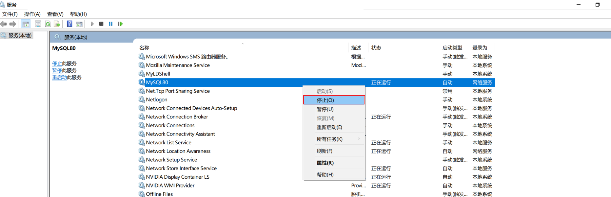
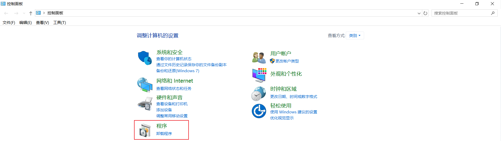
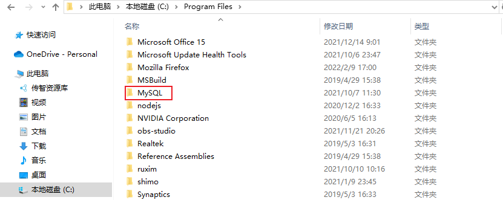
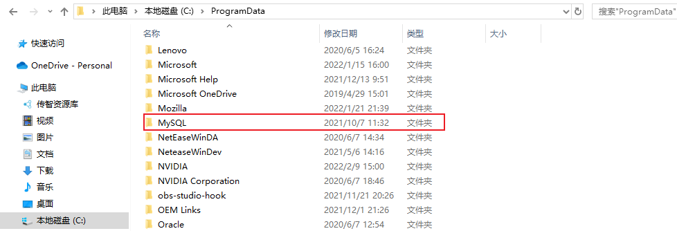

在这一章节，我们主要介绍两个部分，数据库相关概念及 MySQL 数据库的介绍、下载、安装、启动及连接。

# 一、数据库相关概念

在这一部分，我们先来讲解三个概念：数据库、数据库管理系统、SQL。
| 名称           | 全称                                                         |               简称                |
| :------------- | :----------------------------------------------------------- | :-------------------------------: |
| 数据库         | 存储数据的仓库，数据是有组织的进行存储                       |          DataBase（DB）           |
| 数据库管理系统 | 操纵和管理数据库的大型软件                                   | DataBase Management System (DBMS) |
| SQL            | 操作关系型数据库的编程语言，定义了一套操作关系型数据库统一标准 |  Structured Query Language (SQL)  |


而目前主流的关系型数据库管理系统的市场占有率排名如下：


* Oracle：大型的收费数据库，Oracle 公司产品，价格昂贵。
* MySQL：开源免费的中小型数据库，后来 Sun 公司收购了 MySQL，而 Oracle 又收购了 Sun 公司。目前 Oracle 推出了收费版本的 MySQL，也提供了免费的社区版本。
* SQL Server：Microsoft 公司推出的收费的中型数据库，C#、.net 等语言常用。
* PostgreSQL：开源免费的中小型数据库。
* DB2：IBM 公司的大型收费数据库产品。
* SQLite：嵌入式的微型数据库。Android 内置的数据库采用的就是该数据库。
* MariaDB：开源免费的中小型数据库。是 MySQL 数据库的另外一个分支、另外一个衍生产品，与 MySQL 数据库有很好的兼容性。

> 而不论我们使用的是上面的哪一个关系型数据库，最终在操作时，都是使用 SQL 语言来进行统一操作，因为 SQL 语言是操作关系型数据库的**统一标准**。所以即使我们现在学习的是 MySQL，工作时需要使用别的关系型数据库，如：Oracle、DB2、SQLServer，也完全不用担心，因为操作的方式都是一致的。

# 二、MySQL 数据库

## 1、版本


官网：[https://www.mysql.com/](https://www.mysql.com/)

MySQL 官方提供了两种不同的版本：

* 社区版本（MySQL Community Server）：免费，但 MySQL 不提供任何技术支持
* 商业版本（MySQL Enterprise Edition）：收费，可以免费使用 30 天，官方提供技术支持

## 2、下载

下载地址：[https://downloads.mysql.com/archives/installer/](https://downloads.mysql.com/archives/installer/)


## 3、安装

要想使用 MySQL，我们首先先得将 MySQL 安装好，可以根据下面的步骤，一步一步的完成 MySQL 的安装。

1）双击从官方下载的安装包文件


2）根据安装提示进行安装


安装 MySQL 的相关组件，这个过程可能需要耗时几分钟，耐心等待。


**输入 MySQL 中 root 用户的密码，一定要记住该密码**


3）配置

安装好 MySQL 之后，还需要配置环境变量，这样才可以在任何目录下连接 MySQL。

①在此电脑上，右键选择属性


②点击左侧的 \"高级系统设置\"，选择环境变量


③找到 Path 系统变量，点击 "编辑"


④选择 "新建"，将 MySQL Server 的安装目录下的 bin 目录添加到环境变量


## 4、启动停止

MySQL 安装完成之后，在系统启动时，会自动启动 MySQL 服务，我们无需手动启动了。

当然，也可以手动的通过指令启动停止，以管理员身份运行 cmd，进入命令行执行如下指令：

```shell
net start mysql80

net stop mysql80
```


> 注意：上述的 mysql80 是我们在安装 MySQL 时，默认指定的 mysql 的系统服务名，不是固定的，如果未改动，默认就是mysql80。


## 5、客户端连接

1、方式一：使用 MySQL 提供的客户端命令行工具


2、方式二：使用系统自带的命令行工具执行指令

`mysql [-h 127.0.0.1] [-P 3306] -u root -p`

参数解释：

* -h：MySQL 服务所在的主机 IP
* -P：MySQL 服务端口号，默认 3306
* -u：MySQL 数据库用户名
* -p：MySQL 数据库用户名对应的密码

[ ] 内为可选参数，如果需要连接远程的 MySQL，需要加上这两个参数来指定远程主机 IP、端口，如果连接本地的 MySQL，则无需指定这两个参数。


> 注意：使用这种方式进行连接时，需要安装完毕后配置 PATH 环境变量。

## 6、数据模型

1、关系型数据库（RDBMS）

概念：建立在关系模型基础上，由多张相互连接的二维表组成的数据库。

而所谓二维表，指的是由行和列组成的表，如下图（就类似于 Excel 表格数据，有表头、有列、有行，还可以通过一列关联另外一个表格中的某一列数据）。我们之前提到的 MySQL、Oracle、DB2、SQLServer 这些都属于关系型数据库，里面都是基于二维表存储数据的。

简单说，基于二维表存储数据的数据库就称为关系型数据库，不是基于二维表存储数据的数据库，就是非关系型数据库。


特点：

* 使用表存储数据，格式统一，便于维护。
* 使用 SQL 语言操作，标准统一，使用方便。

2、数据模型

MySQL 是关系型数据库，是基于二维表进行数据存储的，具体的结构如下图：


* 我们可以通过 MySQL 客户端连接数据库管理系统 DBMS，然后通过 DBMS 操作数据库。
* 可以使用 SQL 语句，通过数据库管理系统操作数据库，以及操作数据库中的表结构及数据。
* 一个数据库服务器中可以创建多个数据库，一个数据库中也可以包含多张表，而一张表中又可以包含多行记录。

## 7、卸载

如果电脑上已经安装过 MySQL，想要重新安装另一个版本的，必须得先卸载原来的版本

1）停止 MySQL 服务

win+R 打开运行，输入 services.msc 点击 "确定" 调出系统服务。


 

2）卸载 MySQL 相关组件

打开控制面板 ---> 卸载程序 ---> 卸载 MySQL 相关所有组件



 

 

3）删除 MySQL 安装目录

 

4）删除 MySQL 数据目录

数据存放目录是在 C:\ProgramData\MySQL，直接将该文件夹删除。

 

5）再次打开服务，查看是否有 MySQL 卸载残留

如果已将 MySQL 卸载，但是通过任务管理器 ---> 服务，查看到 MySQL 服务仍然残留在系统服务里。

解决办法：以管理员方式运行 cmd 命令行，输入以下命令：

```shell
sc delete 服务名称（如MySQL80）
```

这样可以实现删除服务。