> SQL 全称 Structured Query Language，结构化查询语言。SQL 是操作关系型数据库的编程语言，定义了一套操作关系型数据库统一**标准**。

# 一、SQL 通用语法

在学习具体的 SQL 语句之前，先来了解一下 SQL 语言的通用语法。

1. SQL 语句可以单行或多行书写，以分号结尾。
2. SQL 语句可以使用空格 / 缩进来增强语句的可读性。
3. MySQL 数据库的 SQL 语句不区分大小写，关键字建议使用大写。
4. 注释：
   * 单行注释：`-- 注释内容` 或 `# 注释内容`（MySQL 特有）
   * 多行注释：`/* 注释内容 */`


# 二、SQL 分类

SQL 语句，根据其功能，主要分为四类：DDL、DML、DQL、DCL。

| 分类 | 全称                       | 说明                                                   |
| ---- | :------------------------- | ------------------------------------------------------ |
| DDL  | Data Definition Language   | 数据定义语言，用来定义数据库对象（数据库，表，字段）   |
| DML  | Data Manipulation Language | 数据操作语言，用来对数据库表中的数据进行增删改         |
| DQL  | Data Query Language        | 数据查询语言，用来查询数据库中表的记录                 |
| DCL  | Data Control Language      | 数据控制语言，用来创建数据库用户、控制数据库的访问权限 |

# 三、DDL

> Data Definition Language，数据定义语言，用来定义数据库对象（数据库，表，字段）

## 1、数据库操作

1、**查询所有数据库**

`show databases;`


2、**查询当前数据库**

`select database();`

3、**创建数据库**

`create database [if not exists] 数据库名 [default charset 字符集] [collate 排序规则];`

案例：

1）创建一个 itcast 数据库，使用数据库默认的字符集。

```sql
create database itcast;
```


在同一个数据库服务器中，不能创建两个名称相同的数据库，否则将会报错。


可以通过 `if not exists` 参数来解决这个问题，数据库不存在，则创建该数据库，如果存在，则不创建。

```sql
create database if not extists itcast;
```

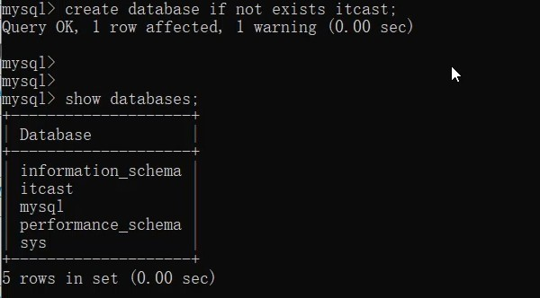

2）创建一个 itheima 数据库，并且指定字符集

```sql
create database itheima default charset utf8mb4;
```


> 注意事项：UTF8 字符集长度为 3 字节，有些符号占 4 字节，所以推荐用 utf8mb4 字符集

4、**删除数据库**

`drop database [if exists] 数据库名;`

如果删除一个不存在的数据库，将会报错。此时，可以加上参数 `if exists`，如果数据库存在，再执行删除，否则不执行删除。


5、**切换数据库**

`use 数据库名;`

我们要操作某一个数据库下的表时，就需要通过该指令，切换到对应的数据库下，否则是不能操作的。比如，切换到 itcast 数据库，执行如下 SQL：

```sql
use itcast;
```

## 2、表操作

### 2.1、查询创建

1、**查询当前数据库所有表**

`show tables;`

比如，我们可以切换到 sys 这个系统数据库，并查看系统数据库中的所有表结构。

```sql
use sys;

show tables;
```


2、**查看指定表结构**

`desc 表名;`

通过这条指令，我们可以查看到指定表的字段，字段的类型、是否可以为 NULL，是否存在默认值等信息。


3、**查询指定表的建表语句**

`show create table 表名;`

通过这条指令，主要是用来查看建表语句的，而有部分参数我们在创建表的时候，并未指定也会查询到，因为这部分是数据库的默认值，如：存储引擎、字符集等。

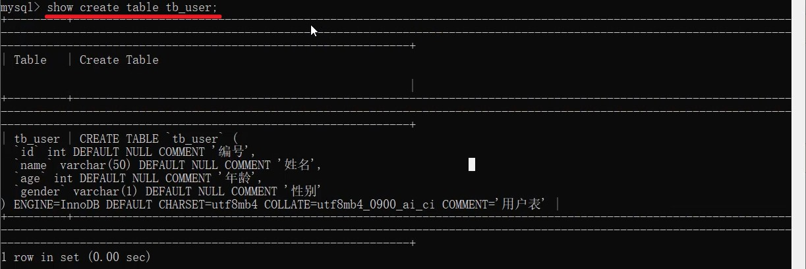

4、**创建表结构**

```sql
CREATE TABLE 表名(
    字段1 字段1类型 [COMMENT 字段1注释],
    字段2 字段2类型 [COMMENT 字段2注释],
    字段3 字段3类型 [COMMENT 字段3注释],
    ......
    字段n 字段n类型 [COMMENT 字段n注释]
) [COMMENT 表注释];
```

> 注意：[ ... ] 内为可选参数，最后一个字段后面没有逗号

比如，我们创建一张表 tb_user，对应的结构如下，那么建表语句为：


```sql
create table tb_user(
    id int comment '编号',
    name varchar(50) comment '姓名',
    age int comment '年龄',
    gender varchar(1) comment '性别'
) comment '用户表';
```

### 2.2、数据类型

在上述的建表语句中，我们在指定字段的数据类型时，用到了 `int` 和 `varchar`，那么在 MySQL 中除了这两种数据类型，还有哪些常见的数据类型呢？下面就详细介绍一下 MySQL 的数据类型。

MySQL 中的数据类型有很多，主要分为三类：数值类型、字符串类型、日期时间类型。

1、**数值类型**


如：

1）年龄字段 —— 不会出现负数，而且人的年龄不会太大

```sql
age tinyint unsigned
```

2）分数 —— 总分 100 分，最多出现一位小数

```sql
score double(4,1)
```

2、**字符串类型**


> char 与 varchar 都可以描述字符串，char 是定长字符串，指定长度多长，就占用多少个字符，和字段值的长度无关。而 varchar 是变长字符串，指定的长度为最大占用长度。相对来说，char 的性能会更高些。因为 varchar 类型会根据当前字符串内容确定需要分配的存储空间，自然效率较低但是存储利用率高。

如：

1）用户名 username —— 长度不定，最长不会超过 50

```sql
username varchar(50)
```

2）性别 gender —— 存储值不是男就是女

```sql
gender char(1)
```

3）手机号 phone —— 固定长度为 11

```sql
phone char(11)
```

3、**日期时间类型**


如：

1）生日字段 birthday

```sql
birthday date
```

2）创建时间 createtime

```sql
createtime datetime
```

### 2.3、案例

根据需求创建表，设计合理的数据类型、长度

设计一张员工信息表，要求如下：

1. 编号（纯数字）
2. 员工工号（字符串类型，长度不超过 10 位）
3. 员工姓名（字符串类型，长度不超过 10 位）
4. 性别（男 / 女，存储一个汉字）
5. 年龄（正常人年龄，不可能存储负数）
6. 身份证号（二代身份证号均为 18 位，身份证中有 X 这样的字符）
7. 入职时间（取值年月日即可）

对应的建表语句如下：

```sql
create table emp(
	id int comment '编号',
	workno varchar(10) comment '工号',
	name varchar(10) comment '姓名',
	gender char(1) comment '性别',
	age tinyint unsigned comment '年龄',
	idcard char(18) comment '身份证号',
	entrydate date comment '入职时间'
) comment '员工表';
```

SQL 语句编写完毕之后，就可以在 MySQL 的命令行中执行 SQL，然后也可以通过 desc 指令查询表结构信息：


表结构创建好了，里面的 name 字段是 varchar 类型，最大长度为 10，也就意味着如果超过 10 将会报错，如果我们想修改这个字段的类型或修改字段的长度该如何操作呢？接下来再来讲解 DDL 语句中，如何操作表字段。

### 2.4、修改

1、**添加字段**

`ALTER TABLE 表名 ADD 字段名 类型(长度) [COMMENT 注释] [约束];`

案例：为 emp 表增加一个新的字段 "昵称" 为 nickname，类型为 varchar(20)

```sql
alter table emp add nickname varchar(20) COMMENT '昵称';
```

2、**修改数据类型**

`ALTER TABLE 表名 MODIFY 字段名 新数据类型(长度);`

3、**修改字段名和字段类型**

`ALTER TABLE 表名 CHANGE 旧字段名 新字段名 类型(长度) [COMMENT 注释] [约束];`

案例：将 emp 表的 nickname 字段修改为 username，类型为 varchar(30)

```sql
alter table emp change nickname username varchar(30) comment '昵称';
```

4、**删除字段**

`ALTER TABLE 表名 DROP 字段名;`

案例：将 emp 表的字段 username 删除

```sql
alter table emp drop username;
```

5、**修改表名**

`ALTER TABLE 表名 RENAME TO 新表名;`

案例：将 emp 表的表名修改为 employee

```sql
alter table emp RENAME TO employee;
```

### 2.5、删除

1、**删除表**

`DROP TABLE [IF EXISTS] 表名;`

可选项 IF EXISTS 代表只有表名存在时才会删除该表，表名不存在则不执行删除操作。如果不加该参数项，删除一张不存在的表，执行将会报错。

案例：如果 tb_user 表存在，则删除 tb_user 表

```sql
drop table if exists tb_user;
```

2、**删除指定表, 并重新创建表**

`TRUNCATE TABLE 表名;`

> 注意：在删除表的时候，表中的全部数据也都会被删除。

## 3、总结

1、DDL —— 数据库操作

`show databases;`

`create datebase 数据库名;`

`use 数据库名;`

`select database();`

`drop datdbase 数据库名;`

2、DDL —— 表操作

`show tables;`

`create table 表名 ( 字段 字段类型 ,  字段 字段类型 );`

`desc 表名;`

`show create table 表名;`

`alter table 表名 add / modify / change / drop / rename to ... ;`

`drop table 表名;`

# 四、图形化界面工具

上述，我们已经讲解了通过 DDL 语句，如何操作数据库、操作表、操作表中的字段，而通过 DDL 语句执行在命令行进行操作，主要存在以下两点问题：

1. 会影响开发效率
2. 使用起来，并不直观，并不方便

所以我们在日常的开发中，会借助于 MySQL 的图形化界面，来简化开发，提高开发效率。而目前 MySQL 主流的图形化界面工具，有以下几种：


而本次课程选择最后一种 DataGrip，这种图形化界面工具，功能更加强大，界面提示更加友好，是我们使用 MySQL 的不二之选。接下来，我们来介绍一下 DataGrip 该如何安装、使用。

## 1、安装

1、找到资料中准备好的安装包，双击开始安装


2、点击 next，一步一步的完成安装

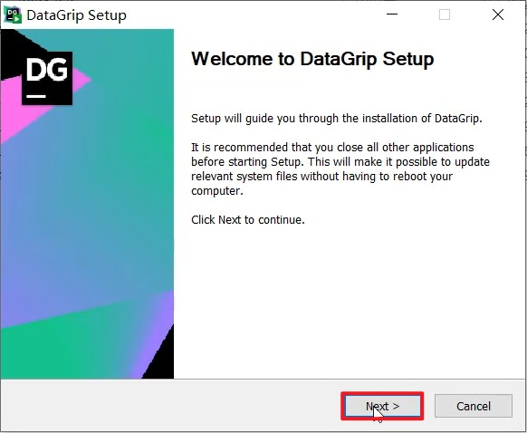

选择 DataGrip 的安装目录，然后选择下一步

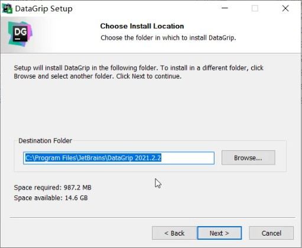


下一步，执行安装


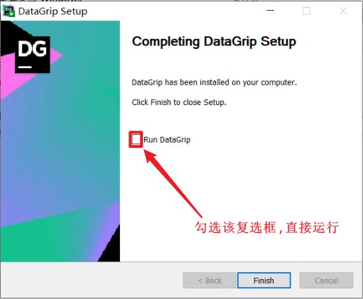

## 2、使用

1、添加数据源

参考图示，一步步操作即可


配置以及驱动 jar 包下载完毕之后，就可以点击 "Test Connection" 进行测试，是否可以连接 MySQL，如果出现  "Successed"，就表明连接成功了。


2、展示所有数据库

连接上了 MySQL 服务之后，并未展示出所有的数据库，此时，我们需要设置，展示所有的数据库，具体操作如下：


3、创建数据库


> 注意：
>
> 以下两种方式都可以创建数据库：
>
> * `create database db01;`
> * `create schema db01;`

4、创建表

在指定的数据库上面右键，选择 new —> Table

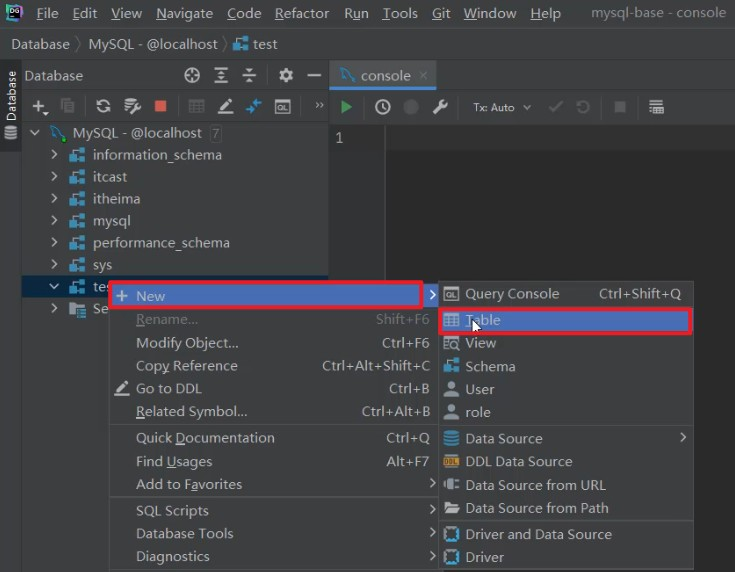


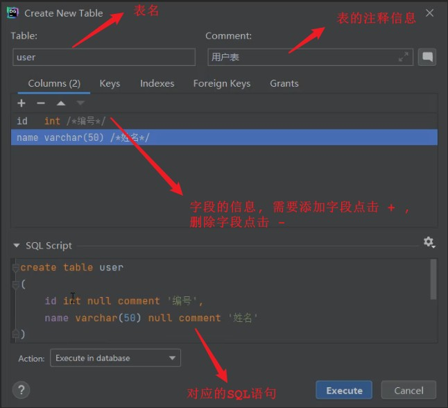

5、修改表结构

在需要修改的表上，右键选择 "Modify Table..."

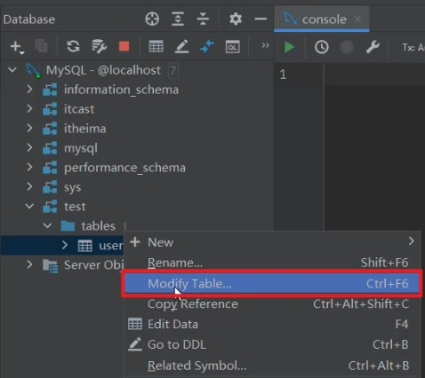


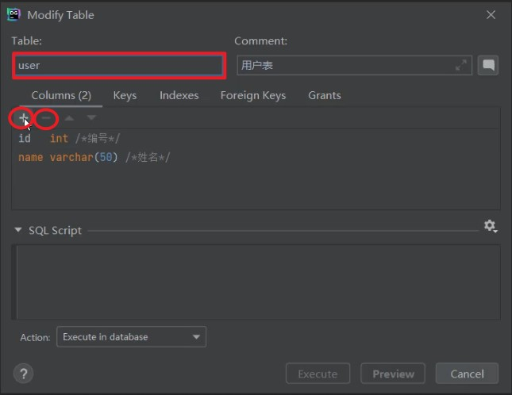

如果想增加字段，直接点击 + 号，录入字段信息，然后点击 Execute 即可。

如果想删除字段，直接点击 - 号，就可以删除字段，然后点击 Execute 即可。

如果想修改字段，双击对应的字段，修改字段信息，然后点击 Execute 即可。

如果要修改表名，或表的注释，直接在输入框修改，然后点击 Execute 即可。

6、在 DataGrip 中执行 SQL 语句

在指定的数据库上，右键，选择 New —> Query Console


然后就可以打开 Query Console 控制台，并在控制台中编写 SQL，执行 SQL。


# 五、DML

DML 英文全称是 Data Manipulation Language（数据操作语言），用来对数据库中表的数据记录进行增、删、改操作。

* 添加数据（INSERT）
* 修改数据（UPDATE）
* 删除数据（DELETE）

## 1、添加数据

1、**给指定字段添加数据**

`INSERT INTO 表名(字段名1, 字段名2, ...) VALUES(值1, 值2, ... );`

案例：给 employee 表所有的字段添加数据

```sql
insert into employee(id, workno, name, gender, age, idcard, entrydate) 
values(1, '1', 'Itcast', '男', 10, '123456789012345678', '2000-01-01');
```

插入数据完成之后，我们有两种方式，查询数据库的数据：

* 方式一：在左侧的表名上双击，就可以查看这张表的数据

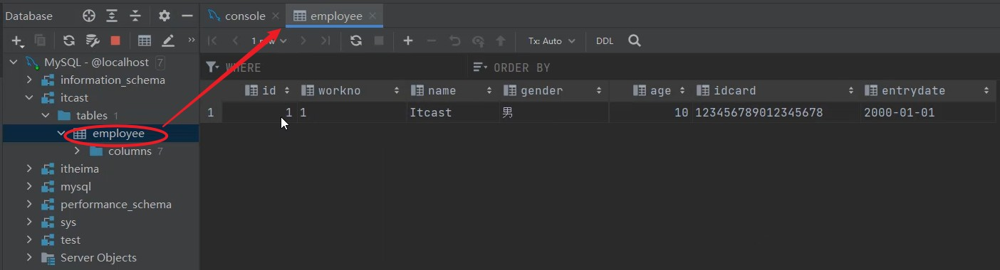

* 方式二：可以直接一条查询数据的 SQL 语句，语句如下：

```sql
select * from employee;
```

案例：给 employee 表所有的字段添加数据

执行如下 SQL，添加的年龄字段值为 -1。

```sql
insert into employee(id, workno, name, gender, age, idcard, entrydate) 
values(1, '1', 'Itcast', '男', -1, '123456789012345678', '2000-01-01');
```

执行上述的 SQL 语句时，报错了，具体的错误信息如下：


因为 employee 表的 age 字段类型为 tinyint，而且还是无符号的 unsigned，所以取值只能在 0-255 之间。

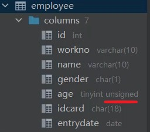

2、**给全部字段添加数据**

`INSERT INTO 表名 VALUES(值1, 值2, ... );`

案例：插入数据到 employee 表，具体的 SQL 如下：

```sql
insert into employee 
values(2, '2', '张无忌', '男', 18, '123456789012345670', '2005-01-01');
```

3、**批量添加数据**

方式一：

`INSERT INTO 表名(字段名1, 字段名2, ...) VALUES(值1, 值2, ...), (值1, 值2, ...), (值1, 值2, ...);`

方式二：

`INSERT INTO 表名 VALUES(值1, 值2, ...), (值1, 值2, ...), (值1, 值2, ...);`

案例：批量插入数据到 employee 表，具体的 SQL 如下：

```sql
insert into employee 
values(3, '3', '韦一笑', '男', 38, '123456789012345670', '2005-01-01'),
	(4, '4', '赵敏', '女', 18, '123456789012345670', '2005-01-01');
```

> 注意事项：
>
> * 插入数据时，指定的字段顺序需要与值的顺序是一一对应的。
>
> * 字符串和日期型数据应该包含在引号中。
> * 插入的数据大小，应该在字段的规定范围内。

## 2、修改数据

修改数据的具体语法为：

`UPDATE 表名 SET 字段名1 = 值1, 字段名2 = 值2, .... [WHERE 条件];`

案例：

1、修改 id 为 1 的数据，将 name 修改为 itheima

```sql
update employee set name = 'itheima' where id = 1;
```

2、修改 id 为 1 的数据，将 name 修改为小昭，gender 修改为女

```sql
update employee set name = '小昭', gender = '女' where id = 1;
```

3、将所有的员工入职日期修改为 2008-01-01

```sql
update employee set entrydate = '2008-01-01';
```

> 注意事项：
>
> 修改语句的条件可以有，也可以没有，如果没有条件，则会修改整张表的所有数据

## 3、删除数据

删除数据的具体语法为：

`DELETE FROM 表名 [WHERE 条件];`

案例：

1、删除 gender 为女的员工

```sql
delete from employee where gender = '女';
```

2、删除所有员工

```sql
delete from employee;
```

> 注意事项：
>
> * DELETE 语句的条件可以有，也可以没有，如果没有条件，则会删除整张表的所有数据
> * DELETE 语句不能删除某一个字段的值（可以使用 UPDATE，将该字段值置为 NULL 即可）
> * 当进行删除全部数据操作时，DataGrip 会提示我们，询问是否确认删除，我们直接点击 Execute 即可


# 六、DQL

DQL 英文全称是 Data Query Language（数据查询语言），用来查询数据库中表的记录。

查询关键字：SELECT

在一个正常的业务系统中，查询操作的频次是要远高于增删改的，当我们去访问企业官网、电商网站，在这些网站中我们所看到的数据，实际都是需要从数据库中查询并展示的。而且在查询的过程中，可能还会涉及到条件、排序、分页等操作。


那么，本小节我们主要学习的就是如何进行数据的查询操作。我们先来完成如下数据准备工作：

```sql
drop table if exists employee;

create table emp(
    id int comment '编号',
    workno varchar(10) comment '工号',
    name varchar(10) comment '姓名',
    gender char(1) comment '性别',
    age tinyint unsigned comment '年龄',
    idcard char(18) comment '身份证号',
    workaddress varchar(50) comment '工作地址',
    entrydate date comment '入职时间'
)comment '员工表';

INSERT INTO emp (id, workno, name, gender, age, idcard, workaddress, entrydate) VALUES 
(1, '00001', '柳岩666', '女', 20, '123456789012345678', '北京', '2000-01-01');

INSERT INTO emp (id, workno, name, gender, age, idcard, workaddress, entrydate) VALUES 
(2, '00002', '张无忌', '男', 18, '123456789012345670', '北京', '2005-09-01');

INSERT INTO emp (id, workno, name, gender, age, idcard, workaddress, entrydate) VALUES 
(3, '00003', '韦一笑', '男', 38, '123456789712345670', '上海', '2005-08-01');

INSERT INTO emp (id, workno, name, gender, age, idcard, workaddress, entrydate) VALUES 
(4, '00004', '赵敏', '女', 18, '123456757123845670', '北京', '2009-12-01');

INSERT INTO emp (id, workno, name, gender, age, idcard, workaddress, entrydate) VALUES 
(5, '00005', '小昭', '女', 16, '123456769012345678', '上海', '2007-07-01');

INSERT INTO emp (id, workno, name, gender, age, idcard, workaddress, entrydate) VALUES 
(6, '00006', '杨逍', '男', 28, '12345678931234567X', '北京', '2006-01-01');

INSERT INTO emp (id, workno, name, gender, age, idcard, workaddress, entrydate) VALUES 
(7, '00007', '范瑶', '男', 40, '123456789212345670', '北京', '2005-05-01');

INSERT INTO emp (id, workno, name, gender, age, idcard, workaddress, entrydate) VALUES 
(8, '00008', '黛绮丝', '女', 38, '123456157123645670', '天津', '2015-05-01');

INSERT INTO emp (id, workno, name, gender, age, idcard, workaddress, entrydate) VALUES 
(9, '00009', '范凉凉', '女', 45, '123156789012345678', '北京', '2010-04-01');

INSERT INTO emp (id, workno, name, gender, age, idcard, workaddress, entrydate) VALUES 
(10, '00010', '陈友谅', '男', 53, '123456789012345670', '上海', '2011-01-01');

INSERT INTO emp (id, workno, name, gender, age, idcard, workaddress, entrydate) VALUES 
(11, '00011', '张士诚', '男', 55, '123567897123465670', '江苏', '2015-05-01');

INSERT INTO emp (id, workno, name, gender, age, idcard, workaddress, entrydate) VALUES 
(12, '00012', '常遇春', '男', 32, '123446757152345670', '北京', '2004-02-01');

INSERT INTO emp (id, workno, name, gender, age, idcard, workaddress, entrydate) VALUES 
(13, '00013', '张三丰', '男', 88, '123656789012345678', '江苏', '2020-11-01');

INSERT INTO emp (id, workno, name, gender, age, idcard, workaddress, entrydate) VALUES 
(14, '00014', '灭绝', '女', 65, '123456719012345670', '西安', '2019-05-01');

INSERT INTO emp (id, workno, name, gender, age, idcard, workaddress, entrydate) VALUES 
(15, '00015', '胡青牛', '男', 70, '12345674971234567X', '西安', '2018-04-01');

INSERT INTO emp (id, workno, name, gender, age, idcard, workaddress, entrydate) VALUES 
(16, '00016', '周芷若', '女', 18, null, '北京', '2012-06-01');
```

准备完毕后，我们就可以看到 emp 表中准备的 16 条数据。接下来，我们再来完成 DQL 语法的学习。

## 1、基本语法

DQL 查询语句，语法结构如下：

```sql
SELECT
	字段列表
FROM
	表名列表
WHERE
	条件列表
GROUP BY
	分组字段列表
HAVING
	分组后条件列表
ORDER BY
	排序字段列表
LIMIT
	分页参数
```

我们在学习这部分内容的时候，会将上面的完整语法进行拆分，分为以下几个部分：

* 基本查询（不带任何条件)
* 条件查询（WHERE）
* 聚合函数（count、max、min、avg、sum）
* 分组查询（group by）
* 排序查询（order by）
* 分页查询（limit）

## 2、基础查询

在基本查询的 DQL 语句中，不带任何的查询条件，查询的语法如下：

1、**查询多个字段**

`SELECT 字段1, 字段2, 字段3 ... FROM 表名;`

`SELECT * FROM 表名;`

> 注意：* 号代表查询所有字段，在实际开发中尽量少用，因为不直观、影响效率

2、**字段设置别名**

`SELECT 字段1 [AS 别名1], 字段2 [AS 别名2] ... FROM 表名;`

`SELECT 字段1 [别名1], 字段2 [别名2] ... FROM 表名;`

3、**去除重复记录**

`SELECT DISTINCT 字段列表 FROM 表名;`

案例：

（1）查询指定字段 name，workno，age 并返回

```sql
select name,workno,age from emp;
```

（2）查询返回所有字段

```sql
# 写法一
select id ,workno,name,gender,age,idcard,workaddress,entrydate from emp;

# 写法二
select * from emp;
```

（3）查询所有员工的工作地址，起别名

```sql
select workaddress as '工作地址' from emp;

-- as可以省略
select workaddress '工作地址' from emp;
```

（4）查询公司员工的上班地址有哪些（不要重复）

```sql
select distinct workaddress '工作地址' from emp;
```

## 3、条件查询

1、**语法**

`SELECT 字段列表 FROM 表名 WHERE 条件列表;`

2、**条件**

常用的比较运算符如下：

| 比较运算符          | 功能                                             |
| ------------------- | ------------------------------------------------ |
| >                   | 大于                                             |
| >=                  | 大于等于                                         |
| <                   | 小于                                             |
| <=                  | 小于等于                                         |
| =                   | 等于                                             |
| <> 或 !=            | 不等于                                           |
| BETWEEN ... AND ... | 在某个范围之内（含最小、最大值）                 |
| IN(...)             | 在 in 之后的列表中的值，多选一                   |
| LIKE 占位符         | 模糊匹配（`_` 匹配单个字符，`%` 匹配任意个字符） |
| IS NULL             | 是 NULL                                          |

常用的逻辑运算符如下：

| 逻辑运算符 | 功能                         |
| ---------- | ---------------------------- |
| AND 或 &&  | 并且（多个条件同时成立）     |
| OR 或 \|\| | 或者（多个条件任意一个成立） |
| NOT 或 !   | 非，不是                     |

案例：

（1）查询年龄等于 88 的员工

```sql
select * from emp where age = 88;
```

（2）查询年龄小于 20 的员工信息

```sql
select * from emp where age < 20;
```

（3）查询年龄小于等于 20 的员工信息

```sql
select * from emp where age <= 20;
```

（4）查询没有身份证号的员工信息

```sql
select * from emp where idcard is null;
```

（5）查询有身份证号的员工信息

```sql
select * from emp where idcard is not null;
```

（6）查询年龄不等于 88 的员工信息

```sql
select * from emp where age != 88;

select * from emp where age <> 88;
```

（7）查询年龄在 15 岁（包含）到 20 岁（包含）之间的员工信息

```sql
select * from emp where age >= 15 && age <= 20;

select * from emp where age >= 15 and age <= 20;

select * from emp where age between 15 and 20;
```

（8）查询性别为女且年龄小于 25 岁的员工信息

```sql
select * from emp where gender = '女' and age < 25;
```

（9）查询年龄等于 18 或 20 或 40 的员工信息

```sql
select * from emp where age = 18 or age = 20 or age =40;

select * from emp where age in (18,20,40);
```

（10）查询姓名为两个字的员工信息 _ %

```sql
select * from emp where name like '__';
```

（11）查询身份证号最后一位是 X 的员工信息

```sql
select * from emp where idcard like '%X';

select * from emp where idcard like '_________________X';
```

## 4、聚合函数

1、**介绍**

聚合函数是将一列数据作为一个整体，进行纵向计算。

2、**常见的聚合函数**

| 函数  | 功能     |
| ----- | -------- |
| count | 统计数量 |
| max   | 最大值   |
| min   | 最小值   |
| avg   | 平均值   |
| sum   | 求和     |

3、**语法**

`SELECT 聚合函数(字段列表) FROM 表名;`

> 注意：NULL 值是不参与所有聚合函数运算的

案例：

（1）统计该企业员工数量

```sql
-- 统计的是总记录数
select count(*) from emp;

-- 统计的是 idcard 字段不为 null 的记录数
select count(idcard) from emp;
```

对于 count 聚合函数，统计符合条件的总记录数，还可以通过 `count(数字/字符串)` 的形式进行统计查询，比如：

```sql
select count(1) from emp;
```

> 对于 count(*)、count(字段)、count(1) 的具体原理，我们在进阶篇中 SQL 优化部分会详细讲解，此处只需要知道如何使用即可

（2）统计该企业员工的平均年龄

```sql
select avg(age) from emp;
```

（3）统计该企业员工的最大年龄

```sql
select max(age) from emp;
```

（4）统计该企业员工的最小年龄

```sql
select min(age) from emp;
```

（5）统计西安地区员工的年龄之和

```sql
select sum(age) from emp where workaddress = '西安';
```

## 5、分组查询

1、**语法**

`SELECT 字段列表 FROM 表名 [WHERE 条件] GROUP BY 分组字段名 [HAVING 分组后过滤条件];`

2、**where 与 having 区别**

* 执行时机不同：where 是分组之前进行过滤，不满足 where 条件则不参与分组；而 having 是分组之后对结果进行过滤。
* 判断条件不同：where 不能对聚合函数进行判断，而 having 可以。

> 注意事项：
>
> * 分组之后，查询的字段一般为聚合函数和分组字段，查询其他字段无任何意义
> * 执行顺序：where > 聚合函数 > having
> * 支持多字段分组，具体语法为：group by columnA, columnB

案例：

（1）根据性别分组 , 统计男性员工和女性员工的数量

```sql
select gender, count(*) from emp group by gender;
```

（2）根据性别分组，统计男性员工和女性员工的平均年龄

```sql
select gender, avg(age) from emp group by gender;
```

（3）查询年龄小于 45 的员工，并根据工作地址分组，获取员工数量大于等于 3 的工作地址

```sql
select workaddress, count(*) address_count from emp where age < 45 
group by workaddress having address_count >= 3;
```

（4）统计各个工作地址上班的男性及女性员工的数量

```sql
select workaddress, gender, count(*) '数量' from emp group by gender, workaddress;
```

## 6、排序查询

排序在日常开发中是非常常见的一个操作，有升序排序，也有降序排序。


1、**语法**

`SELECT 字段列表 FROM 表名 ORDER BY 字段1 排序方式1, 字段2 排序方式2;`

2、**排序方式**

* `ASC`：升序（默认值）
* `DESC`：降序

> 注意事项：
>
> * 如果是升序，可以不指定排序方式 ASC
> * 如果是多字段排序，当第一个字段值相同时，才会根据第二个字段进行排序

案例：

（1）根据年龄对公司的员工进行升序排序

```sql
select * from emp order by age asc;

select * from emp order by age;
```

（2）根据入职时间，对员工进行降序排序

```sql
select * from emp order by entrydate desc;
```

（3）根据年龄对公司的员工进行升序排序，年龄相同，再按照入职时间进行降序排序

```sql
select * from emp order by age asc, entrydate desc;
```

## 7、分页查询

分页操作在业务系统开发时，也是非常常见的一个功能，我们在网站中看到的各种各样的分页条，后台都需要借助于数据库的分页操作。


1、**语法**

`SELECT 字段列表 FROM 表名 LIMIT 起始索引, 查询记录数;`

> 注意事项：
>
> * 起始索引从 0 开始，起始索引 = （查询页码 - 1）* 每页显示记录数
> * 分页查询是数据库的方言，不同的数据库有不同的实现，MySQL 中是 LIMIT
> * 如果查询的是第一页数据，起始索引可以省略，直接简写为 `limit 10`

案例：

（1）查询第 1 页员工数据，每页展示 10 条记录

```sql
select * from emp limit 0,10;

select * from emp limit 10;
```

（2）查询第 2 页员工数据，每页展示 10 条记录 ----------> (页码 - 1) * 页展示记录数

```sql
select * from emp limit 10, 10;
```

## 8、案例练习

按照需求完成以下 DQL 语句编写：

（1）查询年龄为 20，21，22，23 岁的员工信息

```sql
select * from emp where gender = '女' and age in(20, 21, 22, 23);
```

（2）查询性别为男，并且年龄在 20 — 40 岁（含）以内的姓名为三个字的员工

```sql
select * from emp where gender = '男' and ( age between 20 and 40 ) and name like '___';
```

（3）统计员工表中，年龄小于 60 岁的，男性员工和女性员工的人数

```sql
select gender, count(*) from emp where age < 60 group by gender;
```

（4）查询所有年龄小于等于 35 岁员工的姓名和年龄，并对查询结果按年龄升序排序，如果年龄相同按入职时间降序排序

```sql
select name, age from emp where age <= 35 order by age asc, entrydate desc;
```

（5）查询性别为男，且年龄在 20 — 40 岁（含）以内的前 5 个员工信息，对查询的结果按年龄升序排序，年龄相同按入职时间升序排序

```sql
select * from emp where gender = '男' and (age between 20 and 40) order by age asc, entrydate asc limit 5;
```

## 9、执行顺序

在讲解 DQL 语句的具体语法之前，我们已经学习了 DQL 语句的完整语法及编写顺序，接下来要说明的是 DQL 语句在执行时的执行顺序，也就是先执行哪一部分，后执行哪一部分。


验证：

查询年龄大于 15 的员工姓名、年龄，并根据年龄进行升序排序。

```sql
select name, age from emp where age > 15 order by age asc;
```

在查询时，我们给 emp 表起一个别名 e，然后在 select 及 where 中使用该别名。

```sql
select e.name, e.age from emp e where e.age > 15 order by age asc;
```

执行上述 SQL 语句后，我们看到依然可以正常的查询到结果，此时就说明：from 先执行，然后 where 和 select 执行。那 where 和 select 到底哪个先执行呢？

此时，此时我们可以给 select 后面的字段起别名，然后在 where 中使用这个别名，然后看看是否可以执行成功。

```sql
select e.name ename, e.age eage from emp e where eage > 15 order by age asc;
```

执行上述 SQL 报错了：


由此我们可以得出结论：from 先执行，然后执行 where，再执行 select。

接下来，我们再执行如下 SQL 语句，查看执行效果：

```sql
select e.name ename, e.age eage from emp e where e.age > 15 order by eage asc;
```

结果执行成功。那么也就验证了：order by 是在 select 语句之后执行的。

> 综上所述，我们可以看到 DQL 语句的执行顺序为：from > where > group by > having > select > order by > limit

> DQL 总结：
>
> 

# 七、DCL

DCL 英文全称是 **Data Control Language**（数据控制语言），用来管理数据库用户、控制数据库的访问权限。


## 1、管理用户

1、**查询用户**

`select * from mysql.user;`

写法二：

```mysql
USE mysql;
SELECT * FROM user;
```

查询的结果如下：


其中 Host 代表当前用户访问的主机，如果为 localhost 代表只能够在当前本机访问，是不可以远程访问的。User 代表的是访问该数据库的用户名。在 MySQL 中需要通过 Host 和 User 来唯一标识一个用户。

2、**创建用户**

`CREATE USER '用户名'@'主机名' IDENTIFIED BY '密码';`

3、**修改用户密码**

`ALTER USER '用户名'@'主机名' IDENTIFIED WITH mysql_native_password BY '新密码';`

4、**删除用户**

`DROP USER '用户名'@'主机名';`

> 注意事项：
>
> * 在 MySQL 中需要通过 用户名@主机名 的方式，来唯一标识一个用户。
> * 主机名可以使用 % 通配。
> * 这类 SQL 开发人员操作的比较少，主要是 DBA（Database Administrator 数据库管理员）使用。

案例：

（1）创建用户 itcast，只能够在当前主机 localhost 访问，密码 123456

```mysql
create user 'itcast'@'localhost' identified by '123456';
```

（2）创建用户 heima，可以在任意主机访问该数据库，密码 123456

```mysql
create user 'heima'@'%' identified by '123456';
```

（3）修改用户 heima 的访问密码为 1234

```mysql
alter user 'heima'@'%' identified with mysql_native_password by '1234';
```

（4）删除 itcast@localhost 用户

```mysql
drop user 'itcast'@'localhost';
```

## 2、权限控制

MySQL 中定义了很多种权限，但是常用的就以下几种：

| **权限**            | **说明**           |
| ------------------- | ------------------ |
| ALL, ALL PRIVILEGES | 所有权限           |
| SELECT              | 查询数据           |
| INSERT              | 插入数据           |
| UPDATE              | 修改数据           |
| DELETE              | 删除数据           |
| ALTER               | 修改表             |
| DROP                | 删除数据库/表/视图 |
| CREATE              | 创建数据库/表      |

上述只是简单罗列了常见的几种权限描述，其他权限描述及含义，可以直接参考[官方文档](https://dev.mysql.com/doc/refman/8.0/en/privileges-provided.html)。

1、**查询权限**

`SHOW GRANTS FOR '用户名'@'主机名';`

2、**授予权限**

`GRANT 权限列表 ON 数据库名.表名 TO '用户名'@'主机名';`

3、**撤销权限**

`REVOKE 权限列表 ON 数据库名.表名 FROM '用户名'@'主机名';`

> 注意事项：
>
> * 多个权限之间，使用逗号分隔
> * 授权时， 数据库名和表名可以使用 * 进行通配，代表所有。

案例：

（1）查询 'heima'@'%' 用户的权限

```mysql
show grants for 'heima'@'%';
```

（2）授予 'heima'@'%' 用户 itcast 数据库所有表的所有操作权限

```mysql
grant all on itcast.* to 'heima'@'%';
```

（3）撤销 'heima'@'%' 用户的 itcast 数据库的所有权限

```mysql
revoke all on itcast.* from 'heima'@'%';
```
