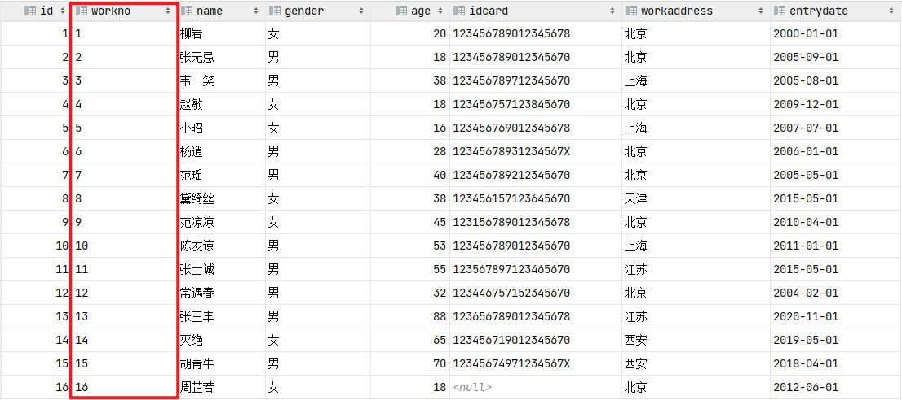
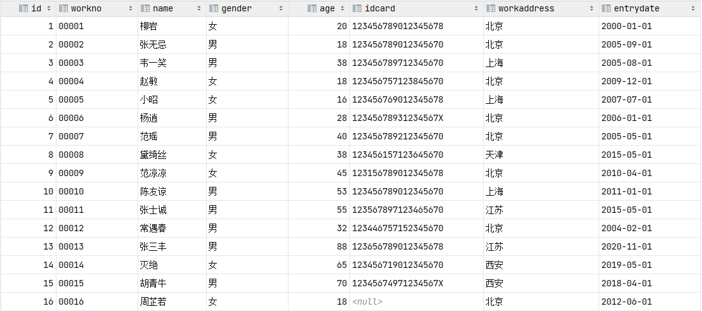
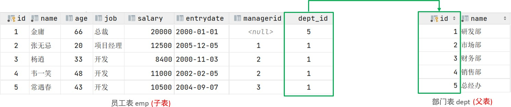
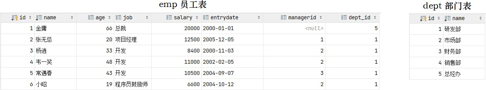
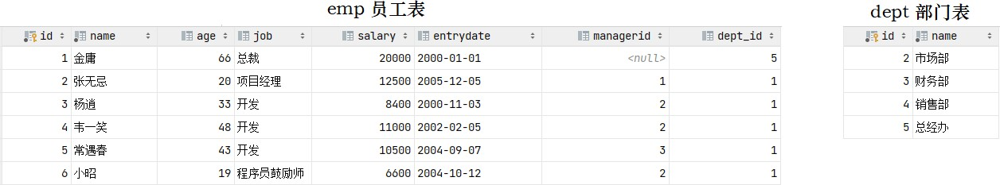
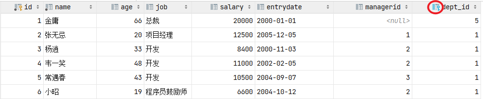
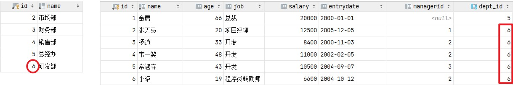
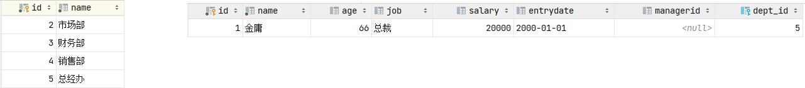
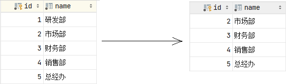
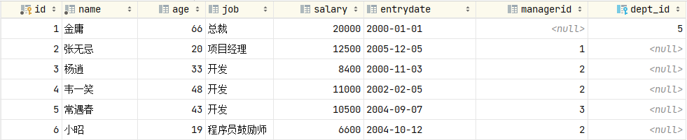

# 一、函数

函数是指一段可以直接被另一段程序调用的程序或代码。 也就意味着，这一段程序或代码在 MySQL 中已经给我们提供了，我们要做的就是在合适的业务场景调用对应的函数完成对应的业务需求即可。 那么，函数到底在哪儿使用呢？

我们先来看两个场景：

1、在企业的 OA 或其他的人力系统中，经常会提供的有这样一个功能：每一个员工登录上来之后都能够看到当前员工入职的天数。而在数据库中，存储的都是入职日期，如 2000-11-12，那如果快速计算出天数呢？


2、在做报表这类的业务需求中，我们要展示出学员的分数等级分布。而在数据库中，存储的是学生的分数值，如98 / 75，如何快速判定分数的等级呢？


其实，上述的这一类的需求呢，我们通过 MySQL 中的函数都可以很方便的实现。

MySQL 中的函数主要分为以下四类： 字符串函数、数值函数、日期函数、流程函数。

## 1、字符串函数

MySQL 中内置了很多字符串函数，常用的几个如下：

| **函数**                   | **功能**                                                     |
| -------------------------- | ------------------------------------------------------------ |
| CONCAT(S1, S2, ...Sn)      | 字符串拼接，将 S1，S2，... Sn 拼接成一个字符串               |
| LOWER(str)                 | 将字符串 str 全部转为小写                                    |
| UPPER(str)                 | 将字符串 str 全部转为大写                                    |
| LPAD(str, n, pad)          | 左填充，用字符串 pad 对 str 的左边进行填充，达到 n 个字符串长度 |
| RPAD(str, n, pad)          | 右填充，用字符串 pad 对 str 的右边进行填充，达到 n 个字符串长度 |
| TRIM(str)                  | 去掉字符串头部和尾部的空格                                   |
| SUBSTRING(str, start, len) | 返回从字符串 str 从 start 位置起的 len 个长度的字符串，注意索引从 1 开始 |

演示如下：

```mysql
-- concat：字符串拼接
select concat('Hello', 'MySQL');

-- lower：全部转小写
select lower('Hello');

-- upper：全部转大写
select upper('Hello');

-- lpad：左填充
select lpad('01', 5, '-');

-- rpad：右填充
select rpad('01', 5, '-');

-- trim：去除空格
select trim(' Hello MySQL ');

-- substring：截取子字符串
select substring('Hello MySQL', 1, 5);
```

案例：



由于业务需求变更，企业员工的工号，统一为 5 位数，目前不足 5 位数的全部在前面补 0。比如：1 号员工的工号应该为 00001。

```mysql
update emp set workno = lpad(workno, 5, '0');
```

处理完毕后，具体的数据为：



## 2、数值函数

常见的数值函数如下：

| **函数**    | **功能**                               |
| ----------- | -------------------------------------- |
| CEIL(x)     | 向上取整                               |
| FLOOR(x)    | 向下取整                               |
| MOD(x, y)   | 返回 x / y 的模                        |
| RAND()      | 返回 0 ~ 1 内的随机数                  |
| ROUND(x, y) | 求参数 x 的四舍五入的值，保留 y 位小数 |

演示如下：

```mysql
-- ceil：向上取整
select ceil(1.1);

-- floor：向下取整
select floor(1.9);

-- mod：取模
select mod(7,4);

-- rand：获取随机数
select rand();

-- round：四舍五入
select round(2.344,2);
```

案例：

通过数据库的函数，生成一个六位数的随机验证码。

思路：获取随机数可以通过 `rand()` 函数，但是获取出来的随机数是在 0 ~ 1 之间的，所以可以在其基础上乘以 1000000，然后舍弃小数部分，如果长度不足 6 位，补 0

```mysql
select lpad(round(rand()*1000000 , 0), 6, '0');
```

## 3、日期函数

常见的日期函数如下：

| **函数**                            | **功能**                                              |
| ----------------------------------- | ----------------------------------------------------- |
| CURDATE()                           | 返回当前日期                                          |
| CURTIME()                           | 返回当前时间                                          |
| NOW()                               | 返回当前日期和时间                                    |
| YEAR(date)                          | 获取指定 date 的年份                                  |
| MONTH(date)                         | 获取指定 date 的月份                                  |
| DAY(date)                           | 获取指定 date 的日期                                  |
| DATE\_ADD(date, INTERVAL expr type) | 返回一个日期 / 时间值加上一个时间间隔 expr 后的时间值 |
| DATEDIFF(date1, date2)              | 返回起始时间 date1 和结束时间 date2 之间的天数        |

演示如下：

```mysql
-- curdate：当前日期
select curdate();

-- curtime：当前时间
select curtime();

-- now：当前日期和时间
select now();

-- YEAR, MONTH, DAY：当前年、月、日
select YEAR(now());
select MONTH(now());
select DAY(now());

-- date_add：增加指定的时间间隔
select date_add(now(), INTERVAL 70 YEAR );

-- datediff：获取两个日期相差的天数
select datediff('2021-10-01', '2021-12-01');
```

案例：

查询所有员工的入职天数，并根据入职天数倒序排序。

思路：入职天数，就是通过当前日期 - 入职日期，所以需要使用 datediff 函数来完成。

```mysql
select name, datediff(curdate(), entrydate) as 'entrydays' from emp order by entrydays desc;
```

## 4、流程函数

流程函数也是很常用的一类函数，可以在 SQL 语句中实现条件筛选，从而提高语句的效率。

| **函数**                                                   | **功能**                                                     |
| ---------------------------------------------------------- | ------------------------------------------------------------ |
| IF(value, t, f)                                            | 如果 value 为 true，则返回 t，否则返回 f                     |
| IFNULL(value1, value2)                                     | 如果 value1 不为空，返回 value1，否则返回 value2             |
| CASE WHEN [val1] THEN [res1] ...  ELSE [default] END       | 如果 val1 为 true，返回 res1，... 否则返回 default 默认值    |
| CASE [expr] WHEN [val1] THEN [res1] ... ELSE [default] END | 如果 expr 的值等于 val1，返回 res1，... 否则返回 default 默认值 |

演示如下：

```mysql
-- if
select if(false, 'Ok', 'Error');

-- ifnull
select ifnull('Ok','Default');
select ifnull('','Default');
select ifnull(null,'Default');

-- case when then else end
-- 需求：查询 emp 表的员工姓名和工作地址，北京/上海展示为一线城市，其他的展示为二线城市
select
    name,
    (case workaddress when '北京' then '一线城市' when '上海' then '一线城市' else '二线城市' end) as '工作地址'
from emp;
```

案例：

统计班级各个学员的成绩，展示的规则如下：

* \>= 85，展示优秀
* \>= 60，展示及格
* 否则，展示不及格

涉及到的学员分数表结构如下：

```mysql
create table score(
    id int comment 'ID',
    name varchar(20) comment '姓名',
    math int comment '数学',
    english int comment '英语',
    chinese int comment '语文'
) comment '学员成绩表';

insert into score(id, name, math, english, chinese) 
VALUES(1, 'Tom', 67, 88, 95), (2, 'Rose' , 23, 66, 90),(3, 'Jack', 56, 98, 76);
```

具体的 SQL 语句如下：

```mysql
select
    id,
    name,
    (case when math >= 85 then '优秀' when math >=60 then '及格' else '不及格' end) '数学',
    (case when english >= 85 then '优秀' when english >=60 then '及格' else '不及格' end) '英语',
    (case when chinese >= 85 then '优秀' when chinese >=60 then '及格' else '不及格' end) '语文'
from score;
```

MySQL 的常见函数我们学习完了，那接下来，我们就来分析一下，在前面讲到的两个函数的案例场景，思考一下需要用到什么样的函数来实现？

* 数据库中，存储的是入职日期，如 2000-01-01，如何快速计算出入职天数呢？
  * 答案：`datediff`


* 数据库中，存储的是学生的分数值，如 98、75，如何快速判定分数的等级呢？
  * 答案：`case ... when ...`

# 二、约束

## 1、概述

概念：约束是作用于表中字段上的规则，用于限制存储在表中的数据。

目的：保证数据库中数据的正确、有效性和完整性。

分类：

| **约束**                    | **描述**                                                 | **关键字**  |
| --------------------------- | -------------------------------------------------------- | ----------- |
| 非空约束                    | 限制该字段的数据不能为 null                              | NOT NULL    |
| 唯一约束                    | 保证该字段的所有数据都是唯一、不重复的                   | UNIQUE      |
| 主键约束                    | 主键是一行数据的唯一标识，要求非空且唯一                 | PRIMARY KEY |
| 默认约束                    | 保存数据时，如果未指定该字段的值，则采用默认值           | DEFAULT     |
| 检查约束（8.0.16 版本之后） | 保证字段值满足某一个条件                                 | CHECK       |
| 外键约束                    | 用来让两张表的数据之间建立连接，保证数据的一致性和完整性 | FOREIGN KEY |

> 注意：约束是作用于表中字段上的，可以在创建表 / 修改表的时候添加约束。

## 2、约束演示

上面我们介绍了数据库中常见的约束，以及约束涉及到的关键字，那这些约束我们到底如何在创建表、修改表的时候来指定呢，接下来我们就通过一个案例，来演示一下。

案例需求： 根据需求，完成表结构的创建。需求如下：

| **字段名** | **字段含义** | **字段类型** | **约束条件**               | **约束关键字**               |
| ---------- | ------------ | ------------ | -------------------------- | ---------------------------- |
| id         | ID 唯一标识  | int          | 主键，并且自动增长         | PRIMARY KEY, AUTO\_INCREMENT |
| name       | 姓名         | varchar(10)  | 不为空，并且唯一           | NOT NULL, UNIQUE             |
| age        | 年龄         | int          | 大于 0，并且小于等于 120   | CHECK                        |
| status     | 状态         | char(1)      | 如果没有指定该值，默认为 1 | DEFAULT                      |
| gender     | 性别         | char(1)      | 无                         |                              |

对应的建表语句为：

```mysql
CREATE TABLE tb_user(
    id int AUTO_INCREMENT PRIMARY KEY COMMENT 'ID唯一标识',
    name varchar(10) NOT NULL UNIQUE COMMENT '姓名',
    age int check (age > 0 && age <= 120) COMMENT '年龄',
    status char(1) default '1' COMMENT '状态',
    gender char(1) COMMENT '性别'
);
```

在为字段添加约束时，我们只需要在字段之后加上约束的关键字即可，需要关注其语法。我们执行上面的 SQL 把表结构创建完成，然后接下来，就可以通过一组数据进行测试，从而验证一下，约束是否可以生效。

```mysql
insert into tb_user(name, age, status, gender) values ('Tom1', 19, '1', '男'), ('Tom2', 25, '0', '男');
insert into tb_user(name, age, status, gender) values ('Tom3', 19, '1', '男');

insert into tb_user(name, age, status, gender) values (null, 19, '1', '男');
insert into tb_user(name, age, status, gender) values ('Tom3', 19, '1', '男');

insert into tb_user(name, age, status, gender) values ('Tom4', 80, '1', '男');
insert into tb_user(name, age, status, gender) values ('Tom5', -1, '1', '男');
insert into tb_user(name, age, status, gender) values ('Tom5', 121, '1', '男');

insert into tb_user(name, age, gender) values ('Tom5',120,'男');
```

上面，我们是通过编写 SQL 语句的形式来完成约束的指定，那加入我们是通过图形化界面来创建表结构时，又该如何来指定约束呢？ 只需要在创建表的时候，根据我们的需要选择对应的约束即可。


## 3、外键约束

### 介绍

外键：用来让两张表的数据之间建立连接，从而保证数据的一致性和完整性。我们来看一个例子：



左侧的 emp 表是员工表，里面存储员工的基本信息，包含员工的 ID、姓名、年龄、职位、薪资、入职日期、上级主管 ID、部门 ID，在员工的信息中存储的是部门的 ID dept\_id，而这个部门的 ID 是关联的部门表 dept 的主键 id，那 emp 表的 dept_id 就是外键，关联的是另一张表的主键。

注意：目前上述两张表，只是在逻辑上存在这样一层关系；在数据库层面，并未建立外键关联，所以是无法保证数据的一致性和完整性的。

没有数据库外键关联的情况下，能够保证一致性和完整性呢，我们来测试一下。

准备数据：

```mysql
create table dept(
    id int auto_increment comment 'ID' primary key,
    name varchar(50) not null comment '部门名称'
) comment '部门表';

INSERT INTO dept (id, name) VALUES (1, '研发部'), (2, '市场部'), (3, '财务部'), (4, '销售部'), (5, '总经办');

create table emp(
    id int auto_increment comment 'ID' primary key,
    name varchar(50) not null comment '姓名',
    age int comment '年龄',
    job varchar(20) comment '职位',
    salary int comment '薪资',
    entrydate date comment '入职时间',
    managerid int comment '直属领导ID',
    dept_id int comment '部门ID'
) comment '员工表';

INSERT INTO emp (id, name, age, job, salary, entrydate, managerid, dept_id) 
VALUES(1, '金庸', 66, '总裁', 20000, '2000-01-01', null, 5), 
(2, '张无忌', 20, '项目经理', 12500, '2005-12-05', 1, 1),
(3, '杨逍', 33, '开发', 8400, '2000-11-03', 2, 1),
(4, '韦一笑', 48, '开发', 11000, '2002-02-05', 2, 1),
(5, '常遇春', 43, '开发', 10500, '2004-09-07', 3, 1),
(6, '小昭', 19, '程序员鼓励师', 6600, '2004-10-12', 2, 1);
```



接下来，我们可以做一个测试，删除 id 为 1 的部门信息。



结果，我们看到删除成功，而删除成功之后，部门表不存在 id 为 1 的部门，而在 emp 表中还有很多的员工，关联的为 id 为 1 的部门，此时就出现了数据的不完整性。 而要想解决这个问题就得通过数据库的外键约束。

### 语法

1、添加外键

方式一：

```mysql
CREATE TABLE 表名(
    字段名 数据类型,
    ...
    [CONSTRAINT] [外键名称] FOREIGN KEY (外键字段名) REFERENCES 主表 (主表列名)
);
```

方式二：

```mysql
ALTER TABLE 表名 ADD CONSTRAINT 外键名称 FOREIGN KEY (外键字段名) REFERENCES 主表 (主表列名);
```

案例：

为 emp 表的 dept\_id 字段添加外键约束，关联 dept 表的主键 id。

```mysql
alter table emp add constraint fk_emp_dept_id foreign key (dept_id) references dept(id);
```



添加了外键约束之后，我们再到 dept 表（父表）删除 id 为 1 的记录，然后看一下会发生什么现象。此时将会报错，不能删除或更新父表记录，因为存在外键约束。


2、删除外键

`ALTER TABLE 表名 DROP FOREIGN KEY 外键名称;`

案例：删除 emp 表的外键 fk_emp_dept_id。

```mysql
alter table emp drop foreign key fk_emp_dept_id;
```

### 删除 / 更新行为

添加了外键之后，再删除父表数据时产生的约束行为，我们就称为删除 / 更新行为。

具体的删除 / 更新行为有以下几种：

| **行为**    | **说明**                                                     |
| ----------- | ------------------------------------------------------------ |
| NO ACTION   | 当在父表中删除 / 更新对应记录时，首先检查该记录是否有对应外键，如果有则不允许删除 / 更新（与 RESTRICT 一致），是默认行为 |
| RESTRICT    | 当在父表中删除 / 更新对应记录时，首先检查该记录是否有对应外键，如果有则不允许删除 / 更新（与 NO ACTION 一致），是默认行为 |
| CASCADE     | 当在父表中删除 / 更新对应记录时，首先检查该记录是否有对应外键，如果有，则也删除 / 更新外键在子表中的记录 |
| SET NULL    | 当在父表中删除对应记录时，首先检查该记录是否有对应外键，如果有则设置子表中该外键值为 null（这就要求该外键允许取 null） |
| SET DEFAULT | 父表有变更时，子表将外键列设置成一个默认的值（Innodb 不支持） |

具体语法为：

`ALTER TABLE 表名 ADD CONSTRAINT 外键名称 FOREIGN KEY (外键字段) REFERENCES 主表名 (主表字段名) ON UPDATE CASCADE ON DELETE CASCADE;`

演示如下：

由于 NO ACTION 是默认行为，我们前面语法演示的时候，已经测试过了，就不再演示了，这里我们再演示其他的两种行为：CASCADE、SET NULL。

1、CASCADE

```mysql
alter table emp add constraint fk_emp_dept_id foreign key (dept_id) references dept(id) on update cascade on delete cascade;
```

（1）修改父表 id 为 1 的记录，将 id 修改为 6



我们发现，原来在子表中 dept_id 值为 1 的记录，现在也变为 6 了，这就是 cascade 级联的效果。

在一般的业务系统中，不会修改一张表的主键值。

（2）删除父表 id 为 6 的记录



我们发现，父表的数据删除成功了，但是子表中关联的记录也被级联删除了。

2、SET NULL

在进行测试之前，我们先需要删除上面建立的外键 fk\_emp\_dept\_id。然后再通过数据脚本，将 emp、dept 表的数据恢复了。

```mysql
alter table emp add constraint fk_emp_dept_id foreign key (dept_id) references dept(id) on update set null on delete set null;
```

接下来，我们删除 id 为 1 的数据，看看会发生什么样的现象。



我们发现父表的记录是可以正常的删除的，父表的数据删除之后，再打开子表 emp，我们发现子表 emp 的 dept_id 字段，原来 dept_id 为 1 的数据，现在都被置为 NULL 了。



这就是 SET NULL 这种删除 / 更新行为的效果。
