# 一、多表查询

我们之前在讲解 SQL 语句的时候，讲解了 DQL 语句，也就是数据查询语句，但是之前讲解的查询都是单表查询，而本章节我们要学习的则是多表查询操作，主要从以下几个方面进行讲解。

## 1、多表关系

项目开发中，在进行数据库表结构设计时，会根据业务需求及业务模块之间的关系，分析并设计表结构，由于业务之间相互关联，所以各个表结构之间也存在着各种联系，基本上分为三种：

* 一对多（多对一）
* 多对多
* 一对一

### 1.1、一对多

案例：部门 与 员工的关系

关系：一个部门对应多个员工，一个员工对应一个部门

实现：在多的一方建立外键，指向一的一方的主键

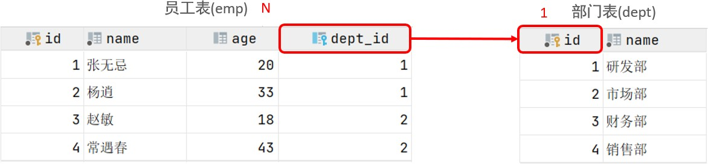

### 1.2、多对多

案例：学生 与 课程的关系

关系：一个学生可以选修多门课程，一门课程也可以供多个学生选择

实现：建立第三张中间表，中间表至少包含两个外键，分别关联两方主键

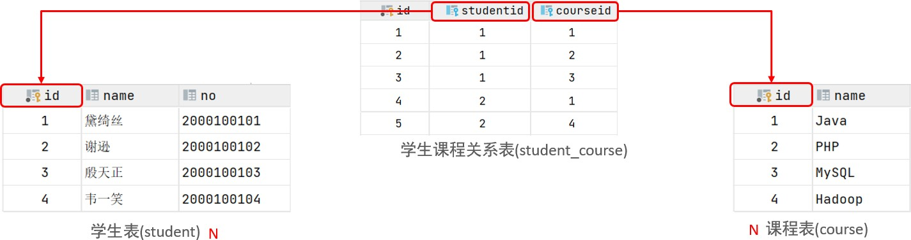

对应的 SQL 脚本：

```mysql
create table student(
    id int auto_increment primary key comment '主键ID',
    name varchar(10) comment '姓名',
    no varchar(10) comment '学号'
) comment '学生表';

insert into student values(null, '黛绮丝', '2000100101'), 
(null, '谢逊', '2000100102'), 
(null, '殷天正', '2000100103'), 
(null, '韦一笑', '2000100104');

create table course(
    id int auto_increment primary key comment '主键ID',
    name varchar(10) comment '课程名称'
) comment '课程表';

insert into course values (null, 'Java'), (null, 'PHP'), (null, 'MySQL'), (null, 'Hadoop');

create table student_course(
    id int auto_increment comment '主键' primary key,
    studentid int not null comment '学生ID',
    courseid int not null comment '课程ID',
    constraint fk_courseid foreign key (courseid) references course (id),
    constraint fk_studentid foreign key (studentid) references student (id)
) comment '学生课程中间表';

insert into student_course values(null, 1, 1), 
(null, 1, 2), (null, 1, 3), (null, 2, 2), 
(null, 2, 3), (null, 3, 4);
```

### 1.3、一对一

案例：用户 与 用户详情的关系

关系：一对一关系，多用于单表拆分，将一张表的基础字段放在一张表中，其他详情字段放在另一张表中，以提升操作效率

实现：在任意一方加入外键，关联另外一方的主键，并且设置外键为唯一的（UNIQUE）

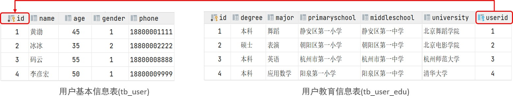

对应的 SQL 脚本：

```mysql
create table tb_user(
    id int auto_increment primary key comment '主键ID',
    name varchar(10) comment '姓名',
    age int comment '年龄',
    gender char(1) comment '1： 男 , 2： 女',
    phone char(11) comment '手机号'
) comment '用户基本信息表';

create table tb_user_edu(
    id int auto_increment primary key comment '主键ID',
    degree varchar(20) comment '学历',
    major varchar(50) comment '专业',
    primaryschool varchar(50) comment '小学',
    middleschool varchar(50) comment '中学',
    university varchar(50) comment '大学',
    userid int unique comment '用户ID',
    constraint fk_userid foreign key (userid) references tb_user(id)
) comment '用户教育信息表';

insert into tb_user(id, name, age, gender, phone) values(null, '黄渤', 45, '1', '18800001111'),
(null, '冰冰', 35, '2', '18800002222'),
(null, '码云', 55, '1', '18800008888'),
(null, '李彦宏', 50, '1', '18800009999');

insert into tb_user_edu(id, degree, major, primaryschool, middleschool, university, userid) 
values(null, '本科', '舞蹈', '静安区第一小学', '静安区第一中学', '北京舞蹈学院', 1),
(null, '硕士', '表演', '朝阳区第一小学', '朝阳区第一中学', '北京电影学院', 2),
(null, '本科', '英语', '杭州市第一小学', '杭州市第一中学', '杭州师范大学', 3),
(null, '本科', '应用数学', '阳泉第一小学', '阳泉区第一中学', '清华大学', 4);
```

## 2、多表查询概述

### 2.1、数据准备

1）删除之前 emp 和 dept 表的测试数据

2）执行如下脚本，创建 emp 表与 dept 表并插入测试数据

```mysql
-- 创建dept表，并插入数据
create table dept(
    id int auto_increment comment 'ID' primary key,
    name varchar(50) not null comment '部门名称'
) comment '部门表';

INSERT INTO dept (id, name) VALUES (1, '研发部'), (2, '市场部'), (3, '财务部'), 
(4, '销售部'), (5, '总经办'), (6, '人事部');

-- 创建emp表，并插入数据
create table emp(
    id int auto_increment comment 'ID' primary key,
    name varchar(50) not null comment '姓名',
    age int comment '年龄',
    job varchar(20) comment '职位',
    salary int comment '薪资',
    entrydate date comment '入职时间',
    managerid int comment '直属领导ID',
    dept_id int comment '部门ID'
) comment '员工表';

-- 添加外键
alter table emp add constraint fk_emp_dept_id foreign key (dept_id) references dept(id);

INSERT INTO emp (id, name, age, job,salary, entrydate, managerid, dept_id) VALUES
(1, '金庸', 66, '总裁', 20000, '2000-01-01', null, 5),
(2, '张无忌', 20, '项目经理', 12500, '2005-12-05', 1, 1),
(3, '杨逍', 33, '开发', 8400, '2000-11-03', 2, 1),
(4, '韦一笑', 48, '开发', 11000, '2002-02-05', 2, 1),
(5, '常遇春', 43, '开发', 10500, '2004-09-07', 3, 1),
(6, '小昭', 19, '程序员鼓励师', 6600, '2004-10-12', 2, 1),
(7, '灭绝', 60, '财务总监', 8500, '2002-09-12', 1, 3),
(8, '周芷若', 19, '会计', 48000, '2006-06-02', 7, 3),
(9, '丁敏君', 23, '出纳', 5250, '2009-05-13', 7, 3),
(10, '赵敏', 20, '市场部总监', 12500, '2004-10-12', 1, 2),
(11, '鹿杖客', 56, '职员', 3750, '2006-10-03', 10, 2),
(12, '鹤笔翁', 19, '职员', 3750, '2007-05-09', 10, 2),
(13, '方东白', 19, '职员', 5500, '2009-02-12', 10, 2),
(14, '张三丰', 88, '销售总监', 14000, '2004-10-12', 1, 4),
(15, '俞莲舟', 38, '销售', 4600, '2004-10-12', 14, 4),
(16, '宋远桥', 40, '销售', 4600, '2004-10-12', 14, 4),
(17, '陈友谅', 42, null, 2000, '2011-10-12', 1, null);
```

dept 表共 6 条记录，emp 表共 17 条记录。

### 2.2、概述

多表查询就是指从多张表中查询数据。

原来查询单表数据，执行的 SQL 形式为：`select * from emp;`

那么我们要执行多表查询，就只需要使用逗号分隔多张表即可，如：`select * from emp, dept;`

具体的执行结果如下：

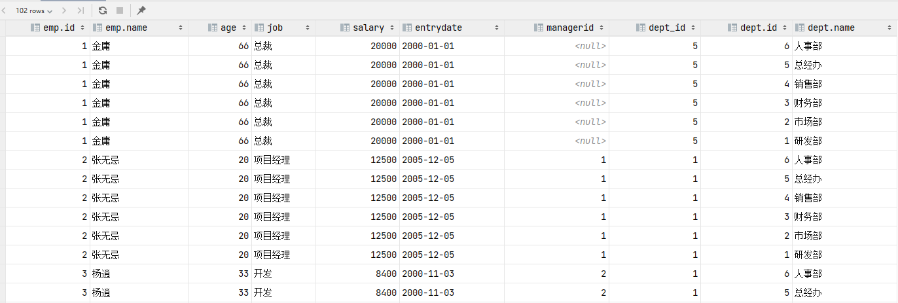

此时，我们看到查询结果中包含了大量的结果集，总共 102 条记录，而这其实就是员工表 emp 所有的记录（17 条）与部门表 dept 所有记录（6 条）的所有组合情况，这种现象称之为笛卡尔积。接下来，就来简单介绍下笛卡尔积。

笛卡尔积：笛卡尔乘积是指在数学中，两个集合 A 集合和 B 集合的所有组合情况。

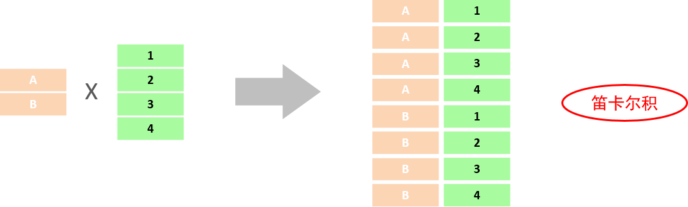

而在多表查询中，我们需要消除无效的笛卡尔积，只保留两张表关联部分的数据。

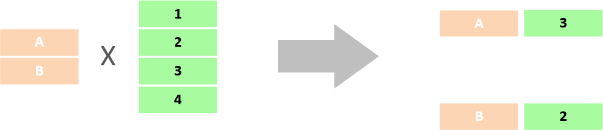

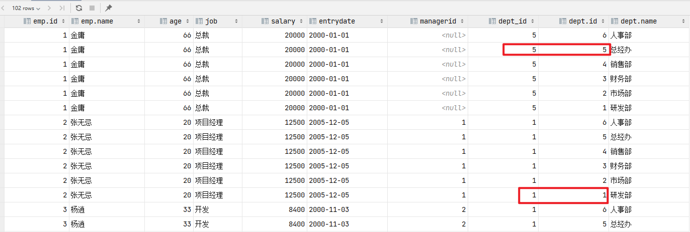

在 SQL 语句中，如何去除无效的笛卡尔积呢？ 我们可以给多表查询加上连接查询的条件即可。

`select * from emp, dept where emp.dept_id = dept.id;`

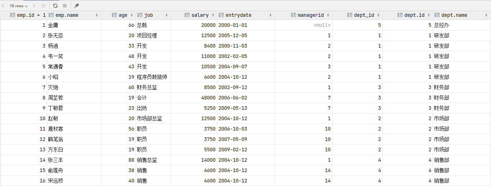

而由于 id 为 17 的员工，没有 dept_id 字段值，所以在多表查询时，根据连接查询的条件并没有查询到。

### 2.3、分类

* 连接查询
  * 内连接：相当于查询 A、B 交集部分数据
  * 外连接：
    * 左外连接：查询左表所有数据，以及两张表交集部分数据
    * 右外连接：查询右表所有数据，以及两张表交集部分数据
  * 自连接：当前表与自身的连接查询，自连接必须使用表别名
* 子查询

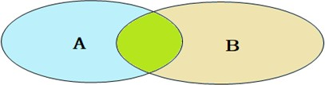

## 3、内连接

内连接查询的是两张表交集部分的数据。（也就是绿色部分的数据）

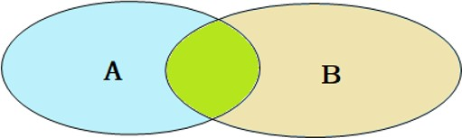

内连接的语法分为两种：隐式内连接、显式内连接。先来学习一下具体的语法结构。

1、隐式内连接

语法：`SELECT 字段列表 FROM 表1 , 表2 WHERE 条件 ... ;`

2、显式内连接

语法：`SELECT 字段列表 FROM 表1 [INNER] JOIN 表2 ON 连接条件 ... ;`

案例：

1）查询每一个员工的姓名，及关联的部门的名称（隐式内连接实现）

表结构：emp，dept

连接条件：emp.dept_id = dept.id

```mysql
select emp.name, dept.name from emp, dept where emp.dept_id = dept.id;

-- 为每一张表起别名,简化 SQL 编写
select e.name, d.name from emp e, dept d where e.dept_id = d.id;
```

2）查询每一个员工的姓名，及关联的部门的名称（显式内连接实现）

```mysql
select e.name, d.name from emp e inner join dept d on e.dept_id = d.id;

-- inner可省略
select e.name, d.name from emp e join dept d on e.dept_id = d.id;
```

给表起别名的两种方式：

* `tablea as 别名1, tableb as 别名2;`
* `tablea 别名1 , tableb 别名2;`

> 注意事项：
>
> 一旦为表起了别名，就不能再使用表名来指定对应的字段了，此时只能够使用别名来指定字段。

## 4、外连接

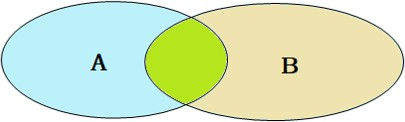

外连接分为两种，分别是：左外连接 和 右外连接。具体的语法结构为：

1、左外连接

语法：`SELECT 字段列表 FROM 表1 LEFT [OUTER] JOIN 表2 ON 条件 ... ;`

左外连接相当于查询表 1（左表）的所有数据，当然也包含表 1 和表 2 交集部分的数据。

2、右外连接

语法：`SELECT 字段列表 FROM 表1 RIGHT [OUTER] JOIN 表2 ON 条件 ... ;`

右外连接相当于查询表 2（右表）的所有数据，当然也包含表 1 和表 2 交集部分的数据。

案例：

1）查询 emp 表的所有数据和对应的部门信息（左外连接）

由于需求中提到，要查询 emp 的所有数据，所以是不能内连接查询的，需要考虑使用外连接查询。

表结构：emp，dept

连接条件：emp.dept\_id = dept.id

```mysql
select e.*, d.name from emp e left outer join dept d on e.dept_id = d.id;

-- outer可以省略
select e.*, d.name from emp e left join dept d on e.dept_id = d.id;
```

2）查询 dept 表的所有数据和对应的员工信息（右外连接）

由于需求中提到，要查询 dept 表的所有数据，所以是不能内连接查询的，需要考虑使用外连接查询。

```mysql
select d.*, e.* from emp e right outer join dept d on e.dept_id = d.id;

-- 右外连接可以转换为左外连接
select d.*, e.* from dept d left outer join emp e on e.dept_id = d.id;
```

> 注意事项：
>
> 左外连接和右外连接是可以相互替换的，只需要调整在连接查询时 SQL 中表结构的先后顺序就可以了。而我们在日常开发使用时，更偏向于左外连接。

## 5、自连接

### 5.1、自连接查询

自连接查询，顾名思义，就是自己连接自己，也就是把一张表连接查询多次。我们先来学习一下自连接的查询语法：

`SELECT 字段列表 FROM 表A 别名A JOIN 表A 别名B ON 条件 ... ;`

而对于自连接查询，可以是内连接查询，也可以是外连接查询。

案例：

1）查询员工 及其 所属领导的名字

```mysql
select a.name '员工', b.name '领导' from emp a, emp b where a.managerid = b.id;
```

2）查询所有员工 emp 及其领导的名字 emp，如果员工没有领导，也需要查询出来

```mysql
select a.name '员工', b.name '领导' from emp a left join emp b on a.managerid = b.id;
```

> 注意事项：
>
> 在自连接查询中，必须要为表起别名，要不然我们不清楚所指定的条件、返回的字段，到底是哪一张表的字段。

### 5.2、联合查询

对于 union 查询，就是把多次查询的结果合并起来，形成一个新的查询结果集。

```mysql
SELECT 字段列表 FROM 表A ...
UNION [ALL]
SELECT 字段列表 FROM 表B;
```

* 对于联合查询的多张表的列数必须保持一致，字段类型也需要保持一致。
* `union all` 会将全部的数据直接合并在一起，`union` 会对合并之后的数据去重。

案例：将薪资低于 5000 的员工，和 年龄大于 50 岁的员工全部查询出来

对于这个需求，我们可以直接使用多条件查询，使用逻辑运算符 or 连接即可。另外也可以通过 union / union all 来联合查询

union all 查询出来的结果，仅仅进行简单的合并，并未去重。

```mysql
select * from emp where salary < 5000
union all
select * from emp where age > 50;
```

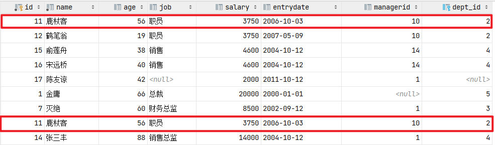

union 联合查询，会对查询出来的结果进行去重处理。

```mysql
select * from emp where salary < 5000
union
select * from emp where age > 50;
```

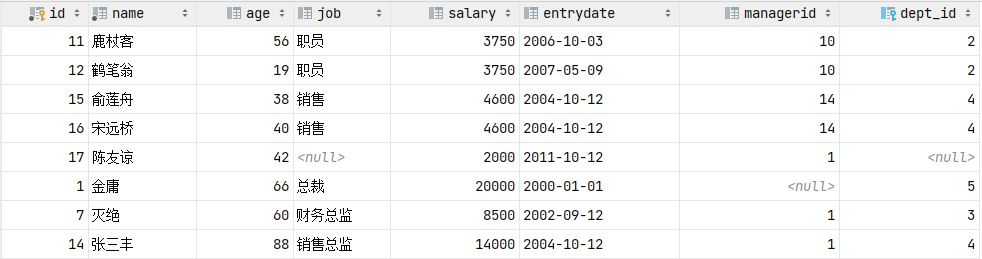

> 注意：
>
> 如果多条查询语句查询出来的结果，字段数量不一致，在进行 union / union all 联合查询时，将会报错。

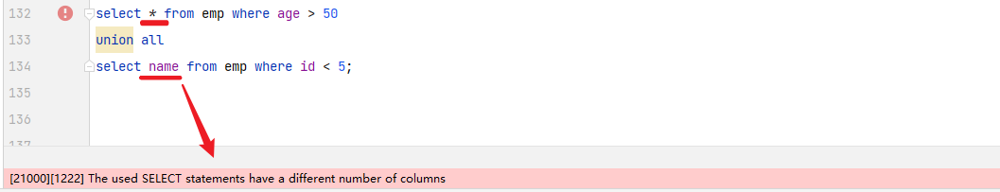

## 6、子查询

### 6.1、概述

1、概念

SQL 语句中嵌套 SELECT 语句，称为嵌套查询，又称子查询。

`SELECT * FROM t1 WHERE column1 = (SELECT column1 FROM t2);`

子查询外部的语句可以是 INSERT / UPDATE / DELETE / SELECT 的任何一个。

2、分类

根据子查询结果不同，分为：

* 标量子查询（子查询结果为单个值）
* 列子查询（子查询结果为一列）
* 行子查询（子查询结果为一行）
* 表子查询（子查询结果为多行多列）

根据子查询位置，分为：

* WHERE 之后
* FROM 之后
* SELECT 之后

### 6.2、标量子查询

子查询返回的结果是单个值（数字、字符串、日期等），最简单的形式，这种子查询称为标量子查询。

常用的操作符：`= <> > >= < <=`

案例：

1、查询 "销售部" 的所有员工信息

完成这个需求时，我们可以将需求分解为两步：

（1）查询 "销售部" 部门 ID

```mysql
select id from dept where name = '销售部';
```

（2）根据 "销售部" 部门 ID 查询员工信息

```mysql
select * from emp where dept_id = (select id from dept where name = '销售部');
```

2、查询在 "方东白" 入职之后的员工信息

完成这个需求时，我们可以将需求分解为两步：

（1）查询 方东白 的入职日期

```mysql
select entrydate from emp where name = '方东白';
```

（2）查询指定入职日期之后入职的员工信息

```mysql
select * from emp where entrydate > (select entrydate from emp where name = '方东白');
```

### 6.3、列子查询

子查询返回的结果是一列（可以是多行），这种子查询称为列子查询。

常用的操作符：`IN、NOT IN、ANY、SOME、ALL`

| **操作符** | **描述**                                    |
| ---------- | ------------------------------------------- |
| IN         | 在指定的集合范围之内，多选一                |
| NOT IN     | 不在指定的集合范围之内                      |
| ANY        | 子查询返回列表中，有任意一个满足即可        |
| SOME       | 与 ANY 等同，使用 SOME 的地方都可以使用 ANY |
| ALL        | 子查询返回列表的所有值都必须满足            |

案例：

1、查询 "销售部" 和 "市场部" 的所有员工信息

分解为以下两步：

（1）查询 "销售部" 和 "市场部" 的部门 ID

```mysql
select id from dept where name = '销售部' or name = '市场部';
```

（2）根据部门 ID，查询员工信息

```mysql
select * from emp where dept_id in (select id from dept where name = '销售部' or name = '市场部');
```

2、查询比 财务部 所有人工资都高的员工信息

分解为以下两步：

（1）查询所有 财务部 人员工资

```mysql
select id from dept where name = '财务部';

select salary from emp where dept_id = (select id from dept where name = '财务部');
```

（2）比 财务部 所有人工资都高的员工信息

```mysql
select * from emp where salary > all 
(select salary from emp where dept_id = (select id from dept where name = '财务部'));
```

3、查询比研发部其中任意一人工资高的员工信息

分解为以下两步：

（1）查询研发部所有人工资

```mysql
select salary from emp where dept_id = (select id from dept where name = '研发部');
```

（2）比研发部其中任意一人工资高的员工信息

```mysql
select * from emp where salary > any 
(select salary from emp where dept_id = (select id from dept where name = '研发部'));
```

### 6.4、行子查询

子查询返回的结果是一行（可以是多列），这种子查询称为行子查询。

常用的操作符：`=、<>、IN、NOT IN`

案例：

查询与 "张无忌" 的薪资及直属领导相同的员工信息

这个需求同样可以拆解为两步进行：

（1）查询 "张无忌" 的薪资及直属领导

```mysql
select salary, managerid from emp where name = '张无忌';
```

（2）查询与 "张无忌" 的薪资及直属领导相同的员工信息

```mysql
select * from emp where (salary, managerid) = (select salary, managerid from emp where name = '张无忌');
```

### 6.5、表子查询

子查询返回的结果是多行多列，这种子查询称为表子查询。

常用的操作符：`IN`

案例：

1、查询与 "鹿杖客"，"宋远桥" 的职位和薪资相同的员工信息

分解为两步执行：

（1）查询 "鹿杖客"，"宋远桥" 的职位和薪资

```mysql
select job, salary from emp where name = '鹿杖客' or name = '宋远桥';
```

（2）查询与 "鹿杖客"，"宋远桥" 的职位和薪资相同的员工信息

```mysql
select * from emp where (job, salary) in (select job, salary from emp where name = '鹿杖客' or name = '宋远桥');
```

2、查询入职日期是 "2006-01-01" 之后的员工信息，及其部门信息

分解为两步执行：

（1）入职日期是 "2006-01-01" 之后的员工信息

```mysql
select * from emp where entrydate > '2006-01-01';
```

（2）查询这部分员工，对应的部门信息

```mysql
select e.*, d.* from (select * from emp where entrydate > '2006-01-01') e left join dept d on e.dept_id = d.id;
```

## 7、多表查询案例

数据环境准备：

```mysql
create table salgrade(
    grade int,
    losal int,
    hisal int
) comment '薪资等级表';

insert into salgrade values (1, 0, 3000);
insert into salgrade values (2, 3001, 5000);
insert into salgrade values (3, 5001, 8000);
insert into salgrade values (4, 8001, 10000);
insert into salgrade values (5, 10001, 15000);
insert into salgrade values (6, 15001, 20000);
insert into salgrade values (7, 20001, 25000);
insert into salgrade values (8, 25001, 30000);
```

在这个案例中，我们主要运用上面所讲解的多表查询的语法，完成以下的 12 个需求即可，而这里主要涉及到的表就三张：emp 员工表、dept 部门表、salgrade 薪资等级表。

1、查询员工的姓名、年龄、职位、部门信息（隐式内连接）

表：emp、dept

连接条件：``emp.dept_id = dept.id`

```mysql
select e.name, e.age, e.job, d.name from emp e, dept d where e.dept_id = d.id;
```

2、查询年龄小于 30 岁的员工的姓名、年龄、职位、部门信息（显式内连接）

表：emp、dept

连接条件：`emp.dept_id = dept.id`

```mysql
select e.name, e.age, e.job, d.name from emp e inner join dept d on e.dept_id = d.id where e.age < 30;
```

3、查询拥有员工的部门 ID、部门名称

表：emp、dept

连接条件：`emp.dept_id = dept.id`

找两张表的交集部分即可，使用内连接

```mysql
select distinct d.id, d.name from emp e, dept d where e.dept_id = d.id;
```

4、查询所有年龄大于 40 岁的员工，及其归属的部门名称；如果员工没有分配部门，也需要展示出来（外连接）

表：emp、dept

连接条件：`emp.dept_id = dept.id`

```mysql
select e.*, d.name from emp e left join dept d on e.dept_id = d.id where e.age > 40;
```

5、查询所有员工的工资等级

表：emp、salgrade

连接条件：`emp.salary >= salgrade.losal and emp.salary <= salgrade.hisal`

隐式内连接

```mysql
-- 方式一
select e.*, s.grade, s.losal, s.hisal from emp e, salgrade s where e.salary >= s.losal and e.salary <= s.hisal;
-- 方式二
select e.*, s.grade, s.losal, s.hisal from emp e, salgrade s where e.salary between s.losal and s.hisal;
```

6、查询 "研发部" 所有员工的信息及 工资等级

表：emp、salgrade、dept

连接条件：`emp.salary between salgrade.losal and salgrade.hisal`，`emp.dept_id = dept.id`

查询条件：`dept.name = '研发部'`

隐式内连接

```mysql
select e.* , s.grade 
from emp e, 
     dept d, 
     salgrade s 
where e.dept_id = d.id 
  and (e.salary between s.losal and s.hisal) 
  and d.name = '研发部';
```

7、查询 "研发部" 员工的平均工资

表：emp、dept

连接条件：`emp.dept_id = dept.id`

```mysql
select avg(e.salary) from emp e, dept d where e.dept_id = d.id and d.name = '研发部';
```

8、查询工资比 "灭绝" 高的员工信息

（1）查询 "灭绝" 的薪资

```mysql
select salary from emp where name = '灭绝';
```

（2）查询比她工资高的员工数据

```mysql
select * from emp where salary > (select salary from emp where name = '灭绝');
```

9、查询比平均薪资高的员工信息

（1）查询员工的平均薪资

```mysql
select avg(salary) from emp;
```

（2）查询比平均薪资高的员工信息

```mysql
select * from emp where salary > (select avg(salary) from emp);
```

10、查询低于本部门平均工资的员工信息

（1）查询指定部门平均薪资

```mysql
select avg(e1.salary) from emp e1 where e1.dept_id = 1;
select avg(e1.salary) from emp e1 where e1.dept_id = 2;
```

（2）查询低于本部门平均工资的员工信息

```mysql
select * from emp e2 where e2.salary < (select avg(e1.salary) from emp e1 where e1.dept_id = e2.dept_id);

-- 也可加上平均薪资来验证
select *, (select avg(e1.salary) from emp e1 where e1.dept_id = e2.dept_id) '平均薪资' 
from emp e2 
where e2.salary < (select avg(e1.salary) from emp e1 where e1.dept_id = e2.dept_id);
```

11、查询所有的部门信息，并统计部门的员工人数

```mysql
select d.id, d.name, (select count(*) from emp e where e.dept_id = d.id) '人数' from dept d;
```

12、查询所有学生的选课情况，展示出学生名称、学号、课程名称

表：student、course、student\_course

连接条件：`student.id = student_course.studentid`，`course.id = student_course.courseid`

```mysql
select s.name, s.no, c.name from student s, student_course sc, course c where s.id = sc.studentid and sc.courseid = c.id;
```

备注：以上需求的实现方式可能会很多，SQL 写法也有很多，只要能满足我们的需求，查询出符合条件的记录即可。

# 二、事务

## 1、事务简介

事务 是一组操作的集合，它是一个不可分割的工作单位，事务会把所有的操作作为一个整体一起向系统提交或撤销操作请求，即这些操作要么同时成功，要么同时失败。

就比如：张三给李四转账 1000 块钱，张三银行账户的钱减少 1000，而李四银行账户的钱要增加 1000。这一组操作就必须在一个事务的范围内，要么都成功，要么都失败。


正常情况：转账这个操作，需要分为以下这么三步来完成，三步完成之后，张三减少 1000，而李四增加 1000，转账成功：

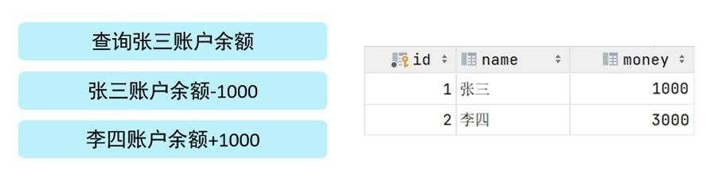

异常情况：转账这个操作，也是分为以下这么三步来完成，但在执行第三步时报错了，这样就导致张三减少 1000 块钱，而李四的金额没变，这样就造成了数据的不一致，就出现问题了。

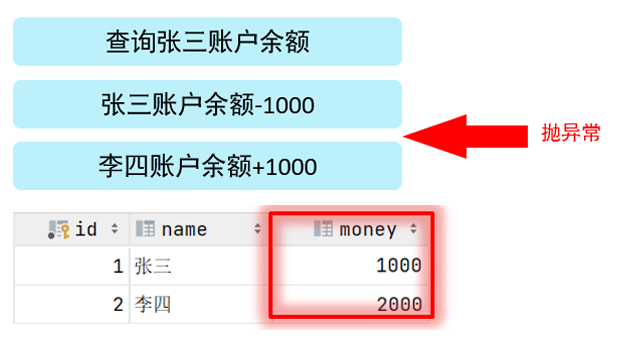

为了解决上述的问题，就需要通过数据的事务来完成，我们只需要在业务逻辑执行之前开启事务，执行完毕后提交事务。如果执行过程中报错，则回滚事务，把数据恢复到事务开始之前的状态。

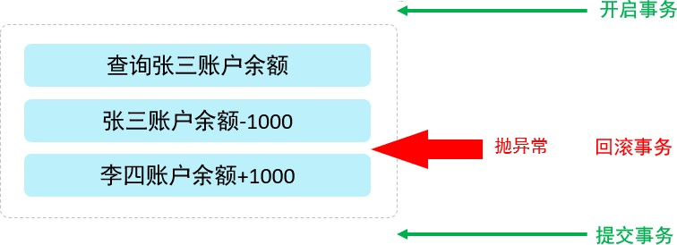

> 注意：默认 MySQL 的事务是自动提交的，也就是说，当执行完一条 DML 语句时，MySQL 会立即隐式的提交事务。

## 2、事务操作

数据准备：

```mysql
drop table if exists account;

create table account(
    id int primary key AUTO_INCREMENT comment 'ID',
    name varchar(10) comment '姓名',
    money double(10,2) comment '余额'
) comment '账户表';

insert into account(name, money) VALUES ('张三', 2000), ('李四', 2000);
```

### 2.1、未控制事务

1、测试正常情况

```mysql
-- 1.查询张三余额
select * from account where name = '张三';
-- 2. 张三的余额减少1000
update account set money = money - 1000 where name = '张三';
-- 3. 李四的余额增加1000
update account set money = money + 1000 where name = '李四';
```

测试完毕之后检查数据的状态，可以看到数据操作前后是一致的。

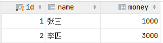

2、测试异常情况

```mysql
-- 1.查询张三余额
select * from account where name = '张三';
-- 2.张三的余额减少1000
update account set money = money - 1000 where name = '张三';
出错了....
-- 3.李四的余额增加1000
update account set money = money + 1000 where name = '李四';
```

我们把数据都恢复到 2000，然后再一次性执行上述的 SQL 语句（“出错了....” 这句话不符合 SQL 语法，执行就会报错），检查最终的数据情况，发现数据在操作前后不一致了。

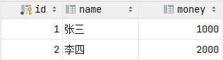

### 2.2、控制事务一

1、查看 / 设置事务提交方式

```mysql
SELECT @@autocommit;

-- 为1是自动提交，为0是手动提交
SET @@autocommit = 0;
```

2、提交事务

`COMMIT;`

3、回滚事务

`ROLLBACK;`

> 注意：上述的这种方式，我们是修改了事务的自动提交行为，把默认的自动提交修改为了手动提交，此时我们执行的 DML 语句都不会提交，需要手动的执行 commit 进行提交。

### 2.3、控制事务二

1、开启事务

`START TRANSACTION;` 或 `BEGIN;`

2、提交事务

`COMMIT;`

3、回滚事务

`ROLLBACK;`

转账案例：

```mysql
-- 开启事务
start transaction

-- 1.查询张三余额
select * from account where name = '张三';

-- 2.张三的余额减少1000
update account set money = money - 1000 where name = '张三';

-- 3.李四的余额增加1000
update account set money = money + 1000 where name = '李四';

-- 如果正常执行完毕, 则提交事务
commit;

-- 如果执行过程中报错, 则回滚事务
-- rollback;
```

## 3、事务四大特性

* 原子性（Atomicity）：事务是不可分割的最小操作单元，要么全部成功，要么全部失败。
* 一致性（Consistency）：事务完成时，必须使所有的数据都保持一致状态。
* 隔离性（Isolation）：数据库系统提供的隔离机制，保证事务在不受外部并发操作影响的独立环境下运行。
* 持久性（Durability）：事务一旦提交或回滚，它对数据库中的数据的改变就是永久的。

上述就是事务的四大特性，简称 ACID。

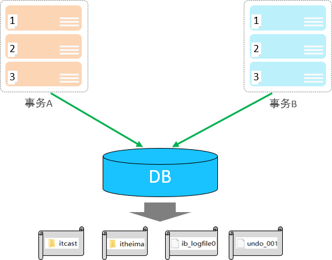

## 4、并发事务问题

1、**赃读**

一个事务读到另外一个事务还没有提交的数据。

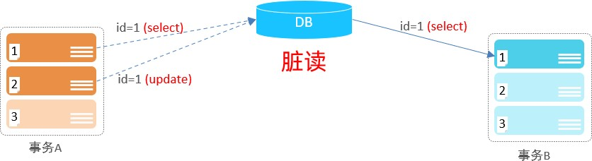

比如 B 读取到了 A 未提交的数据。

2、**不可重复读**

一个事务先后读取同一条记录，但两次读取的数据不同，称之为不可重复读。

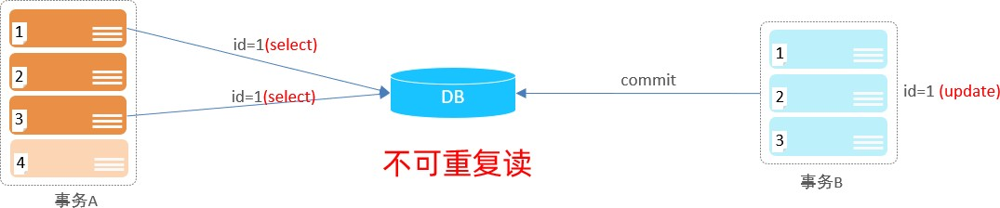

事务 A 两次读取同一条记录，但是读取到的数据却是不一样的。

3、**幻读**

一个事务按照条件查询数据时，没有对应的数据行，但是在插入数据时，又发现这行数据已经存在，好像出现了 "幻影"。

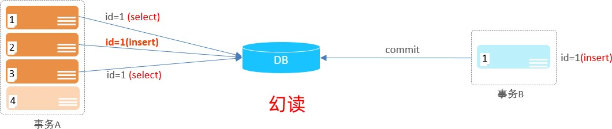

事务 A 执行操作 1 发现 id = 1 的数据不存在，然后事务 B 执行 insert 操作并提交了事务，事务 A 再执行操作 2 想要插入 id = 1 的数据结果失败，于是事务 A 执行操作 3 再次查询 id = 1 的数据，结果还是没查到。因为已经解决了不可重复读的问题，事务 A 两次查询到的结果是一样的都没查到，但插入又不成功，好像出现了幻影。

## 5、事务隔离级别

为了解决并发事务所引发的问题，在数据库中引入了事务隔离级别。主要有以下几种：

| 隔离级别                    | 脏读 | 不可重复读 | 幻读 |
| --------------------------- | :--: | :--------: | :--: |
| **Read uncommitted**        |  √   |     √      |  √   |
| **Read committed**          |  ×   |     √      |  √   |
| **Repeatable Read（默认）** |  ×   |     ×      |  √   |
| **Serializable**            |  ×   |     ×      |  ×   |

1、查看事务隔离级别

`SELECT @@TRANSACTION_ISOLATION;`

2、设置事务隔离级别

`SET [SESSION | GLOBAL] TRANSACTION ISOLATION LEVEL {READ UNCOMMITTED | READ COMMITTED | REPEATABLE READ | SERIALIZABLE}`

> 注意：事务隔离级别越高，数据越安全，但是性能越低。