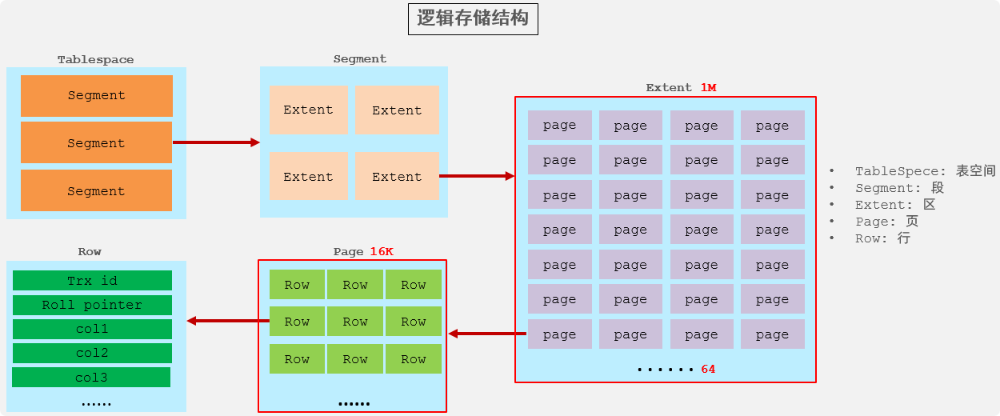

# 一、存储引擎

## 1、MySQL 体系结构


1、连接层

最上层是一些客户端和链接服务，包含本地 sock 通信和大多数基于客户端 / 服务端工具实现的类似于 TCP / IP 的通信。主要完成一些类似于连接处理、授权认证、及相关的安全方案。在该层上引入了线程池的概念，为通过认证安全接入的客户端提供线程。同样在该层上可以实现基于 SSL 的安全链接。服务器也会为安全接入的每个客户端验证它所具有的操作权限。

2、服务层

第二层架构主要完成大多数的核心服务功能，如 SQL 接口，并完成缓存的查询、SQL 的分析和优化、部分内置函数的执行。所有跨存储引擎的功能也在这一层实现，如过程、函数等。在该层，服务器会解析查询并创建相应的内部解析树，并对其完成相应的优化如确定表的查询的顺序，是否利用索引等，最后生成相应的执行操作。如果是 `select` 语句，服务器还会查询内部的缓存，如果缓存空间足够大，这样在解决大量读操作的环境中能够很好的提升系统的性能。

3、引擎层

存储引擎层， 存储引擎真正的负责了 MySQL 中数据的存储和提取，服务器通过 API 和存储引擎进行通信。不同的存储引擎具有不同的功能，这样我们可以根据自己的需要，来选取合适的存储引擎。**数据库中的索引是在存储引擎层实现的**。

4、存储层

数据存储层， 主要是将数据（如：redolog、undolog、数据、索引、二进制日志、错误日志、查询日志、慢查询日志等）存储在文件系统之上，并完成与存储引擎的交互。

和其他数据库相比，MySQL 有点与众不同，它的架构可以在多种不同场景中应用并发挥良好作用。主要体现在存储引擎上，插件式的存储引擎架构，将查询处理和其他的系统任务以及数据的存储提取分离。这种架构可以根据业务的需求和实际需要选择合适的存储引擎。

## 2、存储引擎介绍


大家可能没有听说过存储引擎，但是一定听过引擎这个词，引擎就是发动机，是一个机器的核心组件。比如，对于舰载机、直升机、火箭来说，他们都有各自的引擎，是他们最为核心的组件。而我们在选择引擎的时候，需要在合适的场景，选择合适的存储引擎，就像在直升机上，我们不能选择舰载机的引擎一样。

而对于存储引擎，也是一样，它是 MySQL 数据库的核心，我们也需要在合适的场景选择合适的存储引擎。接下来就来介绍一下存储引擎。

存储引擎就是存储数据、建立索引、更新 / 查询数据等技术的实现方式。存储引擎是基于表的，而不是基于库的，所以存储引擎也可被称为表类型。我们可以在创建表的时候，来指定选择的存储引擎，如果没有指定将自动选择默认的存储引擎。

1、建表时指定存储引擎

```mysql
CREATE TABLE 表名(
    字段1 字段1类型 [COMMENT 字段1注释],
    ......
    字段n 字段n类型 [COMMENT 字段n注释]
) ENGINE = INNODB [COMMENT 表注释];
```

2、查询当前数据库支持的存储引擎

`show engines;`

示例演示：

（1）查询建表语句———默认存储引擎：InnoDB

```mysql
show create table account;
```

我们可以看到，创建表时，即使我们没有指定存储疫情，数据库也会自动选择默认的存储引擎。


（2）查询当前数据库支持的存储引擎

```mysql
show engines;
```


（3）创建表 my\_myisam，并指定 MyISAM 存储引擎

```mysql
create table my_myisam(
    id int,
    name varchar(10)
) engine = MyISAM;
```

（4）创建表 my\_memory，指定 Memory 存储引擎

```mysql
create table my_memory(
    id int,
    name varchar(10)
) engine = Memory;
```

## 3、存储引擎特点

上面我们介绍了什么是存储引擎，以及如何在建表时如何指定存储引擎，接下来我们就来介绍下来上面重点提到的三种存储引擎：InnoDB、MyISAM、Memory 的特点。

### 3.1、InnoDB

1、介绍

InnoDB 是一种兼顾高可靠性和高性能的通用存储引擎，在 MySQL 5.5 之后，InnoDB 是默认的 MySQL 存储引擎。

2、特点

* DML 操作遵循 ACID 模型，支持**事务**
* **行级锁**，提高并发访问性能
* 支持**外键** FOREIGN KEY 约束，保证数据的完整性和正确性

3、文件

`xxx.ibd`：xxx 代表的是表名，innoDB 引擎的每张表都会对应这样一个表空间文件，存储该表的表结构（frm—早期的、sdi—新版的）、数据和索引。

参数：`innodb_file_per_table`

```mysql
show variables like 'innodb_file_per_table';
```


如果该参数开启，代表对于 InnoDB 引擎的表，每一张表都对应一个 ibd 文件。 我们直接打开 MySQL 的数据存放目录：C:\ProgramData\MySQL\MySQL Server 8.0\Data，这个目录下有很多文件夹，不同的文件夹代表不同的数据库，我们直接打开 itcast 文件夹。


可以看到里面有很多的 ibd 文件，每一个 ibd 文件就对应一张表，比如：我们有一张表 account，就有这样的一个 account.ibd 文件，而在这个 ibd 文件中不仅存放表结构、数据，还会存放该表对应的索引信息。 而该文件是基于二进制存储的，不能直接基于记事本打开，我们可以使用 MySQL 提供的一个指令 `ibd2sdi`，通过该指令就可以从 ibd 文件中提取 sdi 信息，而 sdi 数据字典信息中就包含该表的表结构。


4、逻辑存储结构



* 表空间：InnoDB 存储引擎逻辑结构的最高层，ibd 文件其实就是表空间文件，在表空间中可以包含多个 Segment 段。
* 段：表空间是由各个段组成的，常见的段有数据段、索引段、回滚段等。InnoDB 中对于段的管理，都是引擎自身完成，不需要人为对其控制，一个段中包含多个区。
* 区：区是表空间的单元结构，每个区的大小为 1M。默认情况下，InnoDB 存储引擎页大小为 16K，即一个区中一共有 64 个连续的页。
* 页：页是组成区的最小单元，**页也是 InnoDB 存储引擎磁盘管理的最小单元**，每个页的大小默认为 16KB。为了保证页的连续性，InnoDB 存储引擎每次从磁盘申请 4~5 个区。
* 行：InnoDB 存储引擎是面向行的，也就是说数据是按行进行存放的，在每一行中除了定义表时所指定的字段以外，还包含两个隐藏字段（后面会详细介绍）。

### 3.2、MyISAM

1、介绍

MyISAM 是 MySQL 早期的默认存储引擎。

2、特点

* 不支持事务，不支持外键
* 支持表锁，不支持行锁
* 访问速度快

3、文件

* `xxx.sdi`：存储表结构信息
* `xxx.MYD`：存储数据
* `xxx.MYI`：存储索引


### 3.3、Memory

1、介绍

Memory 引擎的表数据是存储在内存中的，由于受到硬件问题、或断电问题的影响，只能将这些表作为临时表或缓存使用。

2、特点

* 内存存放

* 支持 hash 索引（默认）

3、文件

`xxx.sdi`：存储表结构信息

### 3.4、区别及特点

| 特点         | InnoDB               | MyISAM | Memory |
| ------------ | -------------------- | ------ | ------ |
| 存储限制     | 64 TB                | 有     | 有     |
| 事务安全     | 支持                 | -      | -      |
| 锁机制       | 行锁                 | 表锁   | 表锁   |
| B+ 树索引    | 支持                 | 支持   | 支持   |
| Hash 索引    | -                    | -      | 支持   |
| 全文索引     | 支持（5.6 版本之后） | 支持   | -      |
| 空间使用     | 高                   | 低     | N / A  |
| 内存使用     | 高                   | 低     | 中等   |
| 批量插入速度 | 低                   | 高     | 高     |
| 支持外键     | 支持                 | -      | -      |

> 面试题：InnoDB 引擎与 MyISAM 引擎的区别？
>
> * InnoDB 引擎支持事务，而 MyISAM 不支持。
> * InnoDB 引擎支持行锁和表锁，而 MyISAM 仅支持表锁，不支持行锁。
> * InnoDB 引擎支持外键，而 MyISAM 是不支持的。
>
> 主要是上述三点区别，当然也可以从索引结构、存储限制等方面，更加深入的回答，具体参考如下官方文档：
>
> <https://dev.mysql.com/doc/refman/8.0/en/innodb-introduction.html>
>
> <https://dev.mysql.com/doc/refman/8.0/en/myisam-storage-engine.html>

## 4、存储引擎选择

在选择存储引擎时，应该根据应用系统的特点选择合适的存储引擎。对于复杂的应用系统，还可以根据实际情况选择多种存储引擎进行组合。

* InnoDB：是 MySQL 的默认存储引擎，支持事务、外键。如果应用对事务的完整性有比较高的要求，在并发条件下要求数据的一致性，数据操作除了插入和查询之外，还包含很多的更新、删除操作，那么 InnoDB 存储引擎是比较合适的选择。

* MyISAM：如果应用是以读操作和插入操作为主，只有很少的更新和删除操作，并且对事务的完整性、并发性要求不是很高，那么选择这个存储引擎是非常合适的。

* MEMORY：将所有数据保存在内存中，访问速度快，通常用于临时表及缓存。MEMORY 的缺陷就是对表的大小有限制，太大的表无法缓存在内存中，而且无法保障数据的安全性。

# 二、MySQL Linux 版安装与卸载

因为在日常的生产环境、测试环境以及开发环境中，绝大部分用的都是 Linux 系统，所以为了模拟真实企业开发中 MySQL 的使用，在讲解接下来的内容时，将使用 Linux 版本的 MySQL。

## 1、准备一台 Linux 服务器

云服务器或者虚拟机都可以；Linux 的版本为 CentOS 7

## 2、下载 Linux 版 MySQL 安装包

下载地址：<https://downloads.mysql.com/archives/community/>

 

## 3、上传 MySQL 安装包

 

## 4、创建目录并解压

```shell
mkdir mysql

tar -xvf mysql-8.0.26-1.el7.x86_64.rpm-bundle.tar -C mysql
```

## 5、安装 MySQL 的安装包

```shell
cd mysql

rpm -ivh mysql-community-common-8.0.26-1.el7.x86_64.rpm 

rpm -ivh mysql-community-client-plugins-8.0.26-1.el7.x86_64.rpm 

rpm -ivh mysql-community-libs-8.0.26-1.el7.x86_64.rpm 

rpm -ivh mysql-community-libs-compat-8.0.26-1.el7.x86_64.rpm

yum install openssl-devel

rpm -ivh mysql-community-devel-8.0.26-1.el7.x86_64.rpm

rpm -ivh mysql-community-client-8.0.26-1.el7.x86_64.rpm

rpm -ivh  mysql-community-server-8.0.26-1.el7.x86_64.rpm
```

## 6、启动 MySQL 服务

```shell
systemctl start mysqld
```

```shell
systemctl restart mysqld
```

```shell
systemctl stop mysqld
```

## 7、查询自动生成的 root 用户密码

```shell
grep 'temporary password' /var/log/mysqld.log
```

命令行执行指令：

```shell
mysql -u root -p
```

然后输入上述查询到的自动生成的密码，完成登录。

## 8、修改 root 用户密码

登录到 MySQL 之后，需要将自动生成的不便记忆的密码修改了，修改成自己熟悉的便于记忆的密码。

```shell
ALTER USER 'root'@'localhost' IDENTIFIED BY '1234';
```

执行上述的 SQL 会报错，原因是因为设置的密码太简单，密码复杂度不够。我们可以设置密码的复杂度为简单类型，密码长度为 4。

```shell
set global validate_password.policy = 0;
set global validate_password.length = 4;
```

降低密码的校验规则之后，再次执行上述修改密码的指令。

## 9、创建用户

默认的 root 用户只能被当前节点 localhost 访问，是无法远程访问的，我们还需要创建一个 root 账户，允许用户远程访问

```shell
create user 'root'@'%' IDENTIFIED WITH mysql_native_password BY '1234';
```

若执行报错：ERROR 1524 (HY000): Plugin 'mysql_native_password' is not loaded，则把 mysql_native_password 改成 caching_sha2_password，因为从 MySQL 8.0 开始，默认的身份验证插件变更为 caching_sha2_password，而不再是 mysql_native_password。

## 10、给 root 用户分配权限

```shell
grant all on *.* to 'root'@'%';
```

## 11、重新连接 MySQL

```shell
mysql -u root -p
```

然后输入密码

最后通过 DataGrip 远程连接 MySQL 即可

## 12、卸载 MySQL

1、停止 MySQL 服务

```shell
systemctl stop mysqld
```

2、查询 MySQL 的安装文件

```shell
rpm -qa | grep -i mysql
```

 

3、卸载上述查询出来的所有的 MySQL 安装包

```shell
rpm -e mysql-community-client-plugins-8.0.26-1.el7.x86_64 --nodeps

rpm -e mysql-community-server-8.0.26-1.el7.x86_64 --nodeps

rpm -e mysql-community-common-8.0.26-1.el7.x86_64 --nodeps

rpm -e mysql-community-libs-8.0.26-1.el7.x86_64 --nodeps

rpm -e mysql-community-client-8.0.26-1.el7.x86_64 --nodeps

rpm -e mysql-community-libs-compat-8.0.26-1.el7.x86_64 --nodeps
```

4、删除 MySQL 的数据存放目录

```shell
rm -rf /var/lib/mysql/
```

5、删除 MySQL 的配置文件备份

```shell
rm -rf /etc/my.cnf.rpmsave
```