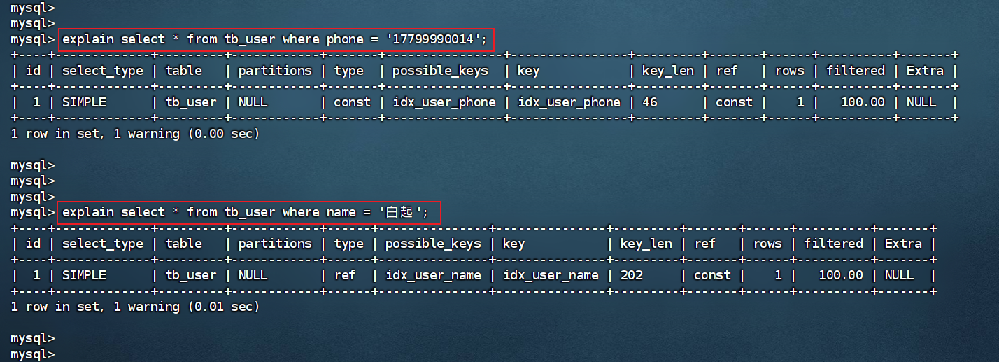

# 1、索引概述

## 1.1、介绍

索引（index）是帮助 MySQL 高效获取数据的数据结构（有序）。在数据之外，数据库系统还维护着满足特定查找算法的数据结构，这些数据结构以某种方式引用（指向）数据， 这样就可以在这些数据结构上实现高级查找算法，这种数据结构就是索引。


一提到数据结构，大家都会有所担心，担心自己不能理解，跟不上节奏。不过在这里大家完全不用担心，我们后面在讲解时，会详细介绍。

## 1.2、演示

表结构及其数据如下：


假如我们要执行的 SQL 语句为：`select * from user where age = 45;`

1、无索引情况


在无索引情况下，就需要从第一行开始扫描，一直扫描到最后一行，我们称之为 全表扫描，性能很低。

2、有索引情况

如果我们针对于这张表建立了索引，假设索引结构就是二叉树，那么也就意味着，会对 age 这个字段建立一个二叉树的索引结构。


此时我们在进行查询时，只需要扫描三次就可以找到数据了，极大的提高的查询的效率。

备注：这里我们只是假设索引的结构是二叉树，介绍一下索引的大概原理，只是一个示意图，并不是索引的真实结构，索引的真实结构后面会详细介绍。

## 1.3、特点

| 优势                                                         | 劣势                                                         |
| ------------------------------------------------------------ | ------------------------------------------------------------ |
| 提高数据检索的效率，降低数据库的 IO 成本                     | 索引列也是要占用空间的。                                     |
| 通过索引列对数据进行排序，降低数据排序的成本，降低 CPU 的消 耗。 | 索引大大提高了查询效率，同时却也降低更新表的速度，如对表进行 INSERT、UPDATE、DELETE 时，效率降低。 |

# 2、索引结构

## 2.1、概述

MySQL 的索引是在存储引擎层实现的，不同的存储引擎有不同的索引结构，主要包含以下几种：

| 索引结构              | 描述                                                         |
| --------------------- | ------------------------------------------------------------ |
| B+ 树索引             | 最常见的索引类型，大部分引擎都支持 B+ 树索引                 |
| Hash 索引             | 底层数据结构是用哈希表实现的，只有精确匹配索引列的查询才有效，不支持范围查询 |
| R-tree（空间索引）    | 空间索引是 MyISAM 引擎的一个特殊索引类型，主要用于地理空间数据类型，通常使用较少 |
| Full-text（全文索引） | 是一种通过建立倒排索引，快速匹配文档的方式。类似于 Lucene、Solr、ES |

上述是 MySQL 中所支持的所有的索引结构，接下来我们再来看看不同的存储引擎对于索引结构的支持情况。

| 索引        | InnoDB           | MyISAM | Memory |
| ----------- | ---------------- | ------ | ------ |
| B+ 树索引   | 支持             | 支持   | 支持   |
| Hash 索引   | 不支持           | 不支持 | 支持   |
| R-tree 索引 | 不支持           | 支持   | 不支持 |
| Full-text   | 5.6 版本之后支持 | 支持   | 不支持 |

> 注意：我们平常所说的索引，如果没有特别指明，都是指 B+ 树结构组织的索引。

## 2.2、二叉树

假如说 MySQL 的索引结构采用二叉树的数据结构，比较理想的结构如下：


如果主键是顺序插入的，则会形成一个单向链表，结构如下：


所以，如果选择二叉树作为索引结构，会存在以下缺点：

* 顺序插入时，会形成一个链表，查询性能大大降低
* 大数据量情况下，层级较深，检索速度慢

此时大家可能会想到，我们可以选择红黑树，红黑树是一颗自平衡二叉树，这样即使是顺序插入数据，最终形成的数据结构也是一颗平衡的二叉树，结构如下：


但是，即使如此，由于红黑树也是一颗二叉树，所以也会存在一个缺点：大数据量情况下，层级较深，检索速度慢。

所以，在 MySQL 的索引结构中，并没有选择二叉树或者红黑树，而选择的是 B+ 树，那什么是 B+ 树呢？在详解 B+ 树之前，先来介绍一下 B 树。

## 2.3、B 树

B-Tree，B 树是一种多路平衡查找树，相对于二叉树，B 树每个节点可以有多个分支，即多叉。

以一颗最大度数（max-degree）为 5（5 阶）的 B 树为例，那这个 B 树每个节点最多存储 4 个 key 和 5 个指针：


> 知识小贴士：树的度数指的是一个节点的子节点个数。

我们可以通过一个数据结构可视化的网站来简单演示一下：<https://www.cs.usfca.edu/~galles/visualization/BTree.html>


插入一组数据：100，65，169，368，900，556，780，35，215，1200，234，888，158，90，1000，88，120，268，250。

然后观察一些数据插入过程中，节点的变化情况。


特点：

* 5 阶的 B 树，每一个节点最多存储 4 个 key，对应 5 个指针。
* 一旦节点存储的 key 数量到达 5，就会裂变，中间元素向上分裂。在 B 树中，非叶子节点和叶子节点都会存放数据。

## 2.4、B+ 树

B+ 树是 B 树的变种，我们以一颗最大度数（max-degree）为 4（4 阶）的 B 树为例，来看一下其结构示意图：


我们可以看到两部分：

* 绿色框框起来的部分，是索引部分，仅仅起到索引数据的作用，不存储数据。
* 红色框框起来的部分，是数据存储部分，在其叶子节点中要存储具体的数据。

我们可以通过一个数据结构可视化的网站来简单演示一下：<https://www.cs.usfca.edu/~galles/visualization/BPlusTree.html>


插入一组数据：100 65 169 368 900 556 780 35 215 1200 234 888 158 90 1000 88 120 268 250。然后观察一些数据插入过程中，节点的变化情况。


最终我们看到，B+ 树与 B 树相比，主要有以下三点区别：

1. 所有的数据都会出现在叶子节点。
2. 叶子节点形成一个单向链表。
3. 非叶子节点仅仅起到索引数据作用，具体的数据都是在叶子节点存放的。

上述我们所看到的结构是标准的 B+ 树的数据结构，接下来，我们再来看看 MySQL 中优化之后的 B+ 树。

MySQL 索引数据结构对经典的 B+ 树进行了优化。在原 B+ 树的基础上，增加一个指向相邻叶子节点的链表指针，就形成了带有顺序指针的 B+ 树，提高区间访问的性能，利于排序。


## 2.5、Hash

MySQL 中除了支持 B+ 树索引，还支持一种索引类型——Hash 索引。

1、结构

哈希索引就是采用一定的 hash 算法，将键值换算成新的 hash 值，映射到对应的槽位上，然后存储在 hash 表中。


如果两个（或多个）键值，映射到一个相同的槽位上，他们就产生了 hash 冲突（也称为 hash 碰撞），可以通过链表来解决。


2、特点

* Hash 索引只能用于对等比较（=，in），不支持范围查询（between，>，<，...）
* 无法利用索引完成排序操作
* 查询效率高，通常（不存在 hash 冲突的情况）只需要一次检索就可以了，效率通常要高于 B+ 树索引

3、存储引擎支持

在 MySQL 中，支持 hash 索引的是 Memory 存储引擎。而 InnoDB 中具有自适应 hash 功能，hash 索引是 InnoDB 存储引擎根据 B+ 树索引在指定条件下自动构建的。

> 面试题：为什么 InnoDB 存储引擎选择使用 B+ 树索引结构？
>
> * 相对于二叉树，层级更少，搜索效率高；
> * 对于 B 树，无论是叶子节点还是非叶子节点，都会保存数据，这样导致一页中存储的键值减少，指针跟着减少，要同样保存大量数据，只能增加树的高度，导致性能降低；
> * 相对 Hash 索引，B+ 树支持范围匹配及排序操作

# 3、索引分类

## 3.1、索引分类

在 MySQL 数据库，将索引的具体类型主要分为以下几类：主键索引、唯一索引、常规索引、全文索引。

| 分类     | 含义                                                 | 特点                     | 关键字   |
| -------- | ---------------------------------------------------- | ------------------------ | -------- |
| 主键索引 | 针对于表中主键创建的索引                             | 默认自动创建，只能有一个 | PRIMARY  |
| 唯一索引 | 避免同一个表中某数据列中的值重复                     | 可以有多个               | UNIQUE   |
| 常规索引 | 快速定位特定数据                                     | 可以有多个               |          |
| 全文索引 | 全文索引查找的是文本中的关键词，而不是比较索引中的值 | 可以有多个               | FULLTEXT |

## 3.2、聚集索引与二级索引

而在 InnoDB 存储引擎中，根据索引的存储形式，又可以分为以下两种：

| **分类**                    | **含义**                                                   | **特点**             |
| --------------------------- | ---------------------------------------------------------- | -------------------- |
| 聚集索引（Clustered Index） | 将数据存储与索引放到了一块，索引结构的叶子节点保存了行数据 | 必须有，而且只有一个 |
| 二级索引（Secondary Index） | 将数据与索引分开存储，索引结构的叶子节点关联的是对应的主键 | 可以存在多个         |

聚集索引选取规则：

* 如果存在主键，主键索引就是聚集索引。
* 如果不存在主键，将使用第一个唯一（UNIQUE）索引作为聚集索引。
* 如果表没有主键，且没有合适的唯一索引，则 InnoDB 会自动生成一个 rowid 作为隐藏的聚集索引。

聚集索引和二级索引的具体结构如下：


* 聚集索引的叶子节点下挂的是这一行的数据
* 二级索引的叶子节点下挂的是该字段值对应的主键值

接下来，我们来分析一下，当我们执行如下的 SQL 语句时，具体的查找过程是什么样子的。


具体过程如下：

1. 由于是根据 name 字段进行查询，所以先根据 name = 'Arm' 到 name 字段的二级索引中进行匹配查找。但是在二级索引中只能查找到 Arm 对应的主键值 10。
2. 由于查询返回的数据是 *，所以此时还需要根据主键值 10，到聚集索引中查找 10 对应的记录，最终找到 10 对应的行 row。
3. 最终拿到这一行的数据，直接返回即可。

**回表查询**：这种先到二级索引中查找数据，找到主键值，然后再到聚集索引中根据主键值，获取数据的方式，就称之为回表查询。

## 3.3、思考题

思考题 1：

以下两条 SQL 语句，哪个执行效率高？为什么？

```mysql
select * from user where id = 10;

select * from user where name = 'Arm';
```

备注：id 为主键，name 字段创建的有索引。

解答：

A 语句的执行性能要高于 B 语句。

因为 A 语句直接走聚集索引，直接返回数据。而 B 语句需要先查询 name 字段的二级索引，然后再查询聚集索引，也就是需要进行回表查询。

思考题 2：

InnoDB 主键索引的 B+ 树高度为多高呢？


假设：一行数据大小为 1KB，一页中可以存储 16 行这样的数据。InnoDB 的指针占用 6 个字节的空间，主键即使为 bigint，占用字节数为 8。

若高度为 2：

`n * 8 + (n + 1) * 6 = 16 * 1024`，算出 n 约为 1170，而 `1171 * 16 = 18736`

也就是说，如果树的高度为 2，则可以存储 18000 多条记录。

若高度为 3：

`1171 * 1171 * 16 = 21939856`

也就是说，如果树的高度为 3，则可以存储 2200w 左右的记录。

# 4、索引语法

1、创建索引

`CREATE [UNIQUE | FULLTEXT] INDEX index_name ON table_name (index_col_name, ...);`

2、查看索引

`SHOW INDEX FROM table_name;`

3、删除索引

`DROP INDEX index_name ON table_name;`

案例演示：

先来创建一张表 tb_user，并且查询测试数据。

```mysql
create table tb_user(
    id int primary key auto_increment comment '主键',
    name varchar(50) not null comment '用户名',
    phone varchar(11) not null comment '手机号',
    email varchar(100) comment '邮箱',
    profession varchar(11) comment '专业',
    age tinyint unsigned comment '年龄',
    gender char(1) comment '性别 , 1: 男, 2: 女',
    status char(1) comment '状态',
    createtime datetime comment '创建时间'
) comment '系统用户表';

INSERT INTO tb_user (name, phone, email, profession, age, gender, status, createtime) 
VALUES ('吕布', '17799990000', 'lvbu666@163.com', '软件工程', 23, '1', '6', '2001-02-02 00:00:00');

INSERT INTO tb_user (name, phone, email, profession, age, gender, status, createtime) 
VALUES ('曹操', '17799990001', 'caocao666@qq.com', '通讯工程', 33, '1', '0', '2001-03-05 00:00:00');

INSERT INTO tb_user (name, phone, email, profession, age, gender, status, createtime) 
VALUES ('赵云', '17799990002', '17799990@139.com', '英语', 34, '1', '2', '2002-03-02 00:00:00');

INSERT INTO tb_user (name, phone, email, profession, age, gender, status, createtime) 
VALUES ('孙悟空', '17799990003', '17799990@sina.com', '工程造价', 54, '1', '0', '2001-07-02 00:00:00');

INSERT INTO tb_user (name, phone, email, profession, age, gender, status, createtime) 
VALUES ('花木兰', '17799990004', '19980729@sina.com', '软件工程', 23, '2', '1', '2001-04-22 00:00:00');

INSERT INTO tb_user (name, phone, email, profession, age, gender, status, createtime) 
VALUES ('大乔', '17799990005', 'daqiao666@sina.com', '舞蹈', 22, '2', '0', '2001-02-07 00:00:00');

INSERT INTO tb_user (name, phone, email, profession, age, gender, status, createtime) 
VALUES ('露娜', '17799990006', 'luna_love@sina.com', '应用数学', 24, '2', '0', '2001-02-08 00:00:00');

INSERT INTO tb_user (name, phone, email, profession, age, gender, status, createtime) 
VALUES ('程咬金', '17799990007', 'chengyaojin@163.com', '化工', 38, '1', '5', '2001-05-23 00:00:00');

INSERT INTO tb_user (name, phone, email, profession, age, gender, status, createtime) 
VALUES ('项羽', '17799990008', 'xiaoyu666@qq.com', '金属材料', 43, '1', '0', '2001-09-18 00:00:00');

INSERT INTO tb_user (name, phone, email, profession, age, gender, status, createtime) 
VALUES ('白起', '17799990009', 'baiqi666@sina.com', '机械工程及其自动化', 27, '1', '2', '2001-08-16 00:00:00');

INSERT INTO tb_user (name, phone, email, profession, age, gender, status, createtime) 
VALUES ('韩信', '17799990010', 'hanxin520@163.com', '无机非金属材料工程', 27, '1', '0', '2001-06-12 00:00:00');

INSERT INTO tb_user (name, phone, email, profession, age, gender, status, createtime) 
VALUES ('荆轲', '17799990011', 'jingke123@163.com', '会计', 29, '1', '0', '2001-05-11 00:00:00');

INSERT INTO tb_user (name, phone, email, profession, age, gender, status, createtime) 
VALUES ('兰陵王', '17799990012', 'lanlinwang666@126.com', '工程造价', 44, '1', '1', '2001-04-09 00:00:00');

INSERT INTO tb_user (name, phone, email, profession, age, gender, status, createtime) 
VALUES ('狂铁', '17799990013', 'kuangtie@sina.com', '应用数学', 43, '1', '2', '2001-04-10 00:00:00');

INSERT INTO tb_user (name, phone, email, profession, age, gender, status, createtime) 
VALUES ('貂蝉', '17799990014', '84958948374@qq.com', '软件工程', 40, '2', '3', '2001-02-12 00:00:00');

INSERT INTO tb_user (name, phone, email, profession, age, gender, status, createtime) 
VALUES ('妲己', '17799990015', '2783238293@qq.com', '软件工程', 31, '2', '0', '2001-01-30 00:00:00');

INSERT INTO tb_user (name, phone, email, profession, age, gender, status, createtime) 
VALUES ('芈月', '17799990016', 'xiaomin2001@sina.com', '工业经济', 35, '2', '0', '2000-05-03 00:00:00');

INSERT INTO tb_user (name, phone, email, profession, age, gender, status, createtime) 
VALUES ('嬴政', '17799990017', '8839434342@qq.com', '化工', 38, '1', '1', '2001-08-08 00:00:00');

INSERT INTO tb_user (name, phone, email, profession, age, gender, status, createtime) 
VALUES ('狄仁杰', '17799990018', 'jujiamlm8166@163.com', '国际贸易', 30, '1', '0', '2007-03-12 00:00:00');

INSERT INTO tb_user (name, phone, email, profession, age, gender, status, createtime) 
VALUES ('安琪拉', '17799990019', 'jdodm1h@126.com', '城市规划', 51, '2', '0', '2001-08-15 00:00:00');

INSERT INTO tb_user (name, phone, email, profession, age, gender, status, createtime) 
VALUES ('典韦', '17799990020', 'ycaunanjian@163.com', '城市规划', 52, '1', '2', '2000-04-12 00:00:00');

INSERT INTO tb_user (name, phone, email, profession, age, gender, status, createtime) 
VALUES ('廉颇', '17799990021', 'lianpo321@126.com', '土木工程', 19, '1', '3', '2002-07-18 00:00:00');

INSERT INTO tb_user (name, phone, email, profession, age, gender, status, createtime) 
VALUES ('后羿', '17799990022', 'altycj2000@139.com', '城市园林', 20, '1', '0', '2002-03-10 00:00:00');

INSERT INTO tb_user (name, phone, email, profession, age, gender, status, createtime) 
VALUES ('姜子牙', '17799990023', '37483844@qq.com', '工程造价', 29, '1', '4', '2003-05-26 00:00:00');
```

表结构中插入的数据如下：


数据准备好了之后，接下来，我们就来完成如下需求：

1、name 字段为姓名字段，该字段的值可能会重复，为该字段创建索引。

```mysql
CREATE INDEX idx_user_name ON tb_user(name);
```

2、phone 手机号字段的值，是非空，且唯一的，为该字段创建唯一索引。

```mysql
CREATE UNIQUE INDEX idx_user_phone ON tb_user(phone);
```

3、为 profession、age、status 创建联合索引。

```mysql
CREATE INDEX idx_user_pro_age_sta ON tb_user(profession,age,status);
```

4、为 email 建立合适的索引来提升查询效率。

```mysql
CREATE INDEX idx_email ON tb_user(email);
```

完成上述的需求之后，我们再查看 tb_user 表的所有的索引数据。

```mysql
show index from tb_user;
```


# 5、SQL 性能分析

## 5.1、SQL 执行频率

MySQL 客户端连接成功后，通过 `show [session | global] status` 命令可以提供服务器状态信息。通过如下指令，可以查看当前数据库的 INSERT、UPDATE、DELETE、SELECT 的访问频次：

```mysql
-- session 是查看当前会话;
-- global 是查询全局数据;
SHOW GLOBAL STATUS LIKE 'Com_______';
```


* Com\_delete：删除次数
* Com\_insert：插入次数
* Com\_select：查询次数
* Com\_update：更新次数

我们可以在当前数据库再执行几次查询操作，然后再次查看执行频次，看看 Com\_select 参数会不会变化。


通过上述指令，我们可以查看到当前数据库到底是以查询为主，还是以增删改为主，从而为数据库优化提供参考依据。 如果是以增删改为主，我们可以考虑不对其进行索引的优化。 如果是以查询为主，那么就要考虑对数据库的索引进行优化了。

通过查询 SQL 的执行频次，我们就能够知道当前数据库到底是增删改为主，还是查询为主。 那假如说是以查询为主，我们又该如何定位针对于哪些查询语句进行优化呢？次数我们可以借助于慢查询日志。

接下来，我们就来介绍一下 MySQL 中的慢查询日志。

## 5.2、慢查询日志

慢查询日志记录了所有执行时间超过指定参数（long_query_time，单位：秒，默认 10 秒）的所有 SQL 语句的日志。

MySQL 的慢查询日志默认没有开启，我们可以查看一下系统变量 slow_query_log。


如果要开启慢查询日志，需要在 MySQL 的配置文件（`/etc/my.cnf`）中配置如下信息：

```shell
# 开启MySQL慢日志查询开关
slow_query_log=1
# 设置慢日志的时间为2秒，SQL语句执行时间超过2秒，就会视为慢查询，记录慢查询日志
long_query_time=2
```

配置完毕之后，通过以下指令重新启动 MySQL 服务器进行测试，查看慢日志文件（`/var/lib/mysql/localhost-slow.log`）中记录的信息。

```shell
systemctl restart mysqld
```

然后，再次查看开关情况，慢查询日志就已经打开了。


测试：

1、创建 tb_sku 表

```mysql
CREATE TABLE `tb_sku` (
    `id` int(11) NOT NULL AUTO_INCREMENT COMMENT '商品id',
    `sn` varchar(100) NOT NULL COMMENT '商品条码',
    `name` varchar(200) NOT NULL COMMENT 'SKU名称',
    `price` int(20) NOT NULL COMMENT '价格（分）',
    `num` int(10) NOT NULL COMMENT '库存数量',
    `alert_num` int(11) DEFAULT NULL COMMENT '库存预警数量',
    `image` varchar(200) DEFAULT NULL COMMENT '商品图片',
    `images` varchar(2000) DEFAULT NULL COMMENT '商品图片列表',
    `weight` int(11) DEFAULT NULL COMMENT '重量（克）',
    `create_time` datetime DEFAULT NULL COMMENT '创建时间',
    `update_time` datetime DEFAULT NULL COMMENT '更新时间',
    `category_name` varchar(200) DEFAULT NULL COMMENT '类目名称',
    `brand_name` varchar(100) DEFAULT NULL COMMENT '品牌名称',
    `spec` varchar(200) DEFAULT NULL COMMENT '规格',
    `sale_num` int(11) DEFAULT '0' COMMENT '销量',
    `comment_num` int(11) DEFAULT '0' COMMENT '评论数',
    `status` char(1) DEFAULT '1' COMMENT '商品状态 1-正常，2-下架，3-删除',
    PRIMARY KEY (`id`) USING BTREE
) ENGINE=InnoDB DEFAULT CHARSET=utf8mb4 COMMENT='商品表';
```

2、向 tb_sku 表中插入 1000 万条数据

注意：由于 1000w 的数据量较大，如果直接加载 1000w，会非常耗费 CPU 及内存。 所以拆分为 5 个部分，每一个部分为 200w 数据，load 5 次即可。

将资料中的 tb_sku1.sql 至 tb_sku5.sql 五个文件上传至虚拟机中 /root/sql/ 目录下，然后执行如下命令：

```shell
load data local infile '/root/sql/tb_sku1.sql' into table `tb_sku` fields terminated by ',' lines terminated by '\n';
```

若出现报错信息：

```
ERROR 3948 (42000): Loading local data is disabled; this must be enabled on both the client and server sides
```

是因为 MySQL 服务器和客户端的本地数据加载功能（`local infile`）是禁用的，需要在 MySQL 的客户端和服务器端都启用加载本地数据的功能。

在服务器端启用：编辑 MySQL 配置文件（通常是 `my.cnf` 或 `my.ini`，取决于你的操作系统），找到或添加如下行，然后重启 MySQL 服务以使更改生效。

```shell
[mysqld]
local_infile=1
```

在客户端启用：当你使用命令行客户端连接到 MySQL 时，可以使用 `--local-infile` 选项来启用本地数据导入功能：

```shell
mysql --local-infile -u 用户名 -p
```

或者，在已经登录到 MySQL 客户端的情况下，你可以通过执行以下 SQL 命令临时启用它：

```mysql
SET GLOBAL local_infile = 1;
```

请注意，允许加载本地数据可能会带来安全风险，因为这允许用户从文件系统中读取文件。确保只对可信用户授予此权限，并遵循最佳安全实践。完成数据导入后，你可以重新禁用这个选项以减少安全风险。

3、执行如下 SQL 语句：

```mysql
-- 这条SQL执行效率比较高, 执行耗时0.00sec
select * from tb_user;
-- 由于tb_sku表中, 预先存入了1000w的记录, count一次,耗时13.35sec
select count(*) from tb_sku;
```


4、检查慢查询日志

最终我们发现，在慢查询日志中，只会记录执行时间超多我们预设时间（2s）的 SQL，执行较快的 SQL 是不会记录的。


那这样，通过慢查询日志，就可以定位出执行效率比较低的 SQL，从而有针对性的进行优化。

## 5.3、profile 详情

`show profiles` 能够在做 SQL 优化时帮助我们了解时间都耗费到哪里去了。通过 `have_profiling` 参数，能够看到当前 MySQL 是否支持 profile 操作：

```mysql
SELECT @@have_profiling;
```


可以看到，当前 MySQL 是支持 profile 操作的，但是开关是关闭的。可以通过 set 语句在 session / global 级别开启 profiling：

`SET profiling = 1;`

开关已经打开了，接下来，我们所执行的 SQL 语句，都会被 MySQL 记录，并记录执行时间消耗到哪儿去了。我们直接执行如下的 SQL 语句：

```mysql
1. select * from tb_user;
2. select * from tb_user where id = 1;
3. select * from tb_user where name = '白起';
4. select count(*) from tb_sku;
```

执行一系列的业务 SQL 的操作，然后通过如下指令查看指令的执行耗时：

1、查看每一条 SQL 的耗时基本情况

`show profiles;`


2、查看指定 query_id 的 SQL 语句各个阶段的耗时情况

`show profile for query query_id;`


3、查看指定 query_id 的 SQL 语句 CPU 的使用情况

`show profile cpu for query query_id;`

## 5.4、explain

`EXPLAIN` 或者 `DESC` 命令获取 MySQL 如何执行 SELECT 语句的信息，包括在 SELECT 语句执行过程中表如何连接和连接的顺序。

语法：

```mysql
-- 直接在select语句之前加上关键字 explain / desc
EXPLAIN SELECT 字段列表 FROM 表名 WHERE 条件;
```


explain 执行计划中各个字段的含义：

| 字段          | 含义                                                         |
| ------------- | ------------------------------------------------------------ |
| id            | select 查询的序列号，表示查询中执行 select 子句或者是操作表的顺序（id 相同，执行顺序从上到下；id 不同，值越大，越先执行） |
| select\_type  | 表示 SELECT 的类型，常见的取值有 SIMPLE（简单表，即不使用表连接或者子查询）、PRIMARY（主查询，即外层的查询）、UNION（UNION 中的第二个或者后面的查询语句）、 SUBQUERY（SELECT / WHERE 之后包含了子查询）等 |
| type          | 表示连接类型，性能由好到差的连接类型为 NULL、system、const、eq_ref、ref、range、 index、all |
| possible\_key | 显示可能应用在这张表上的索引，一个或多个                     |
| key           | 实际使用的索引，如果为 NULL，则没有使用索引                  |
| key\_len      | 表示索引中使用的字节数， 该值为索引字段最大可能长度，并非实际使用长度，在不损失精确性的前提下， 长度越短越好 |
| rows          | MySQL 认为必须要执行查询的行数，在 InnoDB 引擎的表中，是一个估计值，可能并不总是准确的 |
| filtered      | 表示返回结果的行数占需读取行数的百分比，filtered 的值越大越好 |

注意观察下面几张图中 explain 执行计划的各个字段





涉及到的表：

```mysql
create table student(
    id   int auto_increment comment '主键ID' primary key,
    name varchar(10) null comment '姓名',
    no   varchar(10) null comment '学号'
) comment '学生表';

INSERT INTO student (name, no) VALUES ('黛绮丝', '2000100101');
INSERT INTO student (name, no) VALUES ('谢逊', '2000100102');
INSERT INTO student (name, no) VALUES ('殷天正', '2000100103');
INSERT INTO student (name, no) VALUES ('韦一笑', '2000100104');

create table course(
    id int auto_increment comment '主键ID' primary key,
    name varchar(10) null comment '课程名称'
) comment '课程表';

INSERT INTO course (name) VALUES ('Java');
INSERT INTO course (name) VALUES ('PHP');
INSERT INTO course (name) VALUES ('MySQL');
INSERT INTO course (name) VALUES ('Hadoop');

create table student_course(
    id int auto_increment comment '主键' primary key,
    studentid int not null comment '学生ID',
    courseid  int not null comment '课程ID',
    constraint fk_courseid foreign key (courseid) references course (id),
    constraint fk_studentid foreign key (studentid) references student (id)
) comment '学生课程中间表';

INSERT INTO student_course (studentid, courseid) VALUES (1, 1);
INSERT INTO student_course (studentid, courseid) VALUES (1, 2);
INSERT INTO student_course (studentid, courseid) VALUES (1, 3);
INSERT INTO student_course (studentid, courseid) VALUES (2, 2);
INSERT INTO student_course (studentid, courseid) VALUES (2, 3);
INSERT INTO student_course (studentid, courseid) VALUES (3, 4);
```

# 6、索引使用

## 6.1、验证索引效率

在讲解索引的使用原则之前，先通过一个简单的案例，来验证一下索引的效率，看看是否能够通过索引来提升数据查询性能。在演示的时候，我们还是使用之前准备的一张表 tb_sku，在这张表中准备了 1000w 条记录。


这张表中 id 为主键，有主键索引，而其他字段是没有建立索引的。我们先来查询其中的一条记录，看看里面的字段情况，执行如下 SQL：

```mysql
select * from tb_sku where id = 1\G;
```


可以看到即使有 1000w 条数据，根据 id 进行数据查询，性能依然很快，因为主键 id 是有索引的。 那么接下来，我们再来根据 sn 字段进行查询，执行如下 SQL：

```mysql
SELECT * FROM tb_sku WHERE sn = '100000003145001';
```


我们可以看到根据 sn 字段进行查询，查询返回了一条数据，结果耗时 20.78 秒，就是因为 sn 没有索引，而造成查询效率很低。

那么我们可以针对于 sn 字段，建立一个索引，建立了索引之后，我们再次根据 sn 进行查询，再来看一下查询耗时情况。

创建索引：

```mysql
create index idx_sku_sn on tb_sku(sn);
```


然后再次执行相同的 SQL 语句，再次查看 SQL 的耗时。

```mysql
SELECT * FROM tb_sku WHERE sn = '100000003145001';
```


我们明显会看到，sn 字段建立了索引之后，查询性能大大提升。建立索引前后，查询耗时都不是一个数量级的。

## 6.2、最左前缀法则

如果索引了多列（联合索引），要遵守**最左前缀法则**。最左前缀法则指的是查询从索引的最左列开始，并且不跳过索引中的列。如果跳跃某一列，索引将会部分失效（后面的字段索引失效)。

以 tb_user 表为例，我们先来查看一下之前 tb_user 表所创建的索引。


在 tb_user 表中，有一个联合索引，这个联合索引涉及到三个字段，顺序分别为：profession、age、status。

对于最左前缀法则指的是，查询时，最左边的列，也就是 profession 必须存在，否则索引全部失效。而且中间不能跳过某一列，否则该列后面的字段索引将失效。接下来，我们来演示几组案例，看一下具体的执行计划：

```mysql
explain select * from tb_user where profession = '软件工程' and age = 31 and status = '0';
```


```mysql
explain select * from tb_user where profession = '软件工程' and age = 31;
```


```mysql
explain select * from tb_user where profession = '软件工程';
```


以上的这三组测试中，我们发现只要联合索引最左边的字段 profession 存在，索引就会生效，只不过索引的长度不同。 而且由以上三组测试，我们也可以推测出 profession 字段索引长度为 47、age 字段索引长度为 2、status 字段索引长度为 5。

```mysql
explain select * from tb_user where age = 31 and status = '0';
```


```mysql
explain select * from tb_user where status = '0';
```


而通过上面的这两组测试，我们可以看到索引并未生效，原因是因为不满足最左前缀法则，联合索引最左边的列 profession 不存在。

```mysql
explain select * from tb_user where profession = '软件工程' and status = '0';
```


上述的 SQL 查询时，存在 profession 字段，最左边的列是存在的，索引满足最左前缀法则的基本条件。但是查询时，跳过了 age 这个列，所以后面的列索引是不会使用的，也就是索引部分生效，所以索引的长度就是 47。

思考题：

当执行 SQL 语句：`explain select * from tb_user where age = 31 and status = '0' and profession = '软件工程';` 时，是否满足最左前缀法则，走不走上述的联合索引，索引长度是多少？


可以看到，是完全满足最左前缀法则的，索引长度 54，联合索引是生效的。

> 注意：最左前缀法则中指的最左边的列，是指在查询时，联合索引的最左边的字段（即是第一个字段）必须存在，与我们编写 SQL 时，条件编写的先后顺序无关。

## 6.3、范围查询

联合索引中，出现范围查询（>，<），范围查询右侧的列索引失效。

```mysql
explain select * from tb_user where profession = '软件工程' and age > 30 and status = '0';
```


当范围查询使用 > 或 < 时，走联合索引了，但是索引的长度为 49，就说明范围查询右边的 status 字段是没有走索引的。

```mysql
explain select * from tb_user where profession = '软件工程' and age >= 30 and status = '0';
```


当范围查询使用 >= 或 <= 时，走联合索引了，但是索引的长度为 54，就说明所有的字段都是走索引的。所以，在业务允许的情况下，尽可能的使用类似于 >= 或 <= 这类的范围查询，而避免使用 > 或 <。

## 6.4、索引失效情况

### 索引列运算

不要在索引列上进行运算操作， 索引将失效。

在 tb_user 表中，除了前面介绍的联合索引之外，还有一个索引，是 phone 字段的单列索引。


1、当根据 phone 字段进行等值匹配查询时，索引生效。

```mysql
explain select * from tb_user where phone = '17799990015';
```


2、当根据 phone 字段进行函数运算操作之后，索引失效。

```mysql
explain select * from tb_user where substring(phone,10,2) = '15';
```


### 字符串不加引号

字符串类型字段使用时，不加引号，索引将失效。

接下来，我们通过两组示例，来看看对于字符串类型的字段，加单引号与不加单引号的区别：

```mysql
explain select * from tb_user where profession = '软件工程' and age = 31 and status = '0';

explain select * from tb_user where profession = '软件工程' and age = 31 and status = 0;
```


```mysql
explain select * from tb_user where phone = '17799990015';
explain select * from tb_user where phone = 17799990015;
```


经过上面两组示例，我们会明显的发现，如果字符串不加单引号，对于查询结果，没什么影响，但是数据库存在隐式类型转换，索引将失效。

### 模糊查询

如果仅仅是尾部模糊匹配，索引不会失效。如果是头部模糊匹配，索引失效。

接下来，我们来看一下这三条 SQL 语句的执行效果，查看一下其执行计划：

由于下面查询语句中，都是根据 profession 字段查询，符合最左前缀法则，联合索引是可以生效的，我们主要看一下，模糊查询时，% 加在关键字之前，和加在关键字之后的影响。

```mysql
explain select * from tb_user where profession like '软件%';
explain select * from tb_user where profession like '%工程';
explain select * from tb_user where profession like '%工%';
```


经过上述的测试，我们发现，在 like 模糊查询中，在关键字后面加 %，索引可以生效。而如果在关键字前面加了 %，索引将会失效。

### or 连接条件

用 or 分割开的条件，如果 or 前的条件中的列有索引，而后面的列中没有索引，那么涉及的索引都不会被用到。

```mysql
explain select * from tb_user where id = 10 or age = 23;
explain select * from tb_user where phone = '17799990017' or age = 23;
```


由于 age 没有索引，所以即使 id、phone 有索引，索引也会失效。所以需要针对于 age 也要建立索引。

然后，我们可以对 age 字段建立索引。

```mysql
create index idx_user_age on tb_user(age);
```


建立了索引之后，我们再次执行上述的 SQL 语句，看看前后执行计划的变化。


最终，我们发现，当 or 连接的条件，左右两侧字段都有索引时，索引才会生效。

### 数据分布影响

如果 MySQL 评估使用索引比全表更慢，则不使用索引。

```mysql
select * from tb_user where phone >= '17799990005';
select * from tb_user where phone >= '17799990015';
```


经过测试我们发现，相同的 SQL 语句，只是传入的字段值不同，最终的执行计划也完全不一样，这是为什么呢？

就是因为 MySQL 在查询时，会评估使用索引的效率与走全表扫描的效率，如果走全表扫描更快，则放弃索引，走全表扫描。 因为索引是用来索引少量数据的，如果通过索引查询返回大批量的数据，则还不如走全表扫描来的快，此时索引就会失效。

接下来，我们再来看看 `is null` 与 `is not null` 操作是否走索引。执行如下两条语句：

```mysql
explain select * from tb_user where profession is null;
explain select * from tb_user where profession is not null;
```


接下来，我们做一个操作将 profession 字段值全部更新为 null。


然后，再次执行上述的两条 SQL，查看 SQL 语句的执行计划。


最终我们看到，一模一样的 SQL 语句，先后执行了两次，结果查询计划是不一样的，为什么会出现这种现象，这是和数据库的数据分布有关系。查询时 MySQL 会评估，走索引快还是全表扫描快，如果全表扫描更快，则放弃索引走全表扫描。 因此，`is null` 、`is not null` 是否走索引，得具体情况具体分析，并不是固定的。

## 6.5、SQL 提示

目前 tb_user 表的数据情况如下：


索引情况如下：


把上述的 idx_user_age、idx_email 这两个之前测试使用过的索引直接删除。

```mysql
drop index idx_user_age on tb_user;
drop index idx_email on tb_user;
```

（1）执行 SQL：`explain select * from tb_user where profession = '软件工程';`


查询走了联合索引。

（2）执行 SQL，创建 profession 的单列索引：`create index idx_user_pro on tb_user(profession);`


（3）创建单列索引后，再次执行（1）中的 SQL 语句，查看执行计划，看看到底走哪个索引。


从测试结果我们可以看到，possible_keys 中 idx_user_pro_age_sta、idx_user_pro 这两个索引都可能用到，最终 MySQL 选择了 idx_user_pro_age_sta 索引。这是 MySQL 自动选择的结果。

那么，我们能不能在查询的时候，自己来指定使用哪个索引呢？答案是肯定的，此时就可以借助于 MySQL 的 SQL 提示来完成。 接下来，介绍一下 SQL 提示。

SQL 提示，是优化数据库的一个重要手段，简单来说，就是在 SQL 语句中加入一些人为的提示来达到优化操作的目的。

1、`use index`：建议 MySQL 使用哪一个索引完成此次查询（仅仅是建议，MySQL 内部还会再次进行评估）。

```mysql
explain select * from tb_user use index(idx_user_pro) where profession = '软件工程';
```


2、`ignore index`：忽略指定的索引。

```mysql
explain select * from tb_user ignore index(idx_user_pro) where profession = '软件工程';
```


3、`force index`：强制使用索引。

```mysql
explain select * from tb_user force index(idx_user_pro) where profession = '软件工程';
```


## 6.6、覆盖索引

尽量使用覆盖索引，减少 `select *`。那么什么是覆盖索引呢？覆盖索引是指查询使用了索引，并且需要返回的列，在该索引中已经全部能够找到。

接下来，我们来看一组 SQL 的执行计划，看看执行计划的差别，然后再来具体做一个解析。

```mysql
explain select id, profession from tb_user where profession = '软件工程' and age = and status = '0';

explain select id,profession,age, status from tb_user where profession = '软件工程' and age = 31 and status = '0';

explain select id,profession,age, status, name from tb_user where profession = '软件工程' and age = 31 and status = '0';

explain select * from tb_user where profession = '软件工程' and age = 31 and status = '0';
```

上述这几条 SQL 的执行结果为：


从上述的执行计划我们可以看到，这四条 SQL 语句的执行计划前面所有的指标都是一样的，看不出来差异。但是此时，我们主要关注的是后面的 Extra，前面两条 SQL 的结果为 `Using where; Using Index;`，而后面两条 SQL 的结果为：`Using index condition`。

| Extra                    | 含义                                                         |
| ------------------------ | ------------------------------------------------------------ |
| Using where; Using Index | 查找使用了索引，但是需要的数据都在索引列中能找到，所以不需要回表查询数据 |
| Using index condition    | 查找使用了索引，但是需要回表查询数据                         |

因为，在 tb_user 表中有一个联合索引 idx_user_pro_age_sta，该索引关联了三个字段 profession、age、status，而这个索引也是一个二级索引，所以叶子节点下面挂的是这一行的主键 id。所以当我们查询返回的数据在 id、profession、age、status 之中，则直接走二级索引直接返回数据了。如果超出这个范围，就需要拿到主键 id，再去扫描聚集索引，再获取额外的数据了，这个过程就是回表。而我们如果一直使用 `select *` 查询返回所有字段值，很容易就会造成回表查询（除非是根据主键查询，此时只会扫描聚集索引）。

为了大家更清楚的理解，什么是覆盖索引，什么是回表查询，我们一起再来看下面的这组 SQL 的执行过程。

1、表结构及索引示意图


id 是主键，是一个聚集索引。name 字段建立了普通索引，是一个二级索引（辅助索引）。

2、执行 SQL：`select * from tb_user where id = 2;`


根据 id 查询，直接走聚集索引查询，一次索引扫描，直接返回数据，性能高。

3、执行 SQL：`select id, name from tb_user where name = 'Arm';`


虽然是根据 name 字段查询，查询二级索引，但是由于查询返回在字段为 id、name，在 name 的二级索引中，这两个值都是可以直接获取到的，因为覆盖索引，所以不需要回表查询，性能高。

4、执行 SQL：`select id, name, gender from tb_user where name = 'Arm';`


由于在 name 的二级索引中，不包含 gender，所以需要两次索引扫描，也就是需要回表查询，性能相对较差一点。

> 思考题：
>
> 一张表，有四个字段（id、username、password、status），由于数据量大，需要对以下 SQL 语句进行优化， 该如何进行优化才是最优方案？
>
> `select id, username, password from tb_user where username = 'itcast';`
>
> 答案：针对于 username 和 password 建立联合索引。
>
> SQL 为：`create index idx_user_name_pass on tb_user(username,password);`
>
> 这样可以避免上述的 SQL 语句，在查询的过程中，出现回表查询。

## 6.7、前缀索引

当字段类型为字符串（varchar、text、longtext 等）时，有时候需要索引很长的字符串，这会让索引变得很大，查询时浪费大量的磁盘 IO，影响查询效率。此时可以只将字符串的一部分前缀，建立索引，这样可以大大节约索引空间，从而提高索引效率。

1、语法

`create index idx_xxxx on table_name(column(n));`

示例：

为 tb_user 表的 email 字段，建立长度为 5 的前缀索引。

```mysql
create index idx_email_5 on tb_user(email(5));
```


2、前缀长度

可以根据索引的选择性来决定，而选择性是指不重复的索引值（基数）和数据表的记录总数的比值，索引选择性越高则查询效率越高，唯一索引的选择性是 1，这是最好的索引选择性，性能也是最好的。

```mysql
select count(distinct email) / count(*) from tb_user;
select count(distinct substring(email,1,5)) / count(*) from tb_user;
```

3、前缀索引的查询流程


## 6.8、单列索引与联合索引

单列索引：即一个索引只包含单个列。

联合索引：即一个索引包含了多个列。

我们先来看看 tb_user 表中目前的索引情况：


在查询出来的索引中，既有单列索引，又有联合索引。

接下来，我们来执行一条 SQL 语句，看看其执行计划：


通过上述执行计划我们可以看出来，在 and 连接的两个字段 phone、name 上都是有单列索引的，但是最终 MySQL 只会选择一个索引，也就是说，只能走一个字段的索引，此时是会回表查询的。

紧接着，我们再来创建一个 phone 和 name 字段的联合索引来查询一下执行计划。

```mysql
create unique index idx_user_phone_name on tb_user(phone,name);
```


此时，查询时，就走了联合索引，而在联合索引中包含 phone、name 的信息，在叶子节点下挂的是对应的主键 id，所以查询是无需回表查询的。

> 在业务场景中，如果存在多个查询条件，考虑针对于查询字段建立索引时，建议建立联合索引，而非单列索引。

如果查询使用的是联合索引，具体的结构示意图如下：


# 7、索引设计原则

1. 针对于数据量较大，且查询比较频繁的表建立索引。
2. 针对于常作为查询条件（where）、排序（order by）、分组（group by）操作的字段建立索引。
3. 尽量选择区分度高的列作为索引，尽量建立唯一索引，区分度越高，使用索引的效率越高。
4. 如果是字符串类型的字段，字段的长度较长，可以针对于字段的特点，建立前缀索引。
5. 尽量使用联合索引，减少单列索引，查询时，联合索引很多时候可以覆盖索引，节省存储空间，避免回表，提高查询效率。
6. 要控制索引的数量，索引并不是多多益善，索引越多，维护索引结构的代价也就越大，会影响增删改的效率。
7. 如果索引列不能存储 NULL 值，请在创建表时使用 NOT NULL 约束它。当优化器知道每列是否包含 NULL 值时，它可以更好地确定哪个索引最有效地用于查询。
