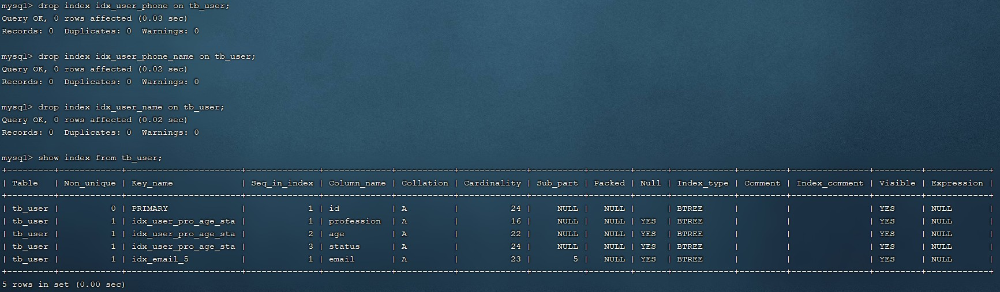
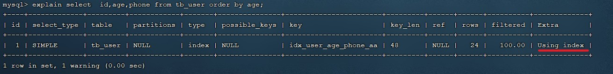
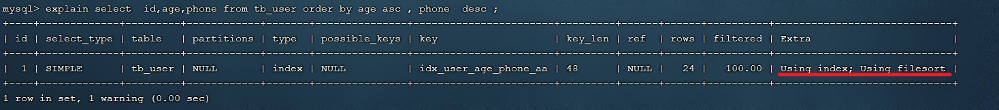
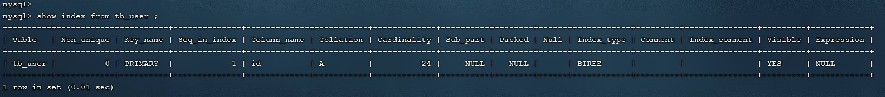
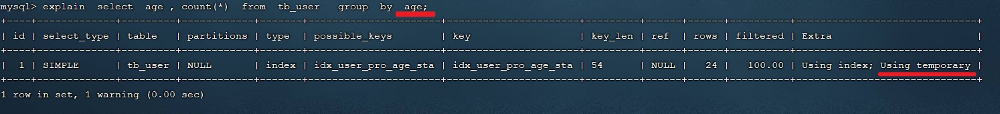

# 1、插入数据

## insert

如果我们需要一次性往数据库表中插入多条记录，可以从以下三个方面进行优化。

```mysql
insert into tb_test values(1,'tom');
insert into tb_test values(2,'cat');
insert into tb_test values(3,'jerry');
......
```

1、优化方案一：批量插入数据

```mysql
insert into tb_test values(1,'Tom'), (2,'Cat'), (3,'Jerry');
```

2、优化方案二：手动控制事务

```mysql
start transaction;
insert into tb_test values(1,'Tom'), (2,'Cat'), (3,'Jerry');
insert into tb_test values(4,'Tom'), (5,'Cat'), (6,'Jerry');
insert into tb_test values(7,'Tom'), (8,'Cat'), (9,'Jerry');
commit;
```

3、优化方案三：主键顺序插入，性能要高于乱序插入。

```
主键乱序插入 : 8 1 9 21 88 2 4 15 89 5 7 3

主键顺序插入 : 1 2 3 4 5 7 8 9 15 21 88 89
```

## 大批量插入数据

如果一次性需要插入大批量数据（比如：几百万的记录），使用 insert 语句插入性能较低，此时可以使用 MySQL 数据库提供的 `load` 指令进行插入。操作如下：


可以执行如下指令，将数据脚本文件中的数据加载到表结构中：

```mysql
-- 客户端连接服务端时，加上参数 -–local-infile
mysql –-local-infile -u root -p

-- 设置全局参数local_infile为1，开启从本地加载文件导入数据的开关
set global local_infile = 1;

-- 执行load指令将准备好的数据，加载到表结构中
load data local infile '/root/sql1.log' into table tb_user fields terminated by ',' lines terminated by '\n';
```

> 主键顺序插入性能高于乱序插入

示例演示：

（1）创建表结构

```mysql
CREATE TABLE `tb_user`(
    `id` INT(11) NOT NULL AUTO_INCREMENT,
    `username` VARCHAR(50) NOT NULL,
    `password` VARCHAR(50) NOT NULL,
    `name` VARCHAR(20) NOT NULL,
    `birthday` DATE DEFAULT NULL,
    `sex` CHAR(1) DEFAULT NULL,
    PRIMARY KEY (`id`),
    UNIQUE KEY `unique_user_username` (`username`)
) ENGINE=INNODB DEFAULT CHARSET=utf8;
```

（2）设置参数

```mysql
-- 客户端连接服务端时，加上参数 -–local-infile
mysql –-local-infile -u root -p

-- 设置全局参数local_infile为1，开启从本地加载文件导入数据的开关
set global local_infile = 1;
```

（3）load 加载数据

```mysql
load data local infile '/root/load_user_100w_sort.sql' into table tb_user fields terminated by ',' lines terminated by '\n';
```


我们看到，插入 100w 的记录，17s 就完成了，性能很好。

> 在 load 时，主键顺序插入性能高于乱序插入

# 2、主键优化

在上一小节，我们提到，主键顺序插入的性能是要高于乱序插入的。这一小节，就来介绍一下具体的原因，然后再分析一下主键又该如何设计。

1、数据组织方式

在 InnoDB 存储引擎中，表数据都是根据主键顺序组织存放的，这种存储方式的表称为索引组织表（index organized table IOT）。


行数据，都是存储在聚集索引的叶子节点上的。而我们之前也讲解过 InnoDB 的逻辑结构图：


在 InnoDB 引擎中，数据行是记录在逻辑结构 page 页中的，而每一个页的大小是固定的，默认 16 K。那也就意味着， 一个页中所存储的行也是有限的，如果插入的数据行 row 在该页存储不下，将会存储到下一个页中，页与页之间会通过指针连接。

2、**页分裂**

页可以为空，也可以填充一半，也可以填充 100%。每个页包含了 2~N 行数据（如果一行数据过大，会行溢出），根据主键排列。

1）主键顺序插入效果

（1）从磁盘中申请页， 主键顺序插入


（2）第一个页没有满，继续往第一页插入


（3）当第一个也写满之后，再写入第二个页，页与页之间会通过指针连接


（4）当第二页写满了，再往第三页写入


2）主键乱序插入效果

（1）假如 1#、2# 页都已经写满了，存放了如图所示的数据


（2）此时再插入 id 为 50 的记录，我们来看看会发生什么现象，会再次开启一个页写入新的页中吗？


不会。因为，索引结构的叶子节点是有顺序的。按照顺序，应该存储在 47 之后。


但是 47 所在的 1# 页，已经写满了，存储不了 50 对应的数据了。那么此时会开辟一个新的页 3#。


但是并不会直接将 50 存入 3# 页，而是会将 1# 页后一半的数据，移动到 3# 页，然后在 3# 页插入 50。


移动数据，并插入 id 为 50 的数据之后，那么此时，这三个页之间的数据顺序是有问题的。1# 的下一个页，应该是 3#，3# 的下一个页是 2#。所以此时需要重新设置链表指针。


上述的这种现象，称之为 **页分裂**，是比较耗费性能的操作。

3、**页合并**

目前表中已有数据的索引结构（叶子节点）如下：


当我们对已有数据进行删除时，具体的效果如下：

当删除一行记录时，实际上记录并没有被物理删除，只是记录被标记（flaged）为删除并且它的空间变得允许被其他记录声明使用。


当我们继续删除 2# 的数据记录


当页中删除的记录达到 `MERGE_THRESHOLD`（默认为页的 50%），InnoDB 会开始寻找最靠近的页（前或后）看看是否可以将两个页合并以优化空间使用。


删除数据，并将页合并之后，再次插入新的数据 20，则直接插入 3# 页


这个里面所发生的合并页的这个现象，就称之为 **页合并**。

> 知识小贴士：
>
> MERGE_THRESHOLD：合并页的阈值，可以自己设置，在创建表或者创建索引时指定。

4、索引设计原则

* 满足业务需求的情况下，尽量降低主键的长度。
* 插入数据时，尽量选择顺序插入，选择使用 `AUTO_INCREMENT` 自增主键。
* 尽量不要使用 UUID 做主键或者是其他自然主键，如身份证号。
* 业务操作时，避免对主键的修改。


# 3、order by 优化

MySQL 的排序，有两种方式：

* `Using filesort`：通过表的索引或全表扫描，读取满足条件的数据行，然后在排序缓冲区 sort buffer 中完成排序操作，所有不是通过索引直接返回排序结果的排序都叫 FileSort 排序。
* `Using index`：通过有序索引顺序扫描直接返回有序数据，这种情况即为 using index，不需要额外排序，操作效率高。

对于以上的两种排序方式，Using index 的性能高，而 Using filesort 的性能低，我们在优化排序操作时，尽量要优化为 Using index。

接下来，我们来做一个测试：

（1）数据准备

把之前测试时，为 tb_user 表所建立的部分索引直接删除掉

```mysql
1. drop index idx_user_phone on tb_user;
2. drop index idx_user_phone_name on tb_user;
3. drop index idx_user_name on tb_user;
```



（2）执行排序 SQL

```mysql
explain select id,age,phone from tb_user order by age;
```


```mysql
explain select id,age,phone from tb_user order by age, phone;
```


由于 age、phone 都没有索引，所以此时在排序时，出现 Using filesort，排序性能较低。

（3）创建索引

```mysql
-- 创建索引
create index idx_user_age_phone_aa on tb_user(age,phone);
```

（4）创建索引后，根据 age，phone 进行升序排序

```mysql
explain select id,age,phone from tb_user order by age;
```



```mysql
explain select id,age,phone from tb_user order by age, phone;
```


建立索引之后，再次进行排序查询，就由原来的 Using filesort 变为了 Using index，性能就是比较高的了。

（5）创建索引后，根据 age，phone 进行降序排序

```mysql
explain select id,age,phone from tb_user order by age desc, phone desc;
```


也出现 Using index， 但是此时 Extra 中出现了 Backward index scan，这个代表反向扫描索引，因为在 MySQL 中我们创建的索引，默认索引的叶子节点是从小到大排序的，而此时我们查询排序时，是从大到小，所以在扫描时就是反向扫描，就会出现 Backward index scan。 在 MySQL 8 版本中，支持降序索引，我们也可以创建降序索引。

（6）根据 phone，age 进行升序排序，phone 在前，age 在后。

```mysql
explain select id,age,phone from tb_user order by phone, age;
```


排序时，也需要满足最左前缀法则，否则也会出现 filesort。因为在创建索引的时候，age 是第一个字段，phone 是第二个字段，所以排序时，也就该按照这个顺序来，否则就会出现 Using filesort。

（7）根据 age，phone 进行排序一个升序，一个降序

```mysql
explain select id,age,phone from tb_user order by age asc, phone desc;
```



因为创建索引时，如果未指定顺序，默认都是按照升序排序的，而查询时一个升序一个降序，此时就会出现 Using filesort。


为了解决上述的问题，我们可以创建一个索引，这个联合索引中 age 升序排序，phone 倒序排序。

（8）创建联合索引（age 升序排序，phone 倒序排序）

```mysql
create index idx_user_age_phone_ad on tb_user(age asc, phone desc);
```


（9）然后再次执行如下 SQL：

```mysql
explain select id,age,phone from tb_user order by age asc, phone desc;
```


升序 / 降序联合索引结构图示：


> 由上述的测试，我们得出 order by 优化原则：
>
> * 根据排序字段建立合适的索引，多字段排序时，也遵循最左前缀法则。
> * 尽量使用覆盖索引。
> * 多字段排序，一个升序一个降序，此时需要注意联合索引在创建时的规则（ASC / DESC）。
> * 如果不可避免的出现 filesort，大数据量排序时，可以适当增大排序缓冲区大小 sort_buffer_size（默认256k）。

# 4、group by 优化

分组操作，我们主要来看看索引对于分组操作的影响。

首先我们先将 tb_user 表的索引全部删除掉。

```mysql
drop index idx_user_pro_age_sta on tb_user;

drop index idx_email_5 on tb_user;

drop index idx_user_age_phone_aa on tb_user;

drop index idx_user_age_phone_ad on tb_user;
```



接下来，在没有索引的情况下，执行如下 SQL，查询执行计划：

```mysql
explain select profession, count(*) from tb_user group by profession;
```


然后，我们再针对于 profession，age，status 创建一个联合索引。

```mysql
create index idx_user_pro_age_sta on tb_user(profession, age, status);
```

紧接着，再执行前面相同的 SQL 查看执行计划。

```mysql
explain select profession, count(*) from tb_user group by profession;
```


再执行如下的分组查询 SQL，查看执行计划：




我们发现，如果仅仅根据 age 分组，就会出现 Using temporary；而如果是根据 profession 和 age 两个字段同时分组，则不会出现 Using temporary。原因是因为对于分组操作，在联合索引中，也是符合最左前缀法则的。

> 所以，在分组操作中，我们需要通过以下两点进行优化，以提升性能：
>
> 1. 在分组操作时，可以通过索引来提高效率。
> 2. 分组操作时，索引的使用也是满足最左前缀法则的。

# 5、limit 优化

在数据量比较大时，如果进行 limit 分页查询，在查询时，越往后分页查询效率越低。

我们一起来看看执行 limit 分页查询耗时对比：


通过测试我们会看到，越往后，分页查询效率越低，这就是分页查询的问题所在。

因为在进行分页查询时，如果执行 `limit 2000000, 10`，此时需要 MySQL 排序前 2000010 记录，仅仅返回 2000000 - 2000010 的记录，其他记录丢弃，查询排序的代价非常大。

> 优化思路：一般分页查询时，通过创建 覆盖索引 能够比较好地提高性能，可以通过覆盖索引加子查询形式进行优化。

```mysql
explain select * from tb_sku t, (select id from tb_sku order by id limit 2000000, 10) a where t.id = a.id;
```

# 6、count 优化

## 6.1、概述

```mysql
select count(*) from tb_sku;
```

在之前的测试中，我们发现，如果数据量很大，在执行 count 操作时，是非常耗时的。

* MyISAM 引擎把一个表的总行数存在了磁盘上，因此执行 count(\*) 的时候会直接返回这个数，效率很高；但是如果是带条件的 count，MyISAM 也慢。

* InnoDB 引擎就麻烦了，它执行 count(\*) 的时候，需要把数据一行一行地从引擎里面读出来，然后累积计数。

如果说要大幅度提升 InnoDB 表的 count 效率，主要的优化思路：自己计数（可以借助于 Redis 这样的数据库进行，但是如果是带条件的 count 又比较麻烦了）。

## 6.2、count 用法

`count()` 是一个聚合函数，对于返回的结果集，一行行地判断，如果 count 函数的参数不是 NULL，累计值就加 1，否则不加，最后返回累计值。

用法：

* `count(*)`
* `count(主键)`
* `count(字段)`
* `count(数字)`

| **count用法** | **含义**                                                     |
| ------------- | ------------------------------------------------------------ |
| count(主键)   | InnoDB 引擎会遍历整张表，把每一行的主键 id 值都取出来，返回给服务层。服务层拿到主键后，直接按行进行累加（主键不可能为 null） |
| count(字段)   | 没有 not null 约束：InnoDB 引擎会遍历整张表把每一行的字段值都取出来，返回给服务层，服务层判断是否为 null，不为 null 则计数累加。<br />有 not null 约束：InnoDB 引擎会遍历整张表把每一行的字段值都取出来，返回给服务层，直接按行进行累加。 |
| count(数字)   | InnoDB 引擎遍历整张表，但不取值。服务层对于返回的每一行，放一个数字 “1” 进去，直接按行进行累加。 |
| count(\*)     | InnoDB 引擎并不会把全部字段取出来，而是专门做了优化，不取值，服务层直接按行进行累加。 |

> 按照效率排序的话，count(字段) < count(主键 id) < count(1) ≈ count(\*)，所以尽量使用 count(\*)。

# 7、update 优化

我们主要需要注意一下 update 语句执行时的注意事项。

```mysql
update course set name = 'javaEE' where id = 1;
```

当我们在执行修改的 SQL 语句时，会锁定 id 为 1 这一行的数据，然后事务提交之后，行锁释放。

但是当我们在执行如下 SQL 时

```mysql
update course set name = 'SpringBoot' where name = 'PHP';
```

当我们开启多个事务，再执行上述的 SQL 时，我们发现行锁升级为了表锁。导致该 update 语句的性能大大降低。

> InnoDB 的行锁是针对索引加的锁，不是针对记录加的锁，并且该索引不能失效，否则会从行锁升级为表锁。所以要注意根据索引进行更新