# 一、概述

锁是计算机协调多个进程或线程并发访问某一资源的机制。在数据库中，除传统的计算资源（CPU、 RAM、I/O）的争用以外，数据也是一种供许多用户共享的资源。如何保证数据并发访问的一致性、有效性是所有数据库必须解决的一个问题，锁冲突也是影响数据库并发访问性能的一个重要因素。从这个角度来说，锁对数据库而言显得尤其重要，也更加复杂。

MySQL 中的锁，按照锁的粒度分，分为以下三类：

* 全局锁：锁定数据库中的所有表。
* 表级锁：每次操作锁住整张表。
* 行级锁：每次操作锁住对应的行数据。

# 二、全局锁

## 1、介绍

全局锁就是对整个数据库实例加锁，加锁后整个实例就处于只读状态，后续的 DML 的写语句、DDL 语句、已经更新操作的事务提交语句都将被阻塞。

其典型的使用场景是做全库的逻辑备份，对所有的表进行锁定，从而获取一致性视图，保证数据的完整性。

为什么全库逻辑备份，就需要加全就锁呢？

（1）我们一起先来分析一下不加全局锁，可能存在的问题。

假设在数据库中存在这样三张表：tb_stock 库存表，tb_order 订单表，tb_orderlog 订单日志表。

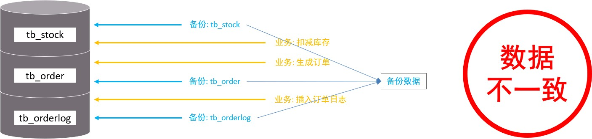

* 在进行数据备份时，先备份了 tb_stock 库存表。
* 然后接下来，在业务系统中，执行了下单操作，扣减库存，生成订单（更新 tb_stock 表，插入 tb_order 表）。
* 然后再执行备份 tb_order 表的逻辑。
* 业务中执行插入订单日志操作。
* 最后，又备份了 tb_orderlog 表。

此时备份出来的数据，是存在问题的。因为备份出来的数据，tb_stock 表与 tb_order 表的数据不一致（有最新操作的订单信息，但是库存数没减）。

那如何来规避这种问题呢？此时就可以借助于 MySQL 的全局锁来解决。

（2）再来分析一下加了全局锁后的情况

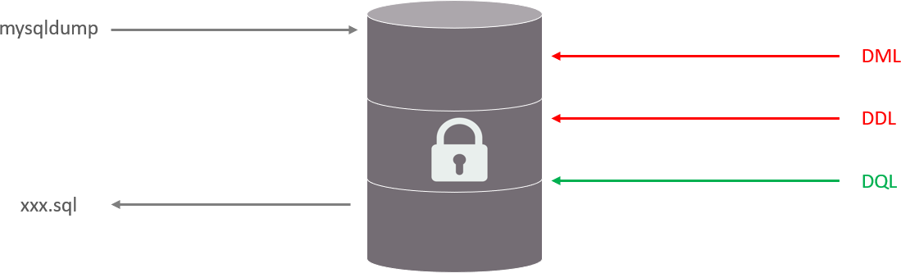

对数据库进行逻辑备份之前，先对整个数据库加上全局锁，一旦加了全局锁之后，其他的 DDL、DML 全部都处于阻塞状态，但是可以执行 DQL 语句，也就是处于只读状态，而数据备份就是查询操作。那么数据在进行逻辑备份的过程中，数据库中的数据就是不会发生变化的，这样就保证了数据的一致性和完整性。

## 2、语法

1、加全局锁

`flush tables with read lock;`

2、数据备份

`mysqldump -uroot –p1234 itcast > itcast.sql`

> 注意：这不是 SQL 语句，而是命令，所以不能直接在 MySQL 命令行中执行，会报错，应该在 cmd 中执行。mysqldump 是 MySQL 提供的一个工具

数据备份的相关指令，在后面 MySQL 管理章节，还会详细讲解

3、释放锁

`unlock tables;`

## 3、特点

数据库中加全局锁，是一个比较重的操作，存在以下问题：

* 如果在主库上备份，那么在备份期间都不能执行更新，业务基本上就得停摆。
* 如果在从库上备份，那么在备份期间从库不能执行主库同步过来的二进制日志（binlog），会导致主从延迟。

在 InnoDB 引擎中，我们可以在备份时加上参数 `--single-transaction` 参数来完成不加锁的一致性数据备份。（只适用于支持「可重复读隔离级别的事务」的存储引擎）

`mysqldump --single-transaction -uroot –p123456 itcast > itcast.sql`

原理补充：通过加上这个参数，确保了在备份开始时创建一个一致性的快照，通过启动一个新的事务来实现这一点。（该事务的隔离级别是 Repeatable Read 级别），从而实现在该事务读取下一直读取的是创建时的数据，而不影响其他事务的读写操作。

# 三、表级锁

## 1、介绍

表级锁，每次操作锁住整张表。锁定粒度大，发生锁冲突的概率最高，并发度最低。应用在 MyISAM、InnoDB、BDB 等存储引擎中。

对于表级锁，主要分为以下三类：

* 表锁
* 元数据锁（meta data lock，MDL）
* 意向锁

## 2、表锁

对于表锁，分为两类：

* 表共享读锁（read lock）
* 表独占写锁（write lock）

语法：

* 加锁：`lock tables 表名... read/write`
* 释放锁：`unlock tables` / 客户端断开连接

特点：

1、读锁

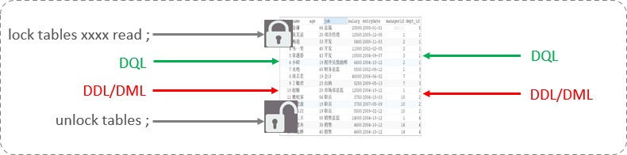

左侧为客户端一，对指定表加了读锁，不会影响右侧客户端二的读，但是会阻塞右侧客户端的写。

测试：

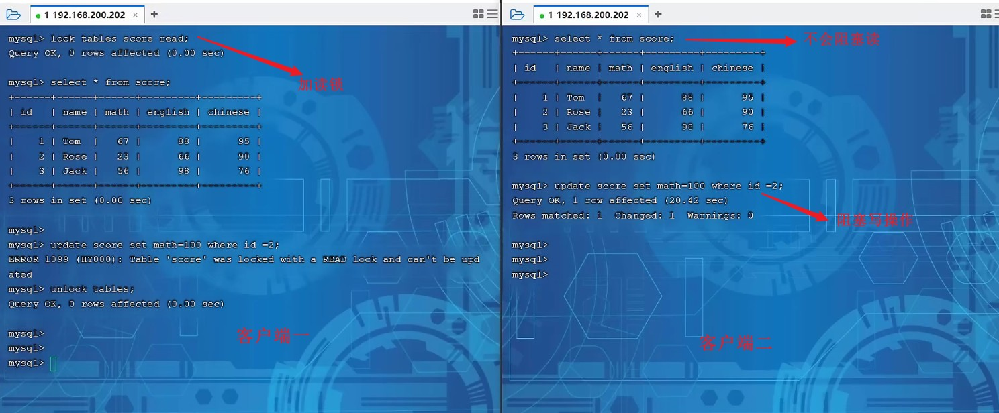

2、写锁

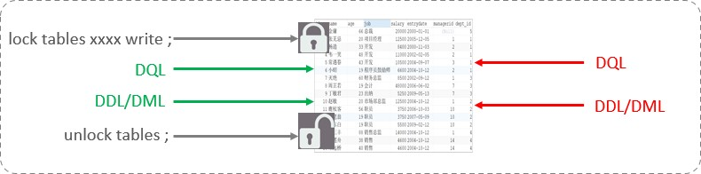

左侧为客户端一，对指定表加了写锁，会阻塞右侧客户端的读和写。

测试：

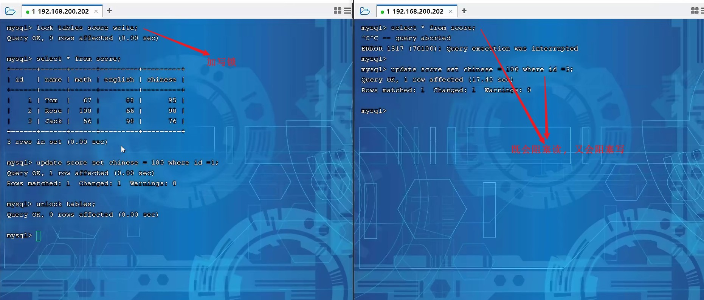

> 结论：读锁不会阻塞其他客户端的读，但是会阻塞写。写锁既会阻塞其他客户端的读，又会阻塞其他客户端的写。

## 3、元数据锁

meta data lock，元数据锁，简写 MDL。

MDL 加锁过程是系统自动控制，无需显式使用，在访问一张表的时候会自动加上。MDL 锁主要作用是维护表元数据的数据一致性，在表上有活动事务的时候，不可以对元数据进行写入操作。**为了避免 DML 与 DDL 冲突，保证读写的正确性**。

这里的元数据，大家可以简单理解为就是一张表的表结构。也就是说，某一张表涉及到未提交的事务时，是不能够修改这张表的表结构的。

在 MySQL 5.5 中引入了 MDL，当对一张表进行增删改查的时候，加 MDL 读锁（共享）；当对表结构进行变更操作的时候，加 MDL 写锁（排他）。

常见的 SQL 操作时，所添加的元数据锁：

| 对应 SQL                                       | 锁类型                                  | 说明                                                 |
| ---------------------------------------------- | --------------------------------------- | ---------------------------------------------------- |
| lock tables xxx read / write                   | SHARED_READ_ONLY / SHARED_NO_READ_WRITE |                                                      |
| select 、select ... lock in share mode         | SHARED_READ                             | 与 SHARED_READ、SHARED_WRITE 兼容，与 EXCLUSIVE 互斥 |
| insert 、update、delete、select ... for update | SHARED_WRITE                            | 与 SHARED_READ、SHARED_WRITE 兼容，与 EXCLUSIVE 互斥 |
| alter table ...                                | EXCLUSIVE                               | 与其他的 MDL 都互斥                                  |

演示：

当执行 SELECT、INSERT、UPDATE、DELETE 等语句时，添加的是元数据共享锁（SHARED_READ / SHARED_WRITE），之间是兼容的。

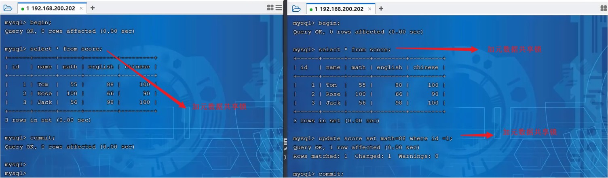

当执行 SELECT 语句时，添加的是元数据共享锁（SHARED_READ），会阻塞元数据排他锁（EXCLUSIVE），之间是互斥的。

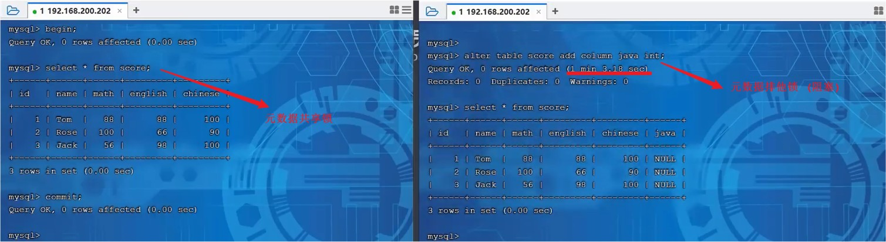

我们可以通过下面的 SQL，来查看数据库中的元数据锁的情况：

`select object_type, object_schema, object_name, lock_type, lock_duration from performance_schema.metadata_locks;`

我们在操作过程中，可以通过上述的 SQL 语句，来查看元数据锁的加锁情况。

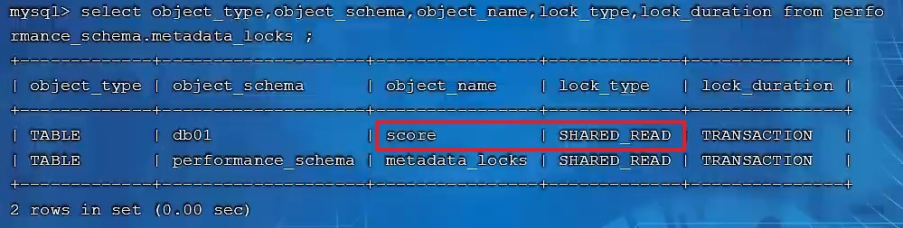

## 4、意向锁

1、介绍

为了避免 DML 在执行时，加的行锁与表锁的冲突，在 InnoDB 中引入了意向锁，使得表锁不用检查每行数据是否加锁，使用意向锁来减少表锁的检查。

假如没有意向锁，客户端一对表加了行锁后，客户端二如何给表加表锁呢，来通过示意图简单分析一下：

首先客户端一，开启一个事务，然后执行 DML 操作，在执行 DML 语句时，会对涉及到的行加行锁。

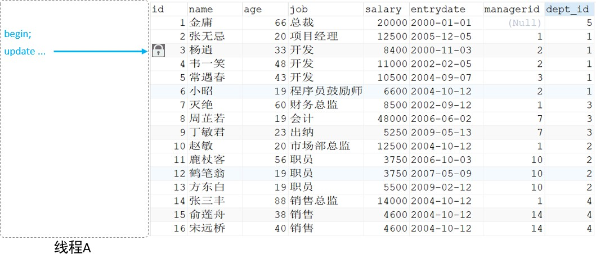

当客户端二想对这张表加表锁时，会检查当前表是否有对应的行锁，如果没有则添加表锁，此时就会从第一行数据，检查到最后一行数据，效率较低。

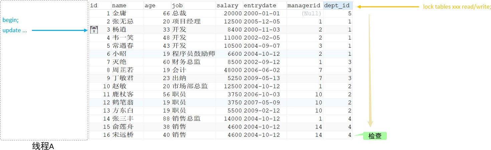

有了意向锁之后：

客户端一在执行 DML 操作时，会对涉及的行加行锁，同时也会对该表加上意向锁。

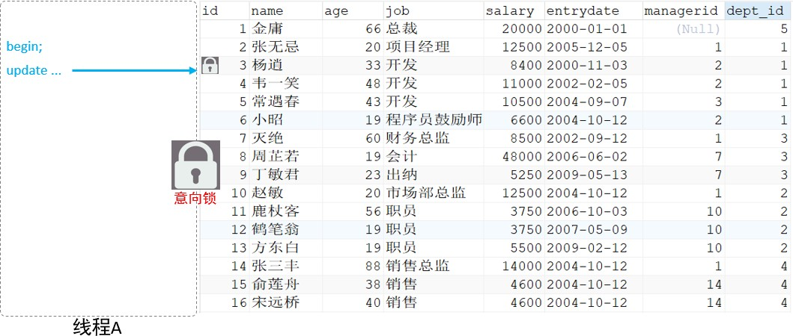

而其他客户端，在对这张表加表锁的时候，会根据该表上所加的意向锁来判定是否可以成功加表锁，而不用逐行判断行锁情况了。

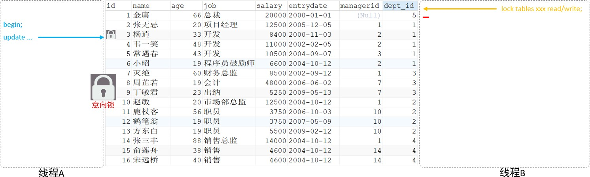

2、分类

* 意向共享锁（IS）：由语句 `select ... lock in share mode` 添加。与表锁共享锁（read）兼容，与表锁排他锁（write）互斥。
* 意向排他锁（IX）：由 insert、update、delete、select ... for update 添加。与表锁共享锁（read）及排他锁（write）都互斥，意向锁之间不会互斥。

> 一旦事务提交了，意向共享锁、意向排他锁，都会自动释放。

可以通过以下 SQL，查看意向锁及行锁的加锁情况：

`select object_schema, object_name, index_name, lock_type, lock_mode, lock_data from performance_schema.data_locks;`

3、演示：

（1）意向共享锁与表读锁是兼容的

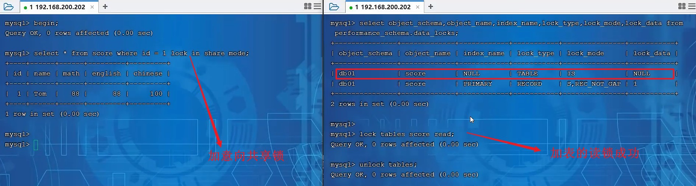

（2）意向排他锁与表读锁、写锁都是互斥的

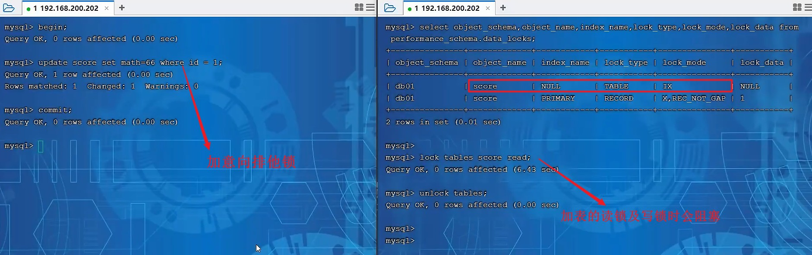

# 四、行级锁

## 1、介绍

行级锁，每次操作锁住对应的行数据。锁定粒度最小，发生锁冲突的概率最低，并发度最高。应用在 InnoDB 存储引擎中。

InnoDB 的数据是基于索引组织的，行锁是通过对索引上的索引项加锁来实现的，而不是对记录加的锁。对于行级锁，主要分为以下三类：

* 行锁（Record Lock）：锁定单个行记录的锁，防止其他事务对此行进行 update 和 delete。在 RC、RR 隔离级别下都支持。


* 间隙锁（Gap Lock）：锁定索引记录间隙（不含该记录），确保索引记录间隙不变，防止其他事务在这个间隙进行 insert，产生幻读。在 RR 隔离级别下都支持。

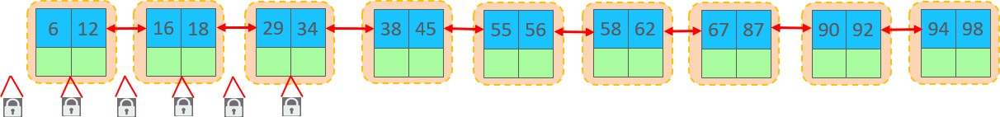

* 临键锁（Next-Key Lock）：行锁和间隙锁组合，同时锁住数据，并锁住数据前面的间隙 Gap。在 RR 隔离级别下支持。

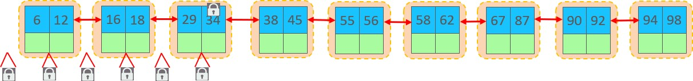

## 2、行锁

1、介绍

InnoDB 实现了以下两种类型的行锁：

* 共享锁（S）：允许一个事务去读一行，阻止其他事务获得相同数据集的排它锁。
* 排他锁（X）：允许获取排他锁的事务更新数据，阻止其他事务获得相同数据集的共享锁和排他锁。

两种行锁的兼容情况如下：


常见的 SQL 语句，在执行时所加的行锁如下：

| SQL                           | 行锁类型   | 说明                                        |
| ----------------------------- | ---------- | ------------------------------------------- |
| INSERT ...                    | 排他锁     | 自动加锁                                    |
| UPDATE ...                    | 排他锁     | 自动加锁                                    |
| DELETE ...                    | 排他锁     | 自动加锁                                    |
| SELECT（正常）                | 不加任何锁 |                                             |
| SELECT ... LOCK IN SHARE MODE | 共享锁     | 需要手动在 SELECT 之后加 LOCK IN SHARE MODE |
| SELECT ... FOR UPDATE         | 排他锁     | 需要手动在 SELECT 之后加 FOR UPDATE         |

2、演示

默认情况下，InnoDB 在 REPEATABLE READ 事务隔离级别运行，InnoDB 使用 next-key 锁进行搜索和索引扫描，以防止幻读。

针对唯一索引进行检索时，对已存在的记录进行等值匹配时，将会自动优化为行锁。

InnoDB 的行锁是针对于索引加的锁，不通过索引条件检索数据，那么 InnoDB 将对表中的所有记录加锁，此时就会升级为表锁。

可以通过以下 SQL，查看意向锁及行锁的加锁情况：

`select object_schema, object_name, index_name, lock_type, lock_mode, lock_data from performance_schema.data_locks;`

示例演示：

（0）数据准备：

```mysql
CREATE TABLE `stu`(
    `id` int NOT NULL  PRIMARY KEY AUTO_INCREMENT,
    `name` varchar(255) DEFAULT NULL,
    `age` int NOT NULL
) ENGINE = InnoDB CHARACTER SET = utf8mb4;

INSERT INTO `stu` VALUES (1, 'tom', 1);
INSERT INTO `stu` VALUES (3, 'cat', 3);
INSERT INTO `stu` VALUES (8, 'rose', 8);
INSERT INTO `stu` VALUES (11, 'jetty', 11);
INSERT INTO `stu` VALUES (19, 'lily', 19);
INSERT INTO `stu` VALUES (25, 'luci', 25);
```

演示行锁的时候，我们就通过上面这张表来演示一下。

（1）普通的 select 语句，执行时不会加锁。

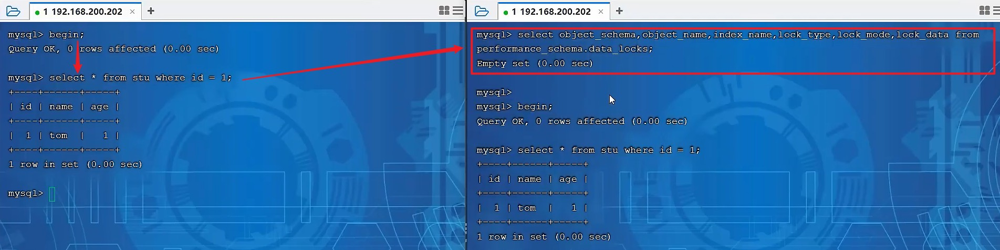

（2）`select ... lock in share mode`，加共享锁，共享锁与共享锁之间兼容。

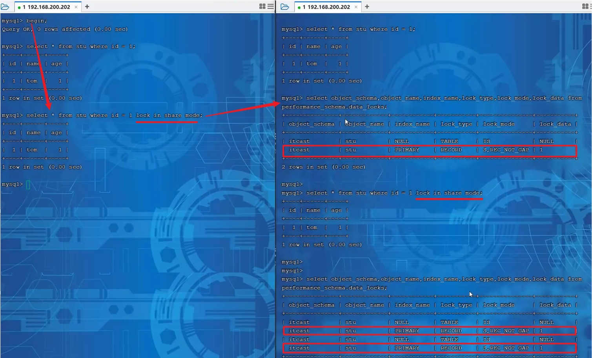

共享锁与排他锁之间互斥。

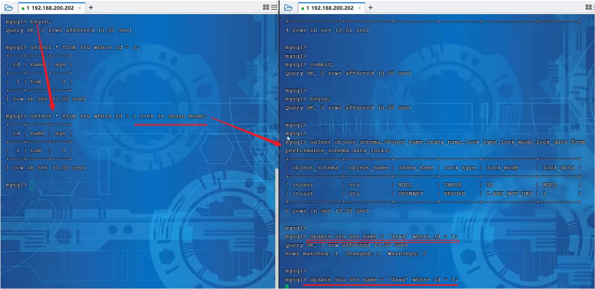

客户端一获取的是 id 为 1 这行的共享锁，客户端二是可以获取 id 为 3 这行的排它锁的，因为不是同一行数据。而如果客户端二想获取 id 为 1 这行的排他锁，会处于阻塞状态，以为共享锁与排他锁之间互斥。

（3）排它锁与排他锁之间互斥


当客户端一执行 update 语句，会为 id 为 1 的记录加排他锁；客户端二如果也执行 update 语句更新 id 为 1 的数据，也要为 id 为 1 的数据加排他锁，但是客户端二会处于阻塞状态，因为排他锁之间是互斥的。直到客户端一把事务提交了，才会把这一行的行锁释放，此时客户端二解除阻塞。

（4）无索引行锁升级为表锁

stu 表中数据如下：


我们在两个客户端中执行如下操作：

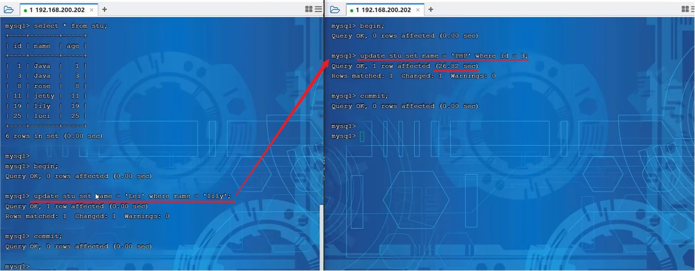

在客户端一中开启事务，并执行 update 语句，更新 name 为 Lily 的数据，也就是 id 为 19 的记录。然后在客户端二中更新 id 为 3 的记录，却不能直接执行，会处于阻塞状态，为什么呢？

原因就是因为此时，客户端一根据 name 字段进行更新时，name 字段是没有索引的，如果没有索引，此时行锁会升级为表锁（因为行锁是对索引项加的锁，而 name 没有索引）。

接下来，我们再针对 name 字段建立索引，索引建立之后，再次做一个测试：

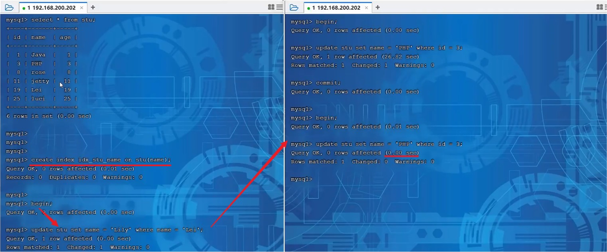

此时我们可以看到，客户端一开启事务，然后依然是根据 name 进行更新。而客户端二在更新 id 为 3 的数据时，更新成功，并未进入阻塞状态。这样就说明，我们根据索引字段进行更新操作，就可以避免行锁升级为表锁的情况。

## 3、间隙锁与临键锁

1、介绍

默认情况下，InnoDB 在 REPEATABLE READ 事务隔离级别运行，InnoDB 使用 next-key 锁进行搜索和索引扫描，以防止幻读。

* 索引上的等值查询（唯一索引），给不存在的记录加锁时，优化为间隙锁。
* 索引上的等值查询（非唯一普通索引），向右遍历时最后一个值不满足查询需求时，next-key lock 退化为间隙锁。
* 索引上的范围查询（唯一索引），会访问到不满足条件的第一个值为止。

> 注意：间隙锁唯一目的是防止其他事务插入间隙。间隙锁可以共存，一个事务采用的间隙锁不会阻止另一个事务在同一间隙上采用间隙锁。

2、示例演示：

（1）索引上的等值查询（唯一索引），给不存在的记录加锁时，优化为间隙锁。

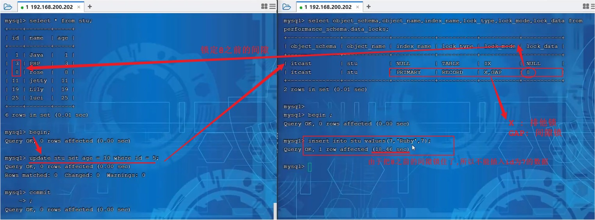

（2）索引上的等值查询（非唯一普通索引），向右遍历时最后一个值不满足查询需求时，临键锁 next-key lock 退化为间隙锁。

介绍分析一下：

我们知道 InnoDB 的 B+ 树索引，叶子节点是有序的双向链表。假如我们要根据这个二级索引查询值为 18 的数据，并加上共享锁，我们是只锁定 18 这一行就可以了吗？并不是，因为是非唯一索引，这个结构中可能有多个 18 的存在，所以在加锁时会继续往后找，找到一个不满足条件的值（当前案例中也就是 29）。此时会对 18 加临键锁，并对 29 之前的间隙加锁。


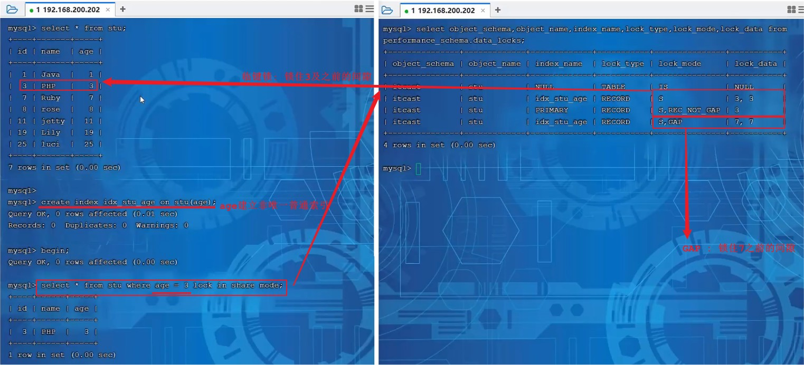

（3）索引上的范围查询（唯一索引），会访问到不满足条件的第一个值为止。

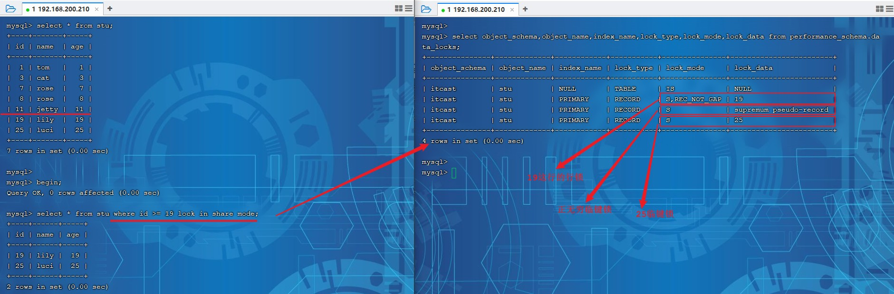

查询的条件为 id >= 19，并添加共享锁。此时我们可以根据数据库表中现有的数据，将数据分为三个部分：[19]、(19, 25]、(25, +∞]

所以数据库数据在加锁时，就是将 19 加了行锁，25 的临键锁（包含 25 及 25 之前的间隙），正无穷的临键锁（正无穷及之前的间隙）。